NAFLD\_github\_commands\_R
================
Todd Testerman
10/7/2021

Package Loading

``` r
pacman::p_load(phyloseq, BiocManager, qiime2R, tidyverse, viridis, pheatmap, ggplot2, vegan, patchwork, ggpubr, ranacapa, nlme, compositions, readr, devtools, DESeq2, microViz, ANCOMBC, microbiome, GUniFrac, RColorBrewer, scales)
```

Data Import

``` r
otudf = read.table("merged_table_species_only2.txt",sep="\t",header=T,row.names=1)
taxdf = read.table("taxonomy_table2.txt",sep="\t",header=T,row.names=1)
samdf = read.table("experimental_design_metaphlan.txt",sep="\t",header=T,row.names=1)

otumat = as.matrix(otudf)
taxmat = as.matrix(taxdf)

OTU = otu_table(otumat, taxa_are_rows = T)
TAX = tax_table(taxmat)
SAMP = sample_data(samdf)

phy_shotgun = phyloseq(OTU, TAX, SAMP)

phy_shotgun_rarefy_8mil = rarefy_even_depth(phy_shotgun, rngseed = 1234, sample.size = 8893658)
```

    ## `set.seed(1234)` was used to initialize repeatable random subsampling.

    ## Please record this for your records so others can reproduce.

    ## Try `set.seed(1234); .Random.seed` for the full vector

    ## ...

Figure 1 - Shannon Alpha Diversity

``` r
p_shotgun_shannon = plot_richness(phy_shotgun_rarefy_8mil, x = "NAFLD", color = "NAFLD", measures="shannon")
```

    ## Warning in estimate_richness(physeq, split = TRUE, measures = measures): The data you have provided does not have
    ## any singletons. This is highly suspicious. Results of richness
    ## estimates (for example) are probably unreliable, or wrong, if you have already
    ## trimmed low-abundance taxa from the data.
    ## 
    ## We recommended that you find the un-trimmed data and retry.

``` r
p_shotgun_shannon = p_shotgun_shannon + geom_boxplot(data = p_shotgun_shannon$data, show.legend = F) + stat_boxplot() + theme_bw() + scale_color_manual(values = c("#D55E00", "#56B4E9")) + theme(legend.position = "none", axis.title.x = element_blank(), strip.background = element_blank(), strip.text.x = element_blank(), text = element_text(size = 16)) + labs(y = "Shannon Diversity Index") 
#+ scale_x_discrete(labels = c("non-NAFLD", "NAFLD")) stat_compare_means(label.x = 1.25)
p_shotgun_shannon
```

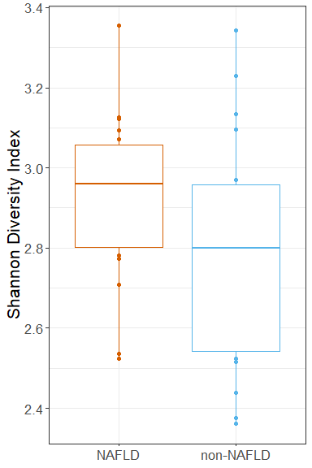<!-- -->

Figure 1 (Bray-Curtis Species only)

``` r
bray_species_fig1 = phy_shotgun_rarefy_8mil %>%
 tax_transform(rank = "Species", transformation = "identity") %>%
 dist_calc(dist = "bray") %>%
 ord_calc(
  method = "NMDS"
 ) %>% 
 ord_plot(
  axes = c(1, 2),
  colour = "NAFLD",
  shape = "circle", alpha = 0.5,
  size = 2, auto_caption = NA
 ) +
 ggplot2::stat_ellipse(
  ggplot2::aes(colour = NAFLD)
 )
```

    ## Run 0 stress 0.2003261 
    ## Run 1 stress 0.2199472 
    ## Run 2 stress 0.2083851 
    ## Run 3 stress 0.2089792 
    ## Run 4 stress 0.2244753 
    ## Run 5 stress 0.2091807 
    ## Run 6 stress 0.2091786 
    ## Run 7 stress 0.2130928 
    ## Run 8 stress 0.2292503 
    ## Run 9 stress 0.2083007 
    ## Run 10 stress 0.2005819 
    ## ... Procrustes: rmse 0.00802562  max resid 0.03496696 
    ## Run 11 stress 0.2285318 
    ## Run 12 stress 0.2107475 
    ## Run 13 stress 0.2117709 
    ## Run 14 stress 0.2081743 
    ## Run 15 stress 0.2003261 
    ## ... New best solution
    ## ... Procrustes: rmse 5.07968e-05  max resid 0.0002547502 
    ## ... Similar to previous best
    ## Run 16 stress 0.2003264 
    ## ... Procrustes: rmse 0.0002980251  max resid 0.001519848 
    ## ... Similar to previous best
    ## Run 17 stress 0.2091784 
    ## Run 18 stress 0.2155757 
    ## Run 19 stress 0.2488984 
    ## Run 20 stress 0.2005819 
    ## ... Procrustes: rmse 0.008032652  max resid 0.03505407 
    ## *** Solution reached

``` r
bray_species_fig1 = bray_species_fig1 + scale_color_manual(values = c("#D55E00", "#56B4E9")) + labs(color = "NAFLD Status") + theme(text = element_text(size = 16))
bray_species_fig1 
```

<!-- -->

``` r
#Bray species permanova

bray_species_dists <-
  phy_shotgun_rarefy_8mil %>%
  tax_agg("Species") %>%
  tax_transform("identity") %>% 
  dist_calc("bray")

bray_species_perm <- dist_permanova(
  data = bray_species_dists,
  seed = 1234, # for set.seed to ensure reproducibility of random process
  n_perms = 999, # you should use at least 999!
  n_processes = 1,
  variables = "NAFLD"
)
```

    ## 2022-01-21 11:19:51 - Starting PERMANOVA with 999 perms with 1 processes

    ## 2022-01-21 11:19:51 - Finished PERMANOVA

``` r
perm_get(bray_species_perm) %>% as.data.frame()
```

    ##          Df SumOfSqs        R2        F Pr(>F)
    ## NAFLD     1 0.908425 0.1006239 3.803983  0.001
    ## Residual 34 8.119503 0.8993761       NA     NA
    ## Total    35 9.027928 1.0000000       NA     NA

``` r
bray_species_disp = dist_bdisp(bray_species_dists, variables = "NAFLD", method = "centroid")

bdisp_get(bray_species_disp)
```

    ## $NAFLD
    ## $NAFLD$model
    ## 
    ##  Homogeneity of multivariate dispersions
    ## 
    ## Call: vegan::betadisper(d = distMat, group = metadata[[V]], type =
    ## method)
    ## 
    ## No. of Positive Eigenvalues: 29
    ## No. of Negative Eigenvalues: 6
    ## 
    ## Average distance to centroid:
    ##     NAFLD non-NAFLD 
    ##    0.4399    0.4976 
    ## 
    ## Eigenvalues for PCoA axes:
    ## (Showing 8 of 35 eigenvalues)
    ##  PCoA1  PCoA2  PCoA3  PCoA4  PCoA5  PCoA6  PCoA7  PCoA8 
    ## 1.7818 1.0557 1.0304 0.7941 0.6118 0.5283 0.4125 0.3904 
    ## 
    ## $NAFLD$anova
    ## Analysis of Variance Table
    ## 
    ## Response: Distances
    ##           Df   Sum Sq   Mean Sq F value  Pr(>F)  
    ## Groups     1 0.029895 0.0298955   5.665 0.02306 *
    ## Residuals 34 0.179425 0.0052772                  
    ## ---
    ## Signif. codes:  0 '***' 0.001 '**' 0.01 '*' 0.05 '.' 0.1 ' ' 1
    ## 
    ## $NAFLD$tukeyHSD
    ##   Tukey multiple comparisons of means
    ##     95% family-wise confidence level
    ## 
    ## Fit: aov(formula = distances ~ group, data = df)
    ## 
    ## $group
    ##                       diff         lwr       upr     p adj
    ## non-NAFLD-NAFLD 0.05763438 0.008423952 0.1068448 0.0230569

Bar Plots (for Figure 1)

``` r
tax_fix(phy_shotgun)
```

    ## phyloseq-class experiment-level object
    ## otu_table()   OTU Table:         [ 445 taxa and 36 samples ]
    ## sample_data() Sample Data:       [ 36 samples by 11 sample variables ]
    ## tax_table()   Taxonomy Table:    [ 445 taxa by 7 taxonomic ranks ]

``` r
phy_shotgun@tax_table = gsub("_", " ", phy_shotgun@tax_table)

barplot_phylum = comp_barplot(phy_shotgun, tax_level = "Phylum", n_taxa = 7, bar_outline_colour = "black", facet_by = "NAFLD", label = "", order_with_all_taxa = T, sample_order = "default", bar_width = 0.9) + coord_flip() + theme(
    text = element_text(size = 16),
    axis.title = element_blank(),
    panel.spacing = unit(2, "lines"),
    axis.ticks.y=element_blank()
  )

barplot_phylum 
```

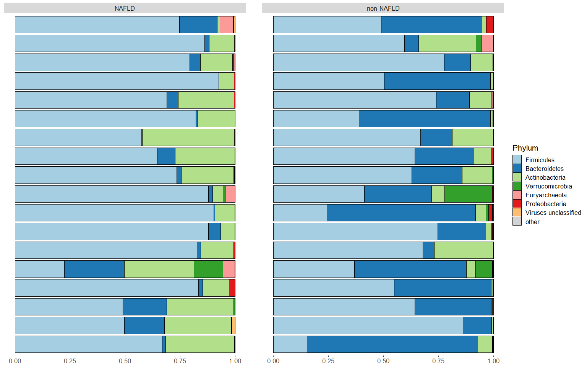<!-- -->

``` r
barplot_species = comp_barplot(phy_shotgun, tax_level = "Species", n_taxa = 30, bar_outline_colour = "black", facet_by = "NAFLD", label = "", order_with_all_taxa = T, sample_order = "default", bar_width = 0.9) + coord_flip() + theme(
    text = element_text(size = 16),
    axis.title = element_blank(),
    panel.spacing = unit(2, "lines"),
    axis.ticks.y=element_blank()) + 
    labs(fill = "Species") + 
    guides(fill = guide_legend(ncol = 1, reverse = T))

barplot_phylum + barplot_species
```

<!-- -->

Figure 1 - Patchwork

``` r
Figure_1 = p_shotgun_shannon + bray_species_fig1 + barplot_phylum + barplot_species
Figure_1 + plot_annotation(tag_levels = "A")
```

<!-- -->

``` r
ggsave("Figure_1.png", width = 16, height = 16)
ggsave("Figure_1.tiff", width = 16, height = 16, compression = "lzw")
```

Figure 2 - PCA - Species w/Taxa Arrows and Iris & Phylum w/Taxa Arrows
and Iris

``` r
PCA_species_ps = phy_shotgun %>%
 tax_filter(min_prevalence = 9, tax_level = "Genus") %>%
 tax_transform(rank = "Species", transformation = "clr") %>%
 ord_calc(method = "PCA")
PCA_species_ps
```

    ## ps_extra object - a list with phyloseq and extras:
    ## 
    ## phyloseq-class experiment-level object
    ## otu_table()   OTU Table:         [ 317 taxa and 36 samples ]
    ## sample_data() Sample Data:       [ 36 samples by 11 sample variables ]
    ## tax_table()   Taxonomy Table:    [ 317 taxa by 7 taxonomic ranks ]
    ## 
    ## ps_extra info:
    ## tax_agg = Species tax_transform = clr
    ## 
    ## ordination of class: rda cca 
    ## rda(formula = OTU ~ 1, data = data)
    ## 
    ## 
    ## $counts OTU Table: [ 317 taxa and 36 samples ]

``` r
PCA_Species_Fig2 = phy_shotgun %>%
 tax_filter(min_prevalence = 9, tax_level = "Genus") %>%
 tax_transform(rank = "Species", transformation = "clr") %>%
 ord_calc(
  method = "PCA"
 ) %>% 
 ord_plot(
  axes = c(1, 2),
  plot_taxa = 1:10,
  colour = "NAFLD",
  shape = "circle", alpha = 0.75,
  size = 4, auto_caption = NA
 )

PCA_Species_Fig2 = PCA_Species_Fig2 + scale_color_manual(values = c("#D55E00", "#56B4E9")) + labs(color = "NAFLD Status") + theme(text = element_text(size = 16))
PCA_Species_Fig2
```

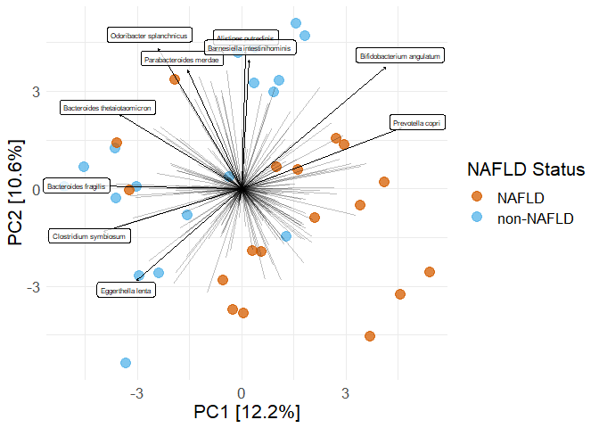<!-- -->

``` r
iris_species_Fig2 = 
PCA_species_ps %>% 
  ord_plot_iris(
    tax_level = "Species", n_taxa = 25,
    anno_colour = "NAFLD"
  )
iris_species_Fig2 = iris_species_Fig2 + scale_color_manual(values = c("#D55E00", "#56B4E9")) + labs(color = "NAFLD Status") + theme(text = element_text(size = 16))
iris_species_Fig2
```

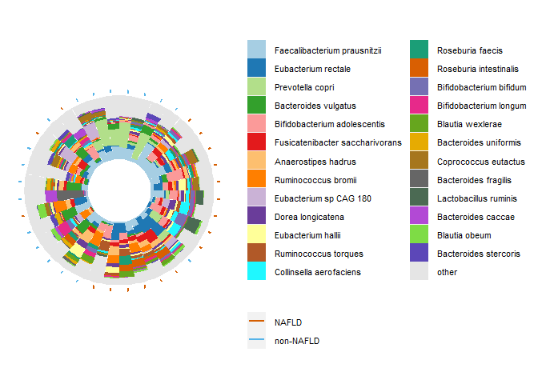<!-- -->

``` r
#Phylum

PCA_phylum_ps = phy_shotgun %>%
 tax_filter(min_prevalence = 9, tax_level = "Genus") %>%
 tax_transform(rank = "Phylum", transformation = "clr") %>%
 ord_calc(method = "PCA")
PCA_phylum_ps
```

    ## ps_extra object - a list with phyloseq and extras:
    ## 
    ## phyloseq-class experiment-level object
    ## otu_table()   OTU Table:         [ 6 taxa and 36 samples ]
    ## sample_data() Sample Data:       [ 36 samples by 11 sample variables ]
    ## tax_table()   Taxonomy Table:    [ 6 taxa by 2 taxonomic ranks ]
    ## 
    ## ps_extra info:
    ## tax_agg = Phylum tax_transform = clr
    ## 
    ## ordination of class: rda cca 
    ## rda(formula = OTU ~ 1, data = data)
    ## 
    ## 
    ## $counts OTU Table: [ 6 taxa and 36 samples ]

``` r
PCA_Phylum_Fig2 = phy_shotgun %>%
 tax_filter(min_prevalence = 9, tax_level = "Genus") %>%
 tax_transform(rank = "Phylum", transformation = "clr") %>%
 ord_calc(
  method = "PCA"
 ) %>% 
 ord_plot(
  axes = c(1, 2),
  plot_taxa = 1:5,
  colour = "NAFLD",
  shape = "circle", alpha = 0.75,
  size = 4, auto_caption = NA
 )

PCA_Phylum_Fig2 = PCA_Phylum_Fig2 + scale_color_manual(values = c("#D55E00", "#56B4E9")) + labs(color = "NAFLD Status") + theme(text = element_text(size = 16))

PCA_Phylum_Fig2
```

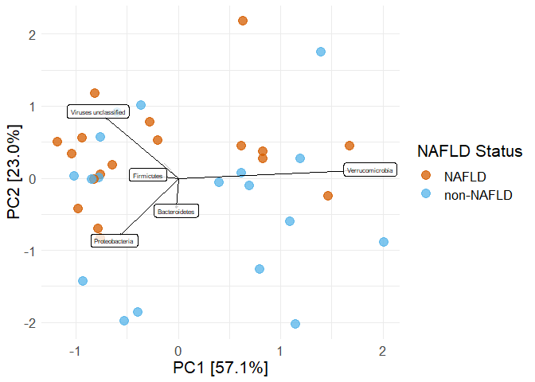<!-- -->

``` r
iris_phylum_Fig2 = 
PCA_phylum_ps %>% 
  ord_plot_iris(
    tax_level = "Phylum", n_taxa = 5,
    anno_colour = "NAFLD"
  )
iris_phylum_Fig2 = iris_phylum_Fig2 + scale_color_manual(values = c("#D55E00", "#56B4E9")) + labs(color = "NAFLD Status") + theme(text = element_text(size = 16))
iris_phylum_Fig2
```

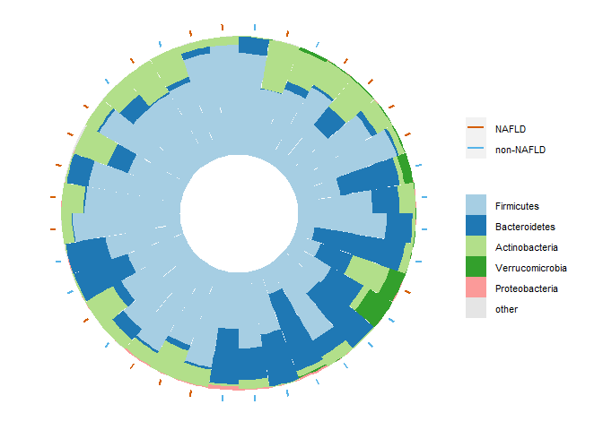<!-- -->

Figure 2 - Patchwork

``` r
Figure_2 = PCA_Species_Fig2 + PCA_Phylum_Fig2 + iris_species_Fig2 + iris_phylum_Fig2
Figure_2 + plot_annotation(tag_levels = "A")
```

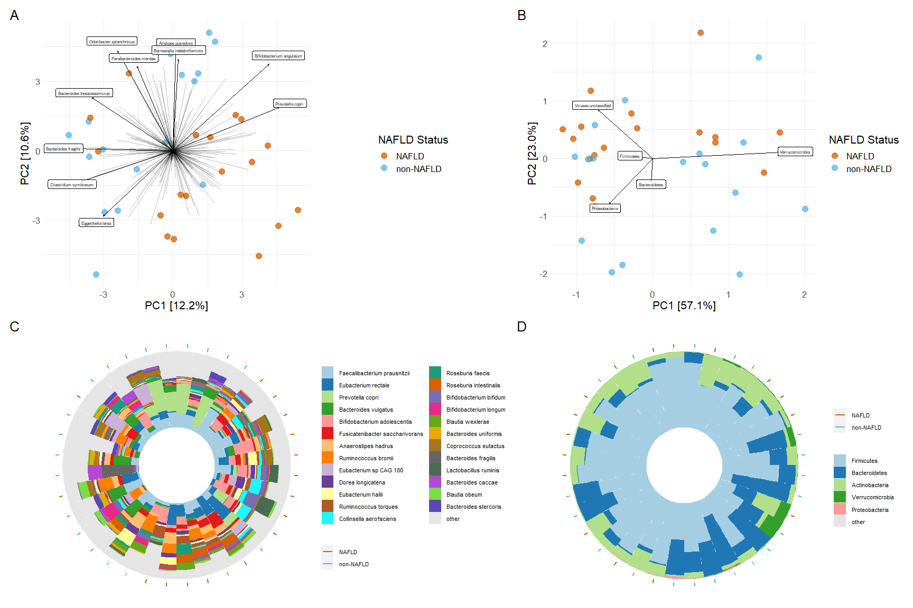<!-- -->

``` r
ggsave("Figure_2.png", plot = Figure_2, width = 18, height = 12)
ggsave("Figure_2.tiff", width = 18, height = 12, compression = "lzw", dpi = 300)
```

ANCOM - Shotgun

``` r
phy_shotgun_species_ANCOM = aggregate_taxa(phy_shotgun, "Species")

ancom_shotgun_species2 = ancombc(phy_shotgun_species_ANCOM, group = "NAFLD", formula = "NAFLD", neg_lb = F, zero_cut = 0.75)
```

    ## Warning in data_prep(phyloseq, group, zero_cut, lib_cut, global = global):
    ## The multi-group comparison will be deactivated as the group variable has < 3
    ## categories.

``` r
res_shotgun_species2 = ancom_shotgun_species2$res
res_shotgun_species2
```

    ## $beta
    ##        NAFLDnon-NAFLD
    ## otu7      -2.07810945
    ## otu11     -4.42267365
    ## otu17     -2.64191900
    ## otu18     -4.13385963
    ## otu19      0.27106940
    ## otu20     -0.14603669
    ## otu22     -0.65659866
    ## otu24     -1.43200627
    ## otu25     -3.27053553
    ## otu37     -1.43177547
    ## otu38     -1.66435955
    ## otu39     -1.15564311
    ## otu40     -2.01412407
    ## otu41     -2.29728007
    ## otu42     -1.17691488
    ## otu43     -1.05113488
    ## otu44     -0.75546374
    ## otu46      0.20711134
    ## otu47     -1.33253399
    ## otu48     -0.52646831
    ## otu49     -1.32842494
    ## otu50     -1.14701967
    ## otu59      4.09860146
    ## otu64      4.11093425
    ## otu70      4.09128574
    ## otu71      5.38616400
    ## otu72      2.35235679
    ## otu73      1.42505573
    ## otu74      1.85812197
    ## otu77      2.23359087
    ## otu83      4.32129874
    ## otu84      2.21319948
    ## otu92      2.51021768
    ## otu94      0.62840101
    ## otu95      3.07136987
    ## otu103     1.53186239
    ## otu107     1.01631096
    ## otu108     1.22855685
    ## otu110     3.19115188
    ## otu113     2.17331067
    ## otu119    -2.87578259
    ## otu141    -1.42415501
    ## otu142    -2.20598058
    ## otu147    -0.08937372
    ## otu154    -2.60543316
    ## otu157    -1.58606005
    ## otu166    -3.99091108
    ## otu169    -1.88878015
    ## otu170    -2.31054314
    ## otu171    -1.68652770
    ## otu175    -2.14458833
    ## otu183    -3.56995261
    ## otu189    -1.47264355
    ## otu190     3.23965468
    ## otu193     2.60834662
    ## otu201     2.56189901
    ## otu202     1.82901917
    ## otu207    -1.92992672
    ## otu208    -2.05510332
    ## otu210    -2.64132833
    ## otu211     0.18907914
    ## otu214     1.59980515
    ## otu216    -2.18170501
    ## otu220    -0.42932654
    ## otu225    -1.78283795
    ## otu227    -0.83401381
    ## otu229    -1.07985721
    ## otu230    -0.93794630
    ## otu231    -1.56290152
    ## otu233    -2.04497332
    ## otu234     0.04971873
    ## otu235    -1.13818404
    ## otu236    -0.99566442
    ## otu237    -1.35712282
    ## otu240     1.19076921
    ## otu241    -1.98505562
    ## otu245     2.83448626
    ## otu246     2.47277996
    ## otu252     3.65137800
    ## otu256    -1.76059324
    ## otu258    -1.27229949
    ## otu259    -1.38886650
    ## otu260    -0.17102382
    ## otu261    -4.33914275
    ## otu262    -1.53797127
    ## otu266    -1.45731679
    ## otu269     2.71334410
    ## otu270     0.27966797
    ## otu274    -1.67564647
    ## otu278    -4.16013602
    ## otu279    -1.75420939
    ## otu281     0.87758560
    ## otu282     2.41217613
    ## otu283     0.20987203
    ## otu284     2.57684979
    ## otu285    -0.08414427
    ## otu288     0.54957502
    ## otu290     1.30052713
    ## otu292    -0.85456051
    ## otu293    -2.91403787
    ## otu294    -0.88410582
    ## otu296     0.68807553
    ## otu302     1.41404039
    ## otu307     2.70513181
    ## otu308     2.81810937
    ## otu310    -0.21084782
    ## otu311    -1.09320963
    ## otu316     2.40264067
    ## otu319    -0.63171878
    ## otu325     2.18559792
    ## otu330     1.42623115
    ## otu338    -0.79865392
    ## otu350    -1.08863226
    ## otu373    -4.04930304
    ## otu374     0.26621154
    ## otu377     1.91696606
    ## otu381    -0.05835881
    ## otu385     0.43740479
    ## otu391     0.83353378
    ## otu409    -2.57543966
    ## 
    ## $se
    ##        NAFLDnon-NAFLD
    ## otu7        1.0077075
    ## otu11       0.9886309
    ## otu17       0.9192226
    ## otu18       1.5913511
    ## otu19       1.8797073
    ## otu20       1.9322844
    ## otu22       1.6354271
    ## otu24       1.1735388
    ## otu25       1.6704669
    ## otu37       1.0143200
    ## otu38       1.1339283
    ## otu39       1.0519983
    ## otu40       1.1338990
    ## otu41       0.9453079
    ## otu42       0.8345451
    ## otu43       1.2431002
    ## otu44       1.3372950
    ## otu46       1.5208073
    ## otu47       1.0826260
    ## otu48       0.8491988
    ## otu49       1.5138662
    ## otu50       1.5586508
    ## otu59       1.7549664
    ## otu64       1.3442046
    ## otu70       1.6712487
    ## otu71       1.3273854
    ## otu72       1.2546358
    ## otu73       0.9160259
    ## otu74       1.5295706
    ## otu77       1.5685701
    ## otu83       1.4166372
    ## otu84       0.9627280
    ## otu92       1.0523909
    ## otu94       1.9248861
    ## otu95       1.1495101
    ## otu103      1.4891789
    ## otu107      1.8240949
    ## otu108      1.3886596
    ## otu110      1.5339937
    ## otu113      1.6468254
    ## otu119      1.1569263
    ## otu141      1.2592887
    ## otu142      1.7902225
    ## otu147      1.1950238
    ## otu154      1.3253351
    ## otu157      1.0796013
    ## otu166      1.2306678
    ## otu169      0.7889719
    ## otu170      1.1341881
    ## otu171      0.9570972
    ## otu175      1.3178848
    ## otu183      1.4410638
    ## otu189      1.4572295
    ## otu190      1.4768458
    ## otu193      1.4077788
    ## otu201      1.0183017
    ## otu202      1.8212855
    ## otu207      1.7185437
    ## otu208      0.7886889
    ## otu210      1.5785440
    ## otu211      2.0130538
    ## otu214      1.5057674
    ## otu216      1.5620133
    ## otu220      0.9320953
    ## otu225      1.1164987
    ## otu227      1.5800522
    ## otu229      0.7609661
    ## otu230      1.7152681
    ## otu231      1.5516140
    ## otu233      1.2223086
    ## otu234      1.5515613
    ## otu235      1.9384286
    ## otu236      0.9408699
    ## otu237      1.0974654
    ## otu240      1.3599436
    ## otu241      0.5555901
    ## otu245      1.2468723
    ## otu246      1.2328840
    ## otu252      1.4466351
    ## otu256      0.6541598
    ## otu258      1.6067941
    ## otu259      1.5344066
    ## otu260      1.2009966
    ## otu261      1.6578329
    ## otu262      0.9257379
    ## otu266      1.0037162
    ## otu269      1.4063255
    ## otu270      1.4865511
    ## otu274      1.0403601
    ## otu278      1.1730434
    ## otu279      1.0371304
    ## otu281      1.4172682
    ## otu282      1.2231840
    ## otu283      0.4001831
    ## otu284      0.8486108
    ## otu285      0.8360713
    ## otu288      1.2233375
    ## otu290      1.5194438
    ## otu292      1.6746911
    ## otu293      2.0479649
    ## otu294      1.4863976
    ## otu296      1.7161773
    ## otu302      0.8749489
    ## otu307      1.4564489
    ## otu308      1.1333178
    ## otu310      1.3406332
    ## otu311      1.4992713
    ## otu316      1.2869608
    ## otu319      1.6617881
    ## otu325      1.5009460
    ## otu330      1.4841549
    ## otu338      1.7832203
    ## otu350      1.2804169
    ## otu373      1.2181694
    ## otu374      1.2959001
    ## otu377      1.2294730
    ## otu381      1.6379713
    ## otu385      1.2809953
    ## otu391      1.8761267
    ## otu409      1.1604377
    ## 
    ## $W
    ##        NAFLDnon-NAFLD
    ## otu7      -2.06221499
    ## otu11     -4.47353349
    ## otu17     -2.87407968
    ## otu18     -2.59770430
    ## otu19      0.14420830
    ## otu20     -0.07557722
    ## otu22     -0.40148452
    ## otu24     -1.22024622
    ## otu25     -1.95785718
    ## otu37     -1.41156196
    ## otu38     -1.46778204
    ## otu39     -1.09852183
    ## otu40     -1.77628170
    ## otu41     -2.43019231
    ## otu42     -1.41024719
    ## otu43     -0.84557536
    ## otu44     -0.56491928
    ## otu46      0.13618513
    ## otu47     -1.23083497
    ## otu48     -0.61995883
    ## otu49     -0.87750483
    ## otu50     -0.73590547
    ## otu59      2.33543011
    ## otu64      3.05826537
    ## otu70      2.44804123
    ## otu71      4.05772426
    ## otu72      1.87493192
    ## otu73      1.55569377
    ## otu74      1.21479973
    ## otu77      1.42396626
    ## otu83      3.05039200
    ## otu84      2.29888338
    ## otu92      2.38525210
    ## otu94      0.32646141
    ## otu95      2.67189473
    ## otu103     1.02866244
    ## otu107     0.55715903
    ## otu108     0.88470697
    ## otu110     2.08029004
    ## otu113     1.31969708
    ## otu119    -2.48570941
    ## otu141    -1.13092014
    ## otu142    -1.23223823
    ## otu147    -0.07478824
    ## otu154    -1.96586742
    ## otu157    -1.46911652
    ## otu166    -3.24288262
    ## otu169    -2.39397631
    ## otu170    -2.03717815
    ## otu171    -1.76212786
    ## otu175    -1.62729580
    ## otu183    -2.47730369
    ## otu189    -1.01057766
    ## otu190     2.19363101
    ## otu193     1.85281003
    ## otu201     2.51585449
    ## otu202     1.00424624
    ## otu207    -1.12300123
    ## otu208    -2.60572116
    ## otu210    -1.67326875
    ## otu211     0.09392652
    ## otu214     1.06245174
    ## otu216    -1.39672629
    ## otu220    -0.46060369
    ## otu225    -1.59681146
    ## otu227    -0.52783939
    ## otu229    -1.41906079
    ## otu230    -0.54682197
    ## otu231    -1.00727473
    ## otu233    -1.67304182
    ## otu234     0.03204432
    ## otu235    -0.58716840
    ## otu236    -1.05823817
    ## otu237    -1.23659736
    ## otu240     0.87560188
    ## otu241    -3.57287817
    ## otu245     2.27327717
    ## otu246     2.00568743
    ## otu252     2.52404914
    ## otu256    -2.69138098
    ## otu258    -0.79182483
    ## otu259    -0.90514896
    ## otu260    -0.14240158
    ## otu261    -2.61735825
    ## otu262    -1.66134629
    ## otu266    -1.45192110
    ## otu269     1.92938560
    ## otu270     0.18813209
    ## otu274    -1.61064083
    ## otu278    -3.54644683
    ## otu279    -1.69140681
    ## otu281     0.61920928
    ## otu282     1.97204683
    ## otu283     0.52443999
    ## otu284     3.03655089
    ## otu285    -0.10064245
    ## otu288     0.44924236
    ## otu290     0.85592316
    ## otu292    -0.51027948
    ## otu293    -1.42289444
    ## otu294    -0.59479765
    ## otu296     0.40093499
    ## otu302     1.61614058
    ## otu307     1.85734750
    ## otu308     2.48660117
    ## otu310    -0.15727481
    ## otu311    -0.72916065
    ## otu316     1.86691054
    ## otu319    -0.38014399
    ## otu325     1.45614696
    ## otu330     0.96097190
    ## otu338    -0.44787171
    ## otu350    -0.85021701
    ## otu373    -3.32408856
    ## otu374     0.20542597
    ## otu377     1.55917703
    ## otu381    -0.03562871
    ## otu385     0.34145697
    ## otu391     0.44428437
    ## otu409    -2.21936917
    ## 
    ## $p_val
    ##        NAFLDnon-NAFLD
    ## otu7     3.918727e-02
    ## otu11    7.693750e-06
    ## otu17    4.052067e-03
    ## otu18    9.384927e-03
    ## otu19    8.853360e-01
    ## otu20    9.397555e-01
    ## otu22    6.880634e-01
    ## otu24    2.223716e-01
    ## otu25    5.024677e-02
    ## otu37    1.580790e-01
    ## otu38    1.421634e-01
    ## otu39    2.719767e-01
    ## otu40    7.568650e-02
    ## otu41    1.509081e-02
    ## otu42    1.584667e-01
    ## otu43    3.977897e-01
    ## otu44    5.721287e-01
    ## otu46    8.916749e-01
    ## otu47    2.183846e-01
    ## otu48    5.352849e-01
    ## otu49    3.802125e-01
    ## otu50    4.617882e-01
    ## otu59    1.952096e-02
    ## otu64    2.226223e-03
    ## otu70    1.436352e-02
    ## otu71    4.955322e-05
    ## otu72    6.080209e-02
    ## otu73    1.197809e-01
    ## otu74    2.244425e-01
    ## otu77    1.544562e-01
    ## otu83    2.285429e-03
    ## otu84    2.151156e-02
    ## otu92    1.706742e-02
    ## otu94    7.440753e-01
    ## otu95    7.542431e-03
    ## otu103   3.036383e-01
    ## otu107   5.774188e-01
    ## otu108   3.763147e-01
    ## otu110   3.749894e-02
    ## otu113   1.869362e-01
    ## otu119   1.292935e-02
    ## otu141   2.580887e-01
    ## otu142   2.178601e-01
    ## otu147   9.403832e-01
    ## otu154   4.931393e-02
    ## otu157   1.418012e-01
    ## otu166   1.183269e-03
    ## otu169   1.666683e-02
    ## otu170   4.163219e-02
    ## otu171   7.804770e-02
    ## otu175   1.036743e-01
    ## otu183   1.323792e-02
    ## otu189   3.122186e-01
    ## otu190   2.826195e-02
    ## otu193   6.390959e-02
    ## otu201   1.187442e-02
    ## otu202   3.152599e-01
    ## otu207   2.614370e-01
    ## otu208   9.168106e-03
    ## otu210   9.427440e-02
    ## otu211   9.251675e-01
    ## otu214   2.880307e-01
    ## otu216   1.624959e-01
    ## otu220   6.450830e-01
    ## otu225   1.103077e-01
    ## otu227   5.976108e-01
    ## otu229   1.558813e-01
    ## otu230   5.845010e-01
    ## otu231   3.138028e-01
    ## otu233   9.431906e-02
    ## otu234   9.744367e-01
    ## otu235   5.570906e-01
    ## otu236   2.899469e-01
    ## otu237   2.162366e-01
    ## otu240   3.812465e-01
    ## otu241   3.530791e-04
    ## otu245   2.300948e-02
    ## otu246   4.488961e-02
    ## otu252   1.160117e-02
    ## otu256   7.115688e-03
    ## otu258   4.284628e-01
    ## otu259   3.653865e-01
    ## otu260   8.867628e-01
    ## otu261   8.861328e-03
    ## otu262   9.664392e-02
    ## otu266   1.465235e-01
    ## otu269   5.368301e-02
    ## otu270   8.507731e-01
    ## otu274   1.072580e-01
    ## otu278   3.904635e-04
    ## otu279   9.075913e-02
    ## otu281   5.357785e-01
    ## otu282   4.860426e-02
    ## otu283   5.999725e-01
    ## otu284   2.393017e-03
    ## otu285   9.198343e-01
    ## otu288   6.532568e-01
    ## otu290   3.920403e-01
    ## otu292   6.098557e-01
    ## otu293   1.547668e-01
    ## otu294   5.519787e-01
    ## otu296   6.884680e-01
    ## otu302   1.060639e-01
    ## otu307   6.326173e-02
    ## otu308   1.289699e-02
    ## otu310   8.750283e-01
    ## otu311   4.659034e-01
    ## otu316   6.191408e-02
    ## otu319   7.038385e-01
    ## otu325   1.453520e-01
    ## otu330   3.365663e-01
    ## otu338   6.542458e-01
    ## otu350   3.952044e-01
    ## otu373   8.870802e-04
    ## otu374   8.372393e-01
    ## otu377   1.189545e-01
    ## otu381   9.715784e-01
    ## otu385   7.327596e-01
    ## otu391   6.568370e-01
    ## otu409   2.646162e-02
    ## 
    ## $q_val
    ##        NAFLDnon-NAFLD
    ## otu7      1.000000000
    ## otu11     0.000923250
    ## otu17     0.449779457
    ## otu18     0.994802301
    ## otu19     1.000000000
    ## otu20     1.000000000
    ## otu22     1.000000000
    ## otu24     1.000000000
    ## otu25     1.000000000
    ## otu37     1.000000000
    ## otu38     1.000000000
    ## otu39     1.000000000
    ## otu40     1.000000000
    ## otu41     1.000000000
    ## otu42     1.000000000
    ## otu43     1.000000000
    ## otu44     1.000000000
    ## otu46     1.000000000
    ## otu47     1.000000000
    ## otu48     1.000000000
    ## otu49     1.000000000
    ## otu50     1.000000000
    ## otu59     1.000000000
    ## otu64     0.253789466
    ## otu70     1.000000000
    ## otu71     0.005896834
    ## otu72     1.000000000
    ## otu73     1.000000000
    ## otu74     1.000000000
    ## otu77     1.000000000
    ## otu83     0.258253427
    ## otu84     1.000000000
    ## otu92     1.000000000
    ## otu94     1.000000000
    ## otu95     0.822124931
    ## otu103    1.000000000
    ## otu107    1.000000000
    ## otu108    1.000000000
    ## otu110    1.000000000
    ## otu113    1.000000000
    ## otu119    1.000000000
    ## otu141    1.000000000
    ## otu142    1.000000000
    ## otu147    1.000000000
    ## otu154    1.000000000
    ## otu157    1.000000000
    ## otu166    0.136075990
    ## otu169    1.000000000
    ## otu170    1.000000000
    ## otu171    1.000000000
    ## otu175    1.000000000
    ## otu183    1.000000000
    ## otu189    1.000000000
    ## otu190    1.000000000
    ## otu193    1.000000000
    ## otu201    1.000000000
    ## otu202    1.000000000
    ## otu207    1.000000000
    ## otu208    0.980987394
    ## otu210    1.000000000
    ## otu211    1.000000000
    ## otu214    1.000000000
    ## otu216    1.000000000
    ## otu220    1.000000000
    ## otu225    1.000000000
    ## otu227    1.000000000
    ## otu229    1.000000000
    ## otu230    1.000000000
    ## otu231    1.000000000
    ## otu233    1.000000000
    ## otu234    1.000000000
    ## otu235    1.000000000
    ## otu236    1.000000000
    ## otu237    1.000000000
    ## otu240    1.000000000
    ## otu241    0.041663329
    ## otu245    1.000000000
    ## otu246    1.000000000
    ## otu252    1.000000000
    ## otu256    0.782725707
    ## otu258    1.000000000
    ## otu259    1.000000000
    ## otu260    1.000000000
    ## otu261    0.957023462
    ## otu262    1.000000000
    ## otu266    1.000000000
    ## otu269    1.000000000
    ## otu270    1.000000000
    ## otu274    1.000000000
    ## otu278    0.045684233
    ## otu279    1.000000000
    ## otu281    1.000000000
    ## otu282    1.000000000
    ## otu283    1.000000000
    ## otu284    0.268017918
    ## otu285    1.000000000
    ## otu288    1.000000000
    ## otu290    1.000000000
    ## otu292    1.000000000
    ## otu293    1.000000000
    ## otu294    1.000000000
    ## otu296    1.000000000
    ## otu302    1.000000000
    ## otu307    1.000000000
    ## otu308    1.000000000
    ## otu310    1.000000000
    ## otu311    1.000000000
    ## otu316    1.000000000
    ## otu319    1.000000000
    ## otu325    1.000000000
    ## otu330    1.000000000
    ## otu338    1.000000000
    ## otu350    1.000000000
    ## otu373    0.102901304
    ## otu374    1.000000000
    ## otu377    1.000000000
    ## otu381    1.000000000
    ## otu385    1.000000000
    ## otu391    1.000000000
    ## otu409    1.000000000
    ## 
    ## $diff_abn
    ##        NAFLDnon-NAFLD
    ## otu7            FALSE
    ## otu11            TRUE
    ## otu17           FALSE
    ## otu18           FALSE
    ## otu19           FALSE
    ## otu20           FALSE
    ## otu22           FALSE
    ## otu24           FALSE
    ## otu25           FALSE
    ## otu37           FALSE
    ## otu38           FALSE
    ## otu39           FALSE
    ## otu40           FALSE
    ## otu41           FALSE
    ## otu42           FALSE
    ## otu43           FALSE
    ## otu44           FALSE
    ## otu46           FALSE
    ## otu47           FALSE
    ## otu48           FALSE
    ## otu49           FALSE
    ## otu50           FALSE
    ## otu59           FALSE
    ## otu64           FALSE
    ## otu70           FALSE
    ## otu71            TRUE
    ## otu72           FALSE
    ## otu73           FALSE
    ## otu74           FALSE
    ## otu77           FALSE
    ## otu83           FALSE
    ## otu84           FALSE
    ## otu92           FALSE
    ## otu94           FALSE
    ## otu95           FALSE
    ## otu103          FALSE
    ## otu107          FALSE
    ## otu108          FALSE
    ## otu110          FALSE
    ## otu113          FALSE
    ## otu119          FALSE
    ## otu141          FALSE
    ## otu142          FALSE
    ## otu147          FALSE
    ## otu154          FALSE
    ## otu157          FALSE
    ## otu166          FALSE
    ## otu169          FALSE
    ## otu170          FALSE
    ## otu171          FALSE
    ## otu175          FALSE
    ## otu183          FALSE
    ## otu189          FALSE
    ## otu190          FALSE
    ## otu193          FALSE
    ## otu201          FALSE
    ## otu202          FALSE
    ## otu207          FALSE
    ## otu208          FALSE
    ## otu210          FALSE
    ## otu211          FALSE
    ## otu214          FALSE
    ## otu216          FALSE
    ## otu220          FALSE
    ## otu225          FALSE
    ## otu227          FALSE
    ## otu229          FALSE
    ## otu230          FALSE
    ## otu231          FALSE
    ## otu233          FALSE
    ## otu234          FALSE
    ## otu235          FALSE
    ## otu236          FALSE
    ## otu237          FALSE
    ## otu240          FALSE
    ## otu241           TRUE
    ## otu245          FALSE
    ## otu246          FALSE
    ## otu252          FALSE
    ## otu256          FALSE
    ## otu258          FALSE
    ## otu259          FALSE
    ## otu260          FALSE
    ## otu261          FALSE
    ## otu262          FALSE
    ## otu266          FALSE
    ## otu269          FALSE
    ## otu270          FALSE
    ## otu274          FALSE
    ## otu278           TRUE
    ## otu279          FALSE
    ## otu281          FALSE
    ## otu282          FALSE
    ## otu283          FALSE
    ## otu284          FALSE
    ## otu285          FALSE
    ## otu288          FALSE
    ## otu290          FALSE
    ## otu292          FALSE
    ## otu293          FALSE
    ## otu294          FALSE
    ## otu296          FALSE
    ## otu302          FALSE
    ## otu307          FALSE
    ## otu308          FALSE
    ## otu310          FALSE
    ## otu311          FALSE
    ## otu316          FALSE
    ## otu319          FALSE
    ## otu325          FALSE
    ## otu330          FALSE
    ## otu338          FALSE
    ## otu350          FALSE
    ## otu373          FALSE
    ## otu374          FALSE
    ## otu377          FALSE
    ## otu381          FALSE
    ## otu385          FALSE
    ## otu391          FALSE
    ## otu409          FALSE

``` r
phy_shotgun@tax_table %>% as.data.frame()
```

    ##        SuperKingdom               Phylum                       Class
    ## otu1        Archaea        Euryarchaeota             Methanobacteria
    ## otu2       Bacteria       Actinobacteria              Actinobacteria
    ## otu3       Bacteria       Actinobacteria              Actinobacteria
    ## otu4       Bacteria       Actinobacteria              Actinobacteria
    ## otu5       Bacteria       Actinobacteria              Actinobacteria
    ## otu6       Bacteria       Actinobacteria              Actinobacteria
    ## otu7       Bacteria       Actinobacteria              Actinobacteria
    ## otu8       Bacteria       Actinobacteria              Actinobacteria
    ## otu9       Bacteria       Actinobacteria              Actinobacteria
    ## otu10      Bacteria       Actinobacteria              Actinobacteria
    ## otu11      Bacteria       Actinobacteria              Actinobacteria
    ## otu12      Bacteria       Actinobacteria              Actinobacteria
    ## otu13      Bacteria       Actinobacteria              Actinobacteria
    ## otu14      Bacteria       Actinobacteria              Actinobacteria
    ## otu15      Bacteria       Actinobacteria              Actinobacteria
    ## otu16      Bacteria       Actinobacteria              Actinobacteria
    ## otu17      Bacteria       Actinobacteria              Actinobacteria
    ## otu18      Bacteria       Actinobacteria              Actinobacteria
    ## otu19      Bacteria       Actinobacteria              Actinobacteria
    ## otu20      Bacteria       Actinobacteria              Actinobacteria
    ## otu21      Bacteria       Actinobacteria              Actinobacteria
    ## otu22      Bacteria       Actinobacteria              Actinobacteria
    ## otu23      Bacteria       Actinobacteria              Actinobacteria
    ## otu24      Bacteria       Actinobacteria              Actinobacteria
    ## otu25      Bacteria       Actinobacteria              Actinobacteria
    ## otu26      Bacteria       Actinobacteria              Actinobacteria
    ## otu27      Bacteria       Actinobacteria              Actinobacteria
    ## otu28      Bacteria       Actinobacteria              Actinobacteria
    ## otu29      Bacteria       Actinobacteria              Actinobacteria
    ## otu30      Bacteria       Actinobacteria              Actinobacteria
    ## otu31      Bacteria       Actinobacteria              Actinobacteria
    ## otu32      Bacteria       Actinobacteria              Actinobacteria
    ## otu33      Bacteria       Actinobacteria              Coriobacteriia
    ## otu34      Bacteria       Actinobacteria              Coriobacteriia
    ## otu35      Bacteria       Actinobacteria              Coriobacteriia
    ## otu36      Bacteria       Actinobacteria              Coriobacteriia
    ## otu37      Bacteria       Actinobacteria              Coriobacteriia
    ## otu38      Bacteria       Actinobacteria              Coriobacteriia
    ## otu39      Bacteria       Actinobacteria              Coriobacteriia
    ## otu40      Bacteria       Actinobacteria              Coriobacteriia
    ## otu41      Bacteria       Actinobacteria              Coriobacteriia
    ## otu42      Bacteria       Actinobacteria              Coriobacteriia
    ## otu43      Bacteria       Actinobacteria              Coriobacteriia
    ## otu44      Bacteria       Actinobacteria              Coriobacteriia
    ## otu45      Bacteria       Actinobacteria              Coriobacteriia
    ## otu46      Bacteria       Actinobacteria              Coriobacteriia
    ## otu47      Bacteria       Actinobacteria              Coriobacteriia
    ## otu48      Bacteria       Actinobacteria              Coriobacteriia
    ## otu49      Bacteria       Actinobacteria              Coriobacteriia
    ## otu50      Bacteria        Bacteroidetes                 Bacteroidia
    ## otu51      Bacteria        Bacteroidetes                 Bacteroidia
    ## otu52      Bacteria        Bacteroidetes                 Bacteroidia
    ## otu53      Bacteria        Bacteroidetes                 Bacteroidia
    ## otu54      Bacteria        Bacteroidetes                 Bacteroidia
    ## otu55      Bacteria        Bacteroidetes                 Bacteroidia
    ## otu56      Bacteria        Bacteroidetes                 Bacteroidia
    ## otu57      Bacteria        Bacteroidetes                 Bacteroidia
    ## otu58      Bacteria        Bacteroidetes                 Bacteroidia
    ## otu59      Bacteria        Bacteroidetes                 Bacteroidia
    ## otu60      Bacteria        Bacteroidetes                 Bacteroidia
    ## otu61      Bacteria        Bacteroidetes                 Bacteroidia
    ## otu62      Bacteria        Bacteroidetes                 Bacteroidia
    ## otu63      Bacteria        Bacteroidetes                 Bacteroidia
    ## otu64      Bacteria        Bacteroidetes                 Bacteroidia
    ## otu65      Bacteria        Bacteroidetes                 Bacteroidia
    ## otu66      Bacteria        Bacteroidetes                 Bacteroidia
    ## otu67      Bacteria        Bacteroidetes                 Bacteroidia
    ## otu68      Bacteria        Bacteroidetes                 Bacteroidia
    ## otu69      Bacteria        Bacteroidetes                 Bacteroidia
    ## otu70      Bacteria        Bacteroidetes                 Bacteroidia
    ## otu71      Bacteria        Bacteroidetes                 Bacteroidia
    ## otu72      Bacteria        Bacteroidetes                 Bacteroidia
    ## otu73      Bacteria        Bacteroidetes                 Bacteroidia
    ## otu74      Bacteria        Bacteroidetes                 Bacteroidia
    ## otu75      Bacteria        Bacteroidetes                 Bacteroidia
    ## otu76      Bacteria        Bacteroidetes                 Bacteroidia
    ## otu77      Bacteria        Bacteroidetes                 Bacteroidia
    ## otu78      Bacteria        Bacteroidetes                 Bacteroidia
    ## otu79      Bacteria        Bacteroidetes                 Bacteroidia
    ## otu80      Bacteria        Bacteroidetes                 Bacteroidia
    ## otu81      Bacteria        Bacteroidetes                 Bacteroidia
    ## otu82      Bacteria        Bacteroidetes                 Bacteroidia
    ## otu83      Bacteria        Bacteroidetes                 Bacteroidia
    ## otu84      Bacteria        Bacteroidetes                 Bacteroidia
    ## otu85      Bacteria        Bacteroidetes                 Bacteroidia
    ## otu86      Bacteria        Bacteroidetes                 Bacteroidia
    ## otu87      Bacteria        Bacteroidetes                 Bacteroidia
    ## otu88      Bacteria        Bacteroidetes                 Bacteroidia
    ## otu89      Bacteria        Bacteroidetes                 Bacteroidia
    ## otu90      Bacteria        Bacteroidetes                 Bacteroidia
    ## otu91      Bacteria        Bacteroidetes                 Bacteroidia
    ## otu92      Bacteria        Bacteroidetes                 Bacteroidia
    ## otu93      Bacteria        Bacteroidetes                 Bacteroidia
    ## otu94      Bacteria        Bacteroidetes                 Bacteroidia
    ## otu95      Bacteria        Bacteroidetes                 Bacteroidia
    ## otu96      Bacteria        Bacteroidetes                 Bacteroidia
    ## otu97      Bacteria        Bacteroidetes                 Bacteroidia
    ## otu98      Bacteria        Bacteroidetes                 Bacteroidia
    ## otu99      Bacteria        Bacteroidetes                 Bacteroidia
    ## otu100     Bacteria        Bacteroidetes                 Bacteroidia
    ## otu101     Bacteria        Bacteroidetes                 Bacteroidia
    ## otu102     Bacteria        Bacteroidetes                 Bacteroidia
    ## otu103     Bacteria        Bacteroidetes                 Bacteroidia
    ## otu104     Bacteria        Bacteroidetes                 Bacteroidia
    ## otu105     Bacteria        Bacteroidetes                 Bacteroidia
    ## otu106     Bacteria        Bacteroidetes                 Bacteroidia
    ## otu107     Bacteria        Bacteroidetes                 Bacteroidia
    ## otu108     Bacteria        Bacteroidetes                 Bacteroidia
    ## otu109     Bacteria        Bacteroidetes                 Bacteroidia
    ## otu110     Bacteria        Bacteroidetes                 Bacteroidia
    ## otu111     Bacteria        Bacteroidetes                 Bacteroidia
    ## otu112     Bacteria        Bacteroidetes                 Bacteroidia
    ## otu113     Bacteria        Bacteroidetes                 Bacteroidia
    ## otu114     Bacteria           Firmicutes                     Bacilli
    ## otu115     Bacteria           Firmicutes                     Bacilli
    ## otu116     Bacteria           Firmicutes                     Bacilli
    ## otu117     Bacteria           Firmicutes                     Bacilli
    ## otu118     Bacteria           Firmicutes                     Bacilli
    ## otu119     Bacteria           Firmicutes                     Bacilli
    ## otu120     Bacteria           Firmicutes                     Bacilli
    ## otu121     Bacteria           Firmicutes                     Bacilli
    ## otu122     Bacteria           Firmicutes                     Bacilli
    ## otu123     Bacteria           Firmicutes                     Bacilli
    ## otu124     Bacteria           Firmicutes                     Bacilli
    ## otu125     Bacteria           Firmicutes                     Bacilli
    ## otu126     Bacteria           Firmicutes                     Bacilli
    ## otu127     Bacteria           Firmicutes                     Bacilli
    ## otu128     Bacteria           Firmicutes                     Bacilli
    ## otu129     Bacteria           Firmicutes                     Bacilli
    ## otu130     Bacteria           Firmicutes                     Bacilli
    ## otu131     Bacteria           Firmicutes                     Bacilli
    ## otu132     Bacteria           Firmicutes                     Bacilli
    ## otu133     Bacteria           Firmicutes                     Bacilli
    ## otu134     Bacteria           Firmicutes                     Bacilli
    ## otu135     Bacteria           Firmicutes                     Bacilli
    ## otu136     Bacteria           Firmicutes                     Bacilli
    ## otu137     Bacteria           Firmicutes                     Bacilli
    ## otu138     Bacteria           Firmicutes                     Bacilli
    ## otu139     Bacteria           Firmicutes                     Bacilli
    ## otu140     Bacteria           Firmicutes                     Bacilli
    ## otu141     Bacteria           Firmicutes                     Bacilli
    ## otu142     Bacteria           Firmicutes                     Bacilli
    ## otu143     Bacteria           Firmicutes                     Bacilli
    ## otu144     Bacteria           Firmicutes                     Bacilli
    ## otu145     Bacteria           Firmicutes                     Bacilli
    ## otu146     Bacteria           Firmicutes                     Bacilli
    ## otu147     Bacteria           Firmicutes                     Bacilli
    ## otu148     Bacteria           Firmicutes                     Bacilli
    ## otu149     Bacteria           Firmicutes                     Bacilli
    ## otu150     Bacteria           Firmicutes                     Bacilli
    ## otu151     Bacteria           Firmicutes                     Bacilli
    ## otu152     Bacteria           Firmicutes                     Bacilli
    ## otu153     Bacteria           Firmicutes                     Bacilli
    ## otu154     Bacteria           Firmicutes                     Bacilli
    ## otu155     Bacteria           Firmicutes                     Bacilli
    ## otu156     Bacteria           Firmicutes                     Bacilli
    ## otu157     Bacteria           Firmicutes                     Bacilli
    ## otu158     Bacteria           Firmicutes                     Bacilli
    ## otu159     Bacteria           Firmicutes                     Bacilli
    ## otu160     Bacteria           Firmicutes                     Bacilli
    ## otu161     Bacteria           Firmicutes                     Bacilli
    ## otu162     Bacteria           Firmicutes                     Bacilli
    ## otu163     Bacteria           Firmicutes                     Bacilli
    ## otu164     Bacteria           Firmicutes                     Bacilli
    ## otu165     Bacteria           Firmicutes                     Bacilli
    ## otu166     Bacteria           Firmicutes                     Bacilli
    ## otu167     Bacteria           Firmicutes                     Bacilli
    ## otu168     Bacteria           Firmicutes                     Bacilli
    ## otu169     Bacteria           Firmicutes                     Bacilli
    ## otu170     Bacteria           Firmicutes                     Bacilli
    ## otu171     Bacteria           Firmicutes                     Bacilli
    ## otu172     Bacteria           Firmicutes                     Bacilli
    ## otu173     Bacteria           Firmicutes                     Bacilli
    ## otu174     Bacteria           Firmicutes                     Bacilli
    ## otu175     Bacteria           Firmicutes                     Bacilli
    ## otu176     Bacteria           Firmicutes                     Bacilli
    ## otu177     Bacteria           Firmicutes                  Clostridia
    ## otu178     Bacteria           Firmicutes                  Clostridia
    ## otu179     Bacteria           Firmicutes                  Clostridia
    ## otu180     Bacteria           Firmicutes                  Clostridia
    ## otu181     Bacteria           Firmicutes                  Clostridia
    ## otu182     Bacteria           Firmicutes                  Clostridia
    ## otu183     Bacteria           Firmicutes                  Clostridia
    ## otu184     Bacteria           Firmicutes                  Clostridia
    ## otu185     Bacteria           Firmicutes                  Clostridia
    ## otu186     Bacteria           Firmicutes                  Clostridia
    ## otu187     Bacteria           Firmicutes                  Clostridia
    ## otu188     Bacteria           Firmicutes                  Clostridia
    ## otu189     Bacteria           Firmicutes                  Clostridia
    ## otu190     Bacteria           Firmicutes                  Clostridia
    ## otu191     Bacteria           Firmicutes                  Clostridia
    ## otu192     Bacteria           Firmicutes                  Clostridia
    ## otu193     Bacteria           Firmicutes                  Clostridia
    ## otu194     Bacteria           Firmicutes                  Clostridia
    ## otu195     Bacteria           Firmicutes                  Clostridia
    ## otu196     Bacteria           Firmicutes                  Clostridia
    ## otu197     Bacteria           Firmicutes                  Clostridia
    ## otu198     Bacteria           Firmicutes                  Clostridia
    ## otu199     Bacteria           Firmicutes                  Clostridia
    ## otu200     Bacteria           Firmicutes                  Clostridia
    ## otu201     Bacteria           Firmicutes                  Clostridia
    ## otu202     Bacteria           Firmicutes                  Clostridia
    ## otu203     Bacteria           Firmicutes                  Clostridia
    ## otu204     Bacteria           Firmicutes                  Clostridia
    ## otu205     Bacteria           Firmicutes                  Clostridia
    ## otu206     Bacteria           Firmicutes                  Clostridia
    ## otu207     Bacteria           Firmicutes                  Clostridia
    ## otu208     Bacteria           Firmicutes                  Clostridia
    ## otu209     Bacteria           Firmicutes                  Clostridia
    ## otu210     Bacteria           Firmicutes                  Clostridia
    ## otu211     Bacteria           Firmicutes                  Clostridia
    ## otu212     Bacteria           Firmicutes                  Clostridia
    ## otu213     Bacteria           Firmicutes                  Clostridia
    ## otu214     Bacteria           Firmicutes                  Clostridia
    ## otu215     Bacteria           Firmicutes                  Clostridia
    ## otu216     Bacteria           Firmicutes                  Clostridia
    ## otu217     Bacteria           Firmicutes                  Clostridia
    ## otu218     Bacteria           Firmicutes                  Clostridia
    ## otu219     Bacteria           Firmicutes                  Clostridia
    ## otu220     Bacteria           Firmicutes                  Clostridia
    ## otu221     Bacteria           Firmicutes                  Clostridia
    ## otu222     Bacteria           Firmicutes                  Clostridia
    ## otu223     Bacteria           Firmicutes                  Clostridia
    ## otu224     Bacteria           Firmicutes                  Clostridia
    ## otu225     Bacteria           Firmicutes                  Clostridia
    ## otu226     Bacteria           Firmicutes                  Clostridia
    ## otu227     Bacteria           Firmicutes                  Clostridia
    ## otu228     Bacteria           Firmicutes                  Clostridia
    ## otu229     Bacteria           Firmicutes                  Clostridia
    ## otu230     Bacteria           Firmicutes                  Clostridia
    ## otu231     Bacteria           Firmicutes                  Clostridia
    ## otu232     Bacteria           Firmicutes                  Clostridia
    ## otu233     Bacteria           Firmicutes                  Clostridia
    ## otu234     Bacteria           Firmicutes                  Clostridia
    ## otu235     Bacteria           Firmicutes                  Clostridia
    ## otu236     Bacteria           Firmicutes                  Clostridia
    ## otu237     Bacteria           Firmicutes                  Clostridia
    ## otu238     Bacteria           Firmicutes                  Clostridia
    ## otu239     Bacteria           Firmicutes                  Clostridia
    ## otu240     Bacteria           Firmicutes                  Clostridia
    ## otu241     Bacteria           Firmicutes                  Clostridia
    ## otu242     Bacteria           Firmicutes                  Clostridia
    ## otu243     Bacteria           Firmicutes                  Clostridia
    ## otu244     Bacteria           Firmicutes                  Clostridia
    ## otu245     Bacteria           Firmicutes                  Clostridia
    ## otu246     Bacteria           Firmicutes                  Clostridia
    ## otu247     Bacteria           Firmicutes                  Clostridia
    ## otu248     Bacteria           Firmicutes                  Clostridia
    ## otu249     Bacteria           Firmicutes                  Clostridia
    ## otu250     Bacteria           Firmicutes                  Clostridia
    ## otu251     Bacteria           Firmicutes                  Clostridia
    ## otu252     Bacteria           Firmicutes                  Clostridia
    ## otu253     Bacteria           Firmicutes                  Clostridia
    ## otu254     Bacteria           Firmicutes                  Clostridia
    ## otu255     Bacteria           Firmicutes                  Clostridia
    ## otu256     Bacteria           Firmicutes                  Clostridia
    ## otu257     Bacteria           Firmicutes                  Clostridia
    ## otu258     Bacteria           Firmicutes                  Clostridia
    ## otu259     Bacteria           Firmicutes                  Clostridia
    ## otu260     Bacteria           Firmicutes                  Clostridia
    ## otu261     Bacteria           Firmicutes                  Clostridia
    ## otu262     Bacteria           Firmicutes                  Clostridia
    ## otu263     Bacteria           Firmicutes                  Clostridia
    ## otu264     Bacteria           Firmicutes                  Clostridia
    ## otu265     Bacteria           Firmicutes                  Clostridia
    ## otu266     Bacteria           Firmicutes                  Clostridia
    ## otu267     Bacteria           Firmicutes                  Clostridia
    ## otu268     Bacteria           Firmicutes                  Clostridia
    ## otu269     Bacteria           Firmicutes                  Clostridia
    ## otu270     Bacteria           Firmicutes                  Clostridia
    ## otu271     Bacteria           Firmicutes                  Clostridia
    ## otu272     Bacteria           Firmicutes                  Clostridia
    ## otu273     Bacteria           Firmicutes                  Clostridia
    ## otu274     Bacteria           Firmicutes                  Clostridia
    ## otu275     Bacteria           Firmicutes                  Clostridia
    ## otu276     Bacteria           Firmicutes                  Clostridia
    ## otu277     Bacteria           Firmicutes                  Clostridia
    ## otu278     Bacteria           Firmicutes                  Clostridia
    ## otu279     Bacteria           Firmicutes                  Clostridia
    ## otu280     Bacteria           Firmicutes                  Clostridia
    ## otu281     Bacteria           Firmicutes                  Clostridia
    ## otu282     Bacteria           Firmicutes                  Clostridia
    ## otu283     Bacteria           Firmicutes                  Clostridia
    ## otu284     Bacteria           Firmicutes                  Clostridia
    ## otu285     Bacteria           Firmicutes                  Clostridia
    ## otu286     Bacteria           Firmicutes                  Clostridia
    ## otu287     Bacteria           Firmicutes                  Clostridia
    ## otu288     Bacteria           Firmicutes                  Clostridia
    ## otu289     Bacteria           Firmicutes                  Clostridia
    ## otu290     Bacteria           Firmicutes                  Clostridia
    ## otu291     Bacteria           Firmicutes                  Clostridia
    ## otu292     Bacteria           Firmicutes                  Clostridia
    ## otu293     Bacteria           Firmicutes                  Clostridia
    ## otu294     Bacteria           Firmicutes                  Clostridia
    ## otu295     Bacteria           Firmicutes                  Clostridia
    ## otu296     Bacteria           Firmicutes                  Clostridia
    ## otu297     Bacteria           Firmicutes                  Clostridia
    ## otu298     Bacteria           Firmicutes                  Clostridia
    ## otu299     Bacteria           Firmicutes                  Clostridia
    ## otu300     Bacteria           Firmicutes                  Clostridia
    ## otu301     Bacteria           Firmicutes                  Clostridia
    ## otu302     Bacteria           Firmicutes                  Clostridia
    ## otu303     Bacteria           Firmicutes            Erysipelotrichia
    ## otu304     Bacteria           Firmicutes            Erysipelotrichia
    ## otu305     Bacteria           Firmicutes            Erysipelotrichia
    ## otu306     Bacteria           Firmicutes            Erysipelotrichia
    ## otu307     Bacteria           Firmicutes            Erysipelotrichia
    ## otu308     Bacteria           Firmicutes            Erysipelotrichia
    ## otu309     Bacteria           Firmicutes            Erysipelotrichia
    ## otu310     Bacteria           Firmicutes            Erysipelotrichia
    ## otu311     Bacteria           Firmicutes            Erysipelotrichia
    ## otu312     Bacteria           Firmicutes            Erysipelotrichia
    ## otu313     Bacteria           Firmicutes            Erysipelotrichia
    ## otu314     Bacteria           Firmicutes            Erysipelotrichia
    ## otu315     Bacteria           Firmicutes            Erysipelotrichia
    ## otu316     Bacteria           Firmicutes            Erysipelotrichia
    ## otu317     Bacteria           Firmicutes            Erysipelotrichia
    ## otu318     Bacteria           Firmicutes            Erysipelotrichia
    ## otu319     Bacteria           Firmicutes            Erysipelotrichia
    ## otu320     Bacteria           Firmicutes     Firmicutes unclassified
    ## otu321     Bacteria           Firmicutes     Firmicutes unclassified
    ## otu322     Bacteria           Firmicutes     Firmicutes unclassified
    ## otu323     Bacteria           Firmicutes     Firmicutes unclassified
    ## otu324     Bacteria           Firmicutes     Firmicutes unclassified
    ## otu325     Bacteria           Firmicutes     Firmicutes unclassified
    ## otu326     Bacteria           Firmicutes     Firmicutes unclassified
    ## otu327     Bacteria           Firmicutes     Firmicutes unclassified
    ## otu328     Bacteria           Firmicutes               Negativicutes
    ## otu329     Bacteria           Firmicutes               Negativicutes
    ## otu330     Bacteria           Firmicutes               Negativicutes
    ## otu331     Bacteria           Firmicutes               Negativicutes
    ## otu332     Bacteria           Firmicutes               Negativicutes
    ## otu333     Bacteria           Firmicutes               Negativicutes
    ## otu334     Bacteria           Firmicutes               Negativicutes
    ## otu335     Bacteria           Firmicutes               Negativicutes
    ## otu336     Bacteria           Firmicutes               Negativicutes
    ## otu337     Bacteria           Firmicutes               Negativicutes
    ## otu338     Bacteria           Firmicutes               Negativicutes
    ## otu339     Bacteria           Firmicutes               Negativicutes
    ## otu340     Bacteria           Firmicutes               Negativicutes
    ## otu341     Bacteria           Firmicutes               Negativicutes
    ## otu342     Bacteria           Firmicutes               Negativicutes
    ## otu343     Bacteria           Firmicutes               Negativicutes
    ## otu344     Bacteria           Firmicutes               Negativicutes
    ## otu345     Bacteria           Firmicutes               Negativicutes
    ## otu346     Bacteria           Firmicutes               Negativicutes
    ## otu347     Bacteria           Firmicutes               Negativicutes
    ## otu348     Bacteria           Firmicutes               Negativicutes
    ## otu349     Bacteria           Firmicutes               Negativicutes
    ## otu350     Bacteria           Firmicutes               Negativicutes
    ## otu351     Bacteria           Firmicutes               Negativicutes
    ## otu352     Bacteria           Firmicutes               Negativicutes
    ## otu353     Bacteria           Firmicutes               Negativicutes
    ## otu354     Bacteria           Firmicutes               Negativicutes
    ## otu355     Bacteria           Firmicutes                Tissierellia
    ## otu356     Bacteria           Firmicutes                Tissierellia
    ## otu357     Bacteria           Firmicutes                Tissierellia
    ## otu358     Bacteria           Firmicutes                Tissierellia
    ## otu359     Bacteria           Firmicutes                Tissierellia
    ## otu360     Bacteria           Firmicutes                Tissierellia
    ## otu361     Bacteria           Firmicutes                Tissierellia
    ## otu362     Bacteria           Firmicutes                Tissierellia
    ## otu363     Bacteria           Firmicutes                Tissierellia
    ## otu364     Bacteria           Firmicutes                Tissierellia
    ## otu365     Bacteria           Firmicutes                Tissierellia
    ## otu366     Bacteria         Fusobacteria               Fusobacteriia
    ## otu367     Bacteria         Fusobacteria               Fusobacteriia
    ## otu368     Bacteria         Fusobacteria               Fusobacteriia
    ## otu369     Bacteria         Fusobacteria               Fusobacteriia
    ## otu370     Bacteria        Lentisphaerae               Lentisphaeria
    ## otu371     Bacteria       Proteobacteria         Alphaproteobacteria
    ## otu372     Bacteria       Proteobacteria          Betaproteobacteria
    ## otu373     Bacteria       Proteobacteria          Betaproteobacteria
    ## otu374     Bacteria       Proteobacteria          Betaproteobacteria
    ## otu375     Bacteria       Proteobacteria          Betaproteobacteria
    ## otu376     Bacteria       Proteobacteria          Betaproteobacteria
    ## otu377     Bacteria       Proteobacteria         Deltaproteobacteria
    ## otu378     Bacteria       Proteobacteria         Deltaproteobacteria
    ## otu379     Bacteria       Proteobacteria       Epsilonproteobacteria
    ## otu380     Bacteria       Proteobacteria       Epsilonproteobacteria
    ## otu381     Bacteria       Proteobacteria         Gammaproteobacteria
    ## otu382     Bacteria       Proteobacteria         Gammaproteobacteria
    ## otu383     Bacteria       Proteobacteria         Gammaproteobacteria
    ## otu384     Bacteria       Proteobacteria         Gammaproteobacteria
    ## otu385     Bacteria       Proteobacteria         Gammaproteobacteria
    ## otu386     Bacteria       Proteobacteria         Gammaproteobacteria
    ## otu387     Bacteria       Proteobacteria         Gammaproteobacteria
    ## otu388     Bacteria       Proteobacteria         Gammaproteobacteria
    ## otu389     Bacteria       Proteobacteria Proteobacteria unclassified
    ## otu390     Bacteria        Synergistetes                 Synergistia
    ## otu391     Bacteria      Verrucomicrobia            Verrucomicrobiae
    ## otu392    Eukaryota           Ascomycota             Saccharomycetes
    ## otu393      Viruses Viruses unclassified        Viruses unclassified
    ## otu394      Viruses Viruses unclassified        Viruses unclassified
    ## otu395      Viruses Viruses unclassified        Viruses unclassified
    ## otu396      Viruses Viruses unclassified        Viruses unclassified
    ## otu397      Viruses Viruses unclassified        Viruses unclassified
    ## otu398      Viruses Viruses unclassified        Viruses unclassified
    ## otu399      Viruses Viruses unclassified        Viruses unclassified
    ## otu400      Viruses Viruses unclassified        Viruses unclassified
    ## otu401      Viruses Viruses unclassified        Viruses unclassified
    ## otu402      Viruses Viruses unclassified        Viruses unclassified
    ## otu403      Viruses Viruses unclassified        Viruses unclassified
    ## otu404      Viruses Viruses unclassified        Viruses unclassified
    ## otu405      Viruses Viruses unclassified        Viruses unclassified
    ## otu406      Viruses Viruses unclassified        Viruses unclassified
    ## otu407      Viruses Viruses unclassified        Viruses unclassified
    ## otu408      Viruses Viruses unclassified        Viruses unclassified
    ## otu409      Viruses Viruses unclassified        Viruses unclassified
    ## otu410      Viruses Viruses unclassified        Viruses unclassified
    ## otu411      Viruses Viruses unclassified        Viruses unclassified
    ## otu412      Viruses Viruses unclassified        Viruses unclassified
    ## otu413      Viruses Viruses unclassified        Viruses unclassified
    ## otu414      Viruses Viruses unclassified        Viruses unclassified
    ## otu415      Viruses Viruses unclassified        Viruses unclassified
    ## otu416      Viruses Viruses unclassified        Viruses unclassified
    ## otu417      Viruses Viruses unclassified        Viruses unclassified
    ## otu418      Viruses Viruses unclassified        Viruses unclassified
    ## otu419      Viruses Viruses unclassified        Viruses unclassified
    ## otu420      Viruses Viruses unclassified        Viruses unclassified
    ## otu421      Viruses Viruses unclassified        Viruses unclassified
    ## otu422      Viruses Viruses unclassified        Viruses unclassified
    ## otu423      Viruses Viruses unclassified        Viruses unclassified
    ## otu424      Viruses Viruses unclassified        Viruses unclassified
    ## otu425      Viruses Viruses unclassified        Viruses unclassified
    ## otu426      Viruses Viruses unclassified        Viruses unclassified
    ## otu427      Viruses Viruses unclassified        Viruses unclassified
    ## otu428      Viruses Viruses unclassified        Viruses unclassified
    ## otu429      Viruses Viruses unclassified        Viruses unclassified
    ## otu430      Viruses Viruses unclassified        Viruses unclassified
    ## otu431      Viruses Viruses unclassified        Viruses unclassified
    ## otu432      Viruses Viruses unclassified        Viruses unclassified
    ## otu433      Viruses Viruses unclassified        Viruses unclassified
    ## otu434      Viruses Viruses unclassified        Viruses unclassified
    ## otu435      Viruses Viruses unclassified        Viruses unclassified
    ## otu436      Viruses Viruses unclassified        Viruses unclassified
    ## otu437      Viruses Viruses unclassified        Viruses unclassified
    ## otu438      Viruses Viruses unclassified        Viruses unclassified
    ## otu439      Viruses Viruses unclassified        Viruses unclassified
    ## otu440      Viruses Viruses unclassified        Viruses unclassified
    ## otu441      Viruses Viruses unclassified        Viruses unclassified
    ## otu442      Viruses Viruses unclassified        Viruses unclassified
    ## otu443      Viruses Viruses unclassified        Viruses unclassified
    ## otu444      Viruses Viruses unclassified        Viruses unclassified
    ## otu445      Viruses Viruses unclassified        Viruses unclassified
    ##                              Order                                   Family
    ## otu1            Methanobacteriales                      Methanobacteriaceae
    ## otu2               Actinomycetales                         Actinomycetaceae
    ## otu3               Actinomycetales                         Actinomycetaceae
    ## otu4               Actinomycetales                         Actinomycetaceae
    ## otu5               Actinomycetales                         Actinomycetaceae
    ## otu6               Actinomycetales                         Actinomycetaceae
    ## otu7               Actinomycetales                         Actinomycetaceae
    ## otu8               Actinomycetales                         Actinomycetaceae
    ## otu9               Actinomycetales                         Actinomycetaceae
    ## otu10              Actinomycetales                         Actinomycetaceae
    ## otu11              Actinomycetales                         Actinomycetaceae
    ## otu12              Actinomycetales                         Actinomycetaceae
    ## otu13              Actinomycetales                         Actinomycetaceae
    ## otu14              Actinomycetales                         Actinomycetaceae
    ## otu15              Actinomycetales                         Actinomycetaceae
    ## otu16              Actinomycetales                         Actinomycetaceae
    ## otu17            Bifidobacteriales                       Bifidobacteriaceae
    ## otu18            Bifidobacteriales                       Bifidobacteriaceae
    ## otu19            Bifidobacteriales                       Bifidobacteriaceae
    ## otu20            Bifidobacteriales                       Bifidobacteriaceae
    ## otu21            Bifidobacteriales                       Bifidobacteriaceae
    ## otu22            Bifidobacteriales                       Bifidobacteriaceae
    ## otu23            Bifidobacteriales                       Bifidobacteriaceae
    ## otu24            Bifidobacteriales                       Bifidobacteriaceae
    ## otu25            Bifidobacteriales                       Bifidobacteriaceae
    ## otu26            Bifidobacteriales                       Bifidobacteriaceae
    ## otu27            Bifidobacteriales                       Bifidobacteriaceae
    ## otu28            Corynebacteriales                       Corynebacteriaceae
    ## otu29            Corynebacteriales                       Corynebacteriaceae
    ## otu30            Corynebacteriales           Corynebacteriales unclassified
    ## otu31                Micrococcales                           Micrococcaceae
    ## otu32                Micrococcales                           Micrococcaceae
    ## otu33             Coriobacteriales                             Atopobiaceae
    ## otu34             Coriobacteriales                             Atopobiaceae
    ## otu35             Coriobacteriales                             Atopobiaceae
    ## otu36             Coriobacteriales                             Atopobiaceae
    ## otu37             Coriobacteriales                             Atopobiaceae
    ## otu38             Coriobacteriales                        Coriobacteriaceae
    ## otu39             Coriobacteriales                        Coriobacteriaceae
    ## otu40             Coriobacteriales                        Coriobacteriaceae
    ## otu41             Coriobacteriales                        Coriobacteriaceae
    ## otu42             Coriobacteriales                        Coriobacteriaceae
    ## otu43               Eggerthellales                          Eggerthellaceae
    ## otu44               Eggerthellales                          Eggerthellaceae
    ## otu45               Eggerthellales                          Eggerthellaceae
    ## otu46               Eggerthellales                          Eggerthellaceae
    ## otu47               Eggerthellales                          Eggerthellaceae
    ## otu48               Eggerthellales                          Eggerthellaceae
    ## otu49               Eggerthellales                          Eggerthellaceae
    ## otu50                Bacteroidales                           Bacteroidaceae
    ## otu51                Bacteroidales                           Bacteroidaceae
    ## otu52                Bacteroidales                           Bacteroidaceae
    ## otu53                Bacteroidales                           Bacteroidaceae
    ## otu54                Bacteroidales                           Bacteroidaceae
    ## otu55                Bacteroidales                           Bacteroidaceae
    ## otu56                Bacteroidales                           Bacteroidaceae
    ## otu57                Bacteroidales                           Bacteroidaceae
    ## otu58                Bacteroidales                           Bacteroidaceae
    ## otu59                Bacteroidales                           Bacteroidaceae
    ## otu60                Bacteroidales                           Bacteroidaceae
    ## otu61                Bacteroidales                           Bacteroidaceae
    ## otu62                Bacteroidales                           Bacteroidaceae
    ## otu63                Bacteroidales                           Bacteroidaceae
    ## otu64                Bacteroidales                           Bacteroidaceae
    ## otu65                Bacteroidales                           Bacteroidaceae
    ## otu66                Bacteroidales                           Bacteroidaceae
    ## otu67                Bacteroidales                           Bacteroidaceae
    ## otu68                Bacteroidales                           Bacteroidaceae
    ## otu69                Bacteroidales                           Bacteroidaceae
    ## otu70                Bacteroidales                           Bacteroidaceae
    ## otu71                Bacteroidales                           Bacteroidaceae
    ## otu72                Bacteroidales                           Bacteroidaceae
    ## otu73                Bacteroidales                           Bacteroidaceae
    ## otu74                Bacteroidales                           Bacteroidaceae
    ## otu75                Bacteroidales               Bacteroidales unclassified
    ## otu76                Bacteroidales               Bacteroidales unclassified
    ## otu77                Bacteroidales                          Barnesiellaceae
    ## otu78                Bacteroidales                          Barnesiellaceae
    ## otu79                Bacteroidales                          Barnesiellaceae
    ## otu80                Bacteroidales                          Barnesiellaceae
    ## otu81                Bacteroidales                         Odoribacteraceae
    ## otu82                Bacteroidales                         Odoribacteraceae
    ## otu83                Bacteroidales                         Odoribacteraceae
    ## otu84                Bacteroidales                       Porphyromonadaceae
    ## otu85                Bacteroidales                       Porphyromonadaceae
    ## otu86                Bacteroidales                       Porphyromonadaceae
    ## otu87                Bacteroidales                       Porphyromonadaceae
    ## otu88                Bacteroidales                           Prevotellaceae
    ## otu89                Bacteroidales                           Prevotellaceae
    ## otu90                Bacteroidales                           Prevotellaceae
    ## otu91                Bacteroidales                           Prevotellaceae
    ## otu92                Bacteroidales                           Prevotellaceae
    ## otu93                Bacteroidales                           Prevotellaceae
    ## otu94                Bacteroidales                           Prevotellaceae
    ## otu95                Bacteroidales                           Prevotellaceae
    ## otu96                Bacteroidales                           Prevotellaceae
    ## otu97                Bacteroidales                           Prevotellaceae
    ## otu98                Bacteroidales                           Prevotellaceae
    ## otu99                Bacteroidales                           Prevotellaceae
    ## otu100               Bacteroidales                           Prevotellaceae
    ## otu101               Bacteroidales                           Prevotellaceae
    ## otu102               Bacteroidales                           Prevotellaceae
    ## otu103               Bacteroidales                            Rikenellaceae
    ## otu104               Bacteroidales                            Rikenellaceae
    ## otu105               Bacteroidales                            Rikenellaceae
    ## otu106               Bacteroidales                            Rikenellaceae
    ## otu107               Bacteroidales                            Rikenellaceae
    ## otu108               Bacteroidales                            Rikenellaceae
    ## otu109               Bacteroidales                            Rikenellaceae
    ## otu110               Bacteroidales                           Tannerellaceae
    ## otu111               Bacteroidales                           Tannerellaceae
    ## otu112               Bacteroidales                           Tannerellaceae
    ## otu113               Bacteroidales                           Tannerellaceae
    ## otu114                  Bacillales                              Bacillaceae
    ## otu115                  Bacillales                  Bacillales unclassified
    ## otu116                  Bacillales                  Bacillales unclassified
    ## otu117                  Bacillales                  Bacillales unclassified
    ## otu118                  Bacillales                  Bacillales unclassified
    ## otu119                  Bacillales                  Bacillales unclassified
    ## otu120                  Bacillales                        Staphylococcaceae
    ## otu121             Lactobacillales                            Aerococcaceae
    ## otu122             Lactobacillales                            Aerococcaceae
    ## otu123             Lactobacillales                        Carnobacteriaceae
    ## otu124             Lactobacillales                        Carnobacteriaceae
    ## otu125             Lactobacillales                          Enterococcaceae
    ## otu126             Lactobacillales                          Enterococcaceae
    ## otu127             Lactobacillales                         Lactobacillaceae
    ## otu128             Lactobacillales                         Lactobacillaceae
    ## otu129             Lactobacillales                         Lactobacillaceae
    ## otu130             Lactobacillales                         Lactobacillaceae
    ## otu131             Lactobacillales                         Lactobacillaceae
    ## otu132             Lactobacillales                         Lactobacillaceae
    ## otu133             Lactobacillales                         Lactobacillaceae
    ## otu134             Lactobacillales                         Lactobacillaceae
    ## otu135             Lactobacillales                         Lactobacillaceae
    ## otu136             Lactobacillales                         Lactobacillaceae
    ## otu137             Lactobacillales                         Lactobacillaceae
    ## otu138             Lactobacillales                         Lactobacillaceae
    ## otu139             Lactobacillales                         Lactobacillaceae
    ## otu140             Lactobacillales                         Lactobacillaceae
    ## otu141             Lactobacillales                         Lactobacillaceae
    ## otu142             Lactobacillales                         Lactobacillaceae
    ## otu143             Lactobacillales                         Lactobacillaceae
    ## otu144             Lactobacillales                         Lactobacillaceae
    ## otu145             Lactobacillales                         Lactobacillaceae
    ## otu146             Lactobacillales                         Lactobacillaceae
    ## otu147             Lactobacillales                         Lactobacillaceae
    ## otu148             Lactobacillales                         Leuconostocaceae
    ## otu149             Lactobacillales                         Leuconostocaceae
    ## otu150             Lactobacillales                         Leuconostocaceae
    ## otu151             Lactobacillales                         Leuconostocaceae
    ## otu152             Lactobacillales                         Leuconostocaceae
    ## otu153             Lactobacillales                         Leuconostocaceae
    ## otu154             Lactobacillales                         Streptococcaceae
    ## otu155             Lactobacillales                         Streptococcaceae
    ## otu156             Lactobacillales                         Streptococcaceae
    ## otu157             Lactobacillales                         Streptococcaceae
    ## otu158             Lactobacillales                         Streptococcaceae
    ## otu159             Lactobacillales                         Streptococcaceae
    ## otu160             Lactobacillales                         Streptococcaceae
    ## otu161             Lactobacillales                         Streptococcaceae
    ## otu162             Lactobacillales                         Streptococcaceae
    ## otu163             Lactobacillales                         Streptococcaceae
    ## otu164             Lactobacillales                         Streptococcaceae
    ## otu165             Lactobacillales                         Streptococcaceae
    ## otu166             Lactobacillales                         Streptococcaceae
    ## otu167             Lactobacillales                         Streptococcaceae
    ## otu168             Lactobacillales                         Streptococcaceae
    ## otu169             Lactobacillales                         Streptococcaceae
    ## otu170             Lactobacillales                         Streptococcaceae
    ## otu171             Lactobacillales                         Streptococcaceae
    ## otu172             Lactobacillales                         Streptococcaceae
    ## otu173             Lactobacillales                         Streptococcaceae
    ## otu174             Lactobacillales                         Streptococcaceae
    ## otu175             Lactobacillales                         Streptococcaceae
    ## otu176             Lactobacillales                         Streptococcaceae
    ## otu177               Clostridiales                         Catabacteriaceae
    ## otu178               Clostridiales                      Christensenellaceae
    ## otu179               Clostridiales                           Clostridiaceae
    ## otu180               Clostridiales                           Clostridiaceae
    ## otu181               Clostridiales                           Clostridiaceae
    ## otu182               Clostridiales                           Clostridiaceae
    ## otu183               Clostridiales                           Clostridiaceae
    ## otu184               Clostridiales                           Clostridiaceae
    ## otu185               Clostridiales                           Clostridiaceae
    ## otu186               Clostridiales                           Clostridiaceae
    ## otu187               Clostridiales                           Clostridiaceae
    ## otu188               Clostridiales                           Clostridiaceae
    ## otu189               Clostridiales                           Clostridiaceae
    ## otu190               Clostridiales                           Clostridiaceae
    ## otu191               Clostridiales                           Clostridiaceae
    ## otu192               Clostridiales                           Clostridiaceae
    ## otu193               Clostridiales                           Clostridiaceae
    ## otu194               Clostridiales                           Clostridiaceae
    ## otu195               Clostridiales Clostridiales Family XIII Incertae Sedis
    ## otu196               Clostridiales Clostridiales Family XIII Incertae Sedis
    ## otu197               Clostridiales Clostridiales Family XIII Incertae Sedis
    ## otu198               Clostridiales               Clostridiales unclassified
    ## otu199               Clostridiales               Clostridiales unclassified
    ## otu200               Clostridiales               Clostridiales unclassified
    ## otu201               Clostridiales               Clostridiales unclassified
    ## otu202               Clostridiales               Clostridiales unclassified
    ## otu203               Clostridiales                           Eubacteriaceae
    ## otu204               Clostridiales                           Eubacteriaceae
    ## otu205               Clostridiales                           Eubacteriaceae
    ## otu206               Clostridiales                           Eubacteriaceae
    ## otu207               Clostridiales                           Eubacteriaceae
    ## otu208               Clostridiales                           Eubacteriaceae
    ## otu209               Clostridiales                           Eubacteriaceae
    ## otu210               Clostridiales                           Eubacteriaceae
    ## otu211               Clostridiales                           Eubacteriaceae
    ## otu212               Clostridiales                           Eubacteriaceae
    ## otu213               Clostridiales                           Eubacteriaceae
    ## otu214               Clostridiales                           Eubacteriaceae
    ## otu215               Clostridiales                           Eubacteriaceae
    ## otu216               Clostridiales                           Eubacteriaceae
    ## otu217               Clostridiales                           Eubacteriaceae
    ## otu218               Clostridiales                   Hungateiclostridiaceae
    ## otu219               Clostridiales                          Lachnospiraceae
    ## otu220               Clostridiales                          Lachnospiraceae
    ## otu221               Clostridiales                          Lachnospiraceae
    ## otu222               Clostridiales                          Lachnospiraceae
    ## otu223               Clostridiales                          Lachnospiraceae
    ## otu224               Clostridiales                          Lachnospiraceae
    ## otu225               Clostridiales                          Lachnospiraceae
    ## otu226               Clostridiales                          Lachnospiraceae
    ## otu227               Clostridiales                          Lachnospiraceae
    ## otu228               Clostridiales                          Lachnospiraceae
    ## otu229               Clostridiales                          Lachnospiraceae
    ## otu230               Clostridiales                          Lachnospiraceae
    ## otu231               Clostridiales                          Lachnospiraceae
    ## otu232               Clostridiales                          Lachnospiraceae
    ## otu233               Clostridiales                          Lachnospiraceae
    ## otu234               Clostridiales                          Lachnospiraceae
    ## otu235               Clostridiales                          Lachnospiraceae
    ## otu236               Clostridiales                          Lachnospiraceae
    ## otu237               Clostridiales                          Lachnospiraceae
    ## otu238               Clostridiales                          Lachnospiraceae
    ## otu239               Clostridiales                          Lachnospiraceae
    ## otu240               Clostridiales                          Lachnospiraceae
    ## otu241               Clostridiales                          Lachnospiraceae
    ## otu242               Clostridiales                          Lachnospiraceae
    ## otu243               Clostridiales                          Lachnospiraceae
    ## otu244               Clostridiales                          Lachnospiraceae
    ## otu245               Clostridiales                          Lachnospiraceae
    ## otu246               Clostridiales                          Lachnospiraceae
    ## otu247               Clostridiales                          Lachnospiraceae
    ## otu248               Clostridiales                          Lachnospiraceae
    ## otu249               Clostridiales                          Lachnospiraceae
    ## otu250               Clostridiales                          Lachnospiraceae
    ## otu251               Clostridiales                          Lachnospiraceae
    ## otu252               Clostridiales                          Lachnospiraceae
    ## otu253               Clostridiales                          Lachnospiraceae
    ## otu254               Clostridiales                          Lachnospiraceae
    ## otu255               Clostridiales                          Lachnospiraceae
    ## otu256               Clostridiales                          Lachnospiraceae
    ## otu257               Clostridiales                          Lachnospiraceae
    ## otu258               Clostridiales                          Lachnospiraceae
    ## otu259               Clostridiales                          Lachnospiraceae
    ## otu260               Clostridiales                          Lachnospiraceae
    ## otu261               Clostridiales                          Lachnospiraceae
    ## otu262               Clostridiales                          Lachnospiraceae
    ## otu263               Clostridiales                          Lachnospiraceae
    ## otu264               Clostridiales                          Lachnospiraceae
    ## otu265               Clostridiales                          Lachnospiraceae
    ## otu266               Clostridiales                          Lachnospiraceae
    ## otu267               Clostridiales                          Lachnospiraceae
    ## otu268               Clostridiales                          Lachnospiraceae
    ## otu269               Clostridiales                         Oscillospiraceae
    ## otu270               Clostridiales                         Oscillospiraceae
    ## otu271               Clostridiales                           Peptococcaceae
    ## otu272               Clostridiales                    Peptostreptococcaceae
    ## otu273               Clostridiales                    Peptostreptococcaceae
    ## otu274               Clostridiales                    Peptostreptococcaceae
    ## otu275               Clostridiales                    Peptostreptococcaceae
    ## otu276               Clostridiales                    Peptostreptococcaceae
    ## otu277               Clostridiales                    Peptostreptococcaceae
    ## otu278               Clostridiales                    Peptostreptococcaceae
    ## otu279               Clostridiales                          Ruminococcaceae
    ## otu280               Clostridiales                          Ruminococcaceae
    ## otu281               Clostridiales                          Ruminococcaceae
    ## otu282               Clostridiales                          Ruminococcaceae
    ## otu283               Clostridiales                          Ruminococcaceae
    ## otu284               Clostridiales                          Ruminococcaceae
    ## otu285               Clostridiales                          Ruminococcaceae
    ## otu286               Clostridiales                          Ruminococcaceae
    ## otu287               Clostridiales                          Ruminococcaceae
    ## otu288               Clostridiales                          Ruminococcaceae
    ## otu289               Clostridiales                          Ruminococcaceae
    ## otu290               Clostridiales                          Ruminococcaceae
    ## otu291               Clostridiales                          Ruminococcaceae
    ## otu292               Clostridiales                          Ruminococcaceae
    ## otu293               Clostridiales                          Ruminococcaceae
    ## otu294               Clostridiales                          Ruminococcaceae
    ## otu295               Clostridiales                          Ruminococcaceae
    ## otu296               Clostridiales                          Ruminococcaceae
    ## otu297               Clostridiales                          Ruminococcaceae
    ## otu298               Clostridiales                          Ruminococcaceae
    ## otu299               Clostridiales                          Ruminococcaceae
    ## otu300               Clostridiales                          Ruminococcaceae
    ## otu301               Clostridiales                          Ruminococcaceae
    ## otu302               Clostridiales                          Ruminococcaceae
    ## otu303          Erysipelotrichales                      Erysipelotrichaceae
    ## otu304          Erysipelotrichales                      Erysipelotrichaceae
    ## otu305          Erysipelotrichales                      Erysipelotrichaceae
    ## otu306          Erysipelotrichales                      Erysipelotrichaceae
    ## otu307          Erysipelotrichales                      Erysipelotrichaceae
    ## otu308          Erysipelotrichales                      Erysipelotrichaceae
    ## otu309          Erysipelotrichales                      Erysipelotrichaceae
    ## otu310          Erysipelotrichales                      Erysipelotrichaceae
    ## otu311          Erysipelotrichales                      Erysipelotrichaceae
    ## otu312          Erysipelotrichales                      Erysipelotrichaceae
    ## otu313          Erysipelotrichales                      Erysipelotrichaceae
    ## otu314          Erysipelotrichales                      Erysipelotrichaceae
    ## otu315          Erysipelotrichales                      Erysipelotrichaceae
    ## otu316          Erysipelotrichales                      Erysipelotrichaceae
    ## otu317          Erysipelotrichales                      Erysipelotrichaceae
    ## otu318          Erysipelotrichales                      Erysipelotrichaceae
    ## otu319          Erysipelotrichales                      Erysipelotrichaceae
    ## otu320     Firmicutes unclassified                  Firmicutes unclassified
    ## otu321     Firmicutes unclassified                  Firmicutes unclassified
    ## otu322     Firmicutes unclassified                  Firmicutes unclassified
    ## otu323     Firmicutes unclassified                  Firmicutes unclassified
    ## otu324     Firmicutes unclassified                  Firmicutes unclassified
    ## otu325     Firmicutes unclassified                  Firmicutes unclassified
    ## otu326     Firmicutes unclassified                  Firmicutes unclassified
    ## otu327     Firmicutes unclassified                  Firmicutes unclassified
    ## otu328           Acidaminococcales                       Acidaminococcaceae
    ## otu329           Acidaminococcales                       Acidaminococcaceae
    ## otu330           Acidaminococcales                       Acidaminococcaceae
    ## otu331           Acidaminococcales                       Acidaminococcaceae
    ## otu332             Selenomonadales                         Selenomonadaceae
    ## otu333             Selenomonadales                         Selenomonadaceae
    ## otu334             Selenomonadales                         Selenomonadaceae
    ## otu335             Selenomonadales                         Selenomonadaceae
    ## otu336             Selenomonadales                         Selenomonadaceae
    ## otu337              Veillonellales                          Veillonellaceae
    ## otu338              Veillonellales                          Veillonellaceae
    ## otu339              Veillonellales                          Veillonellaceae
    ## otu340              Veillonellales                          Veillonellaceae
    ## otu341              Veillonellales                          Veillonellaceae
    ## otu342              Veillonellales                          Veillonellaceae
    ## otu343              Veillonellales                          Veillonellaceae
    ## otu344              Veillonellales                          Veillonellaceae
    ## otu345              Veillonellales                          Veillonellaceae
    ## otu346              Veillonellales                          Veillonellaceae
    ## otu347              Veillonellales                          Veillonellaceae
    ## otu348              Veillonellales                          Veillonellaceae
    ## otu349              Veillonellales                          Veillonellaceae
    ## otu350              Veillonellales                          Veillonellaceae
    ## otu351              Veillonellales                          Veillonellaceae
    ## otu352              Veillonellales                          Veillonellaceae
    ## otu353              Veillonellales                          Veillonellaceae
    ## otu354              Veillonellales                          Veillonellaceae
    ## otu355              Tissierellales                         Peptoniphilaceae
    ## otu356              Tissierellales                         Peptoniphilaceae
    ## otu357              Tissierellales                         Peptoniphilaceae
    ## otu358              Tissierellales                         Peptoniphilaceae
    ## otu359              Tissierellales                         Peptoniphilaceae
    ## otu360              Tissierellales                         Peptoniphilaceae
    ## otu361              Tissierellales                         Peptoniphilaceae
    ## otu362              Tissierellales                         Peptoniphilaceae
    ## otu363              Tissierellales                         Peptoniphilaceae
    ## otu364              Tissierellales                         Peptoniphilaceae
    ## otu365   Tissierellia unclassified                Tissierellia unclassified
    ## otu366             Fusobacteriales                         Fusobacteriaceae
    ## otu367             Fusobacteriales                         Fusobacteriaceae
    ## otu368             Fusobacteriales                         Fusobacteriaceae
    ## otu369             Fusobacteriales                         Fusobacteriaceae
    ## otu370               Victivallales                           Victivallaceae
    ## otu371                 Rhizobiales                       Phyllobacteriaceae
    ## otu372             Burkholderiales                         Burkholderiaceae
    ## otu373             Burkholderiales                         Burkholderiaceae
    ## otu374             Burkholderiales                           Sutterellaceae
    ## otu375             Burkholderiales                           Sutterellaceae
    ## otu376             Burkholderiales                           Sutterellaceae
    ## otu377          Desulfovibrionales                      Desulfovibrionaceae
    ## otu378          Desulfovibrionales                      Desulfovibrionaceae
    ## otu379           Campylobacterales                       Campylobacteraceae
    ## otu380           Campylobacterales                       Campylobacteraceae
    ## otu381            Enterobacterales                       Enterobacteriaceae
    ## otu382            Enterobacterales                       Enterobacteriaceae
    ## otu383            Enterobacterales                       Enterobacteriaceae
    ## otu384            Enterobacterales                       Enterobacteriaceae
    ## otu385              Pasteurellales                          Pasteurellaceae
    ## otu386              Pasteurellales                          Pasteurellaceae
    ## otu387              Pasteurellales                          Pasteurellaceae
    ## otu388              Pasteurellales                          Pasteurellaceae
    ## otu389 Proteobacteria unclassified              Proteobacteria unclassified
    ## otu390               Synergistales                           Synergistaceae
    ## otu391          Verrucomicrobiales                          Akkermansiaceae
    ## otu392           Saccharomycetales                       Saccharomycetaceae
    ## otu393                Caudovirales                               Myoviridae
    ## otu394                Caudovirales                               Myoviridae
    ## otu395                Caudovirales                               Myoviridae
    ## otu396                Caudovirales                               Myoviridae
    ## otu397                Caudovirales                               Myoviridae
    ## otu398                Caudovirales                               Myoviridae
    ## otu399                Caudovirales                               Myoviridae
    ## otu400                Caudovirales                               Myoviridae
    ## otu401                Caudovirales                              Podoviridae
    ## otu402                Caudovirales                              Podoviridae
    ## otu403                Caudovirales                              Podoviridae
    ## otu404                Caudovirales                              Podoviridae
    ## otu405                Caudovirales                             Siphoviridae
    ## otu406                Caudovirales                             Siphoviridae
    ## otu407                Caudovirales                             Siphoviridae
    ## otu408                Caudovirales                             Siphoviridae
    ## otu409                Caudovirales                             Siphoviridae
    ## otu410                Caudovirales                             Siphoviridae
    ## otu411                Caudovirales                             Siphoviridae
    ## otu412                Caudovirales                             Siphoviridae
    ## otu413                Caudovirales                             Siphoviridae
    ## otu414                Caudovirales                             Siphoviridae
    ## otu415                Caudovirales                             Siphoviridae
    ## otu416                Caudovirales                             Siphoviridae
    ## otu417                Caudovirales                             Siphoviridae
    ## otu418                Caudovirales                             Siphoviridae
    ## otu419                Caudovirales                             Siphoviridae
    ## otu420                Caudovirales                             Siphoviridae
    ## otu421                Caudovirales                             Siphoviridae
    ## otu422                Caudovirales                             Siphoviridae
    ## otu423                Caudovirales                             Siphoviridae
    ## otu424                Caudovirales                             Siphoviridae
    ## otu425                Caudovirales                             Siphoviridae
    ## otu426                Caudovirales                             Siphoviridae
    ## otu427                Caudovirales                             Siphoviridae
    ## otu428                Caudovirales                             Siphoviridae
    ## otu429                Caudovirales                             Siphoviridae
    ## otu430                Caudovirales                             Siphoviridae
    ## otu431                Caudovirales                             Siphoviridae
    ## otu432                Caudovirales                             Siphoviridae
    ## otu433                Caudovirales                             Siphoviridae
    ## otu434                Caudovirales                             Siphoviridae
    ## otu435                Caudovirales                             Siphoviridae
    ## otu436                Caudovirales                             Siphoviridae
    ## otu437                Caudovirales                             Siphoviridae
    ## otu438                Caudovirales                             Siphoviridae
    ## otu439                Caudovirales                             Siphoviridae
    ## otu440                Ortervirales                             Retroviridae
    ## otu441        Viruses unclassified                     Viruses unclassified
    ## otu442        Viruses unclassified                     Viruses unclassified
    ## otu443        Viruses unclassified                     Viruses unclassified
    ## otu444        Viruses unclassified                     Viruses unclassified
    ## otu445        Viruses unclassified                     Viruses unclassified
    ##                                                        Genus
    ## otu1                                      Methanobrevibacter
    ## otu2                                           Actinobaculum
    ## otu3                                             Actinomyces
    ## otu4                                             Actinomyces
    ## otu5                                             Actinomyces
    ## otu6                                             Actinomyces
    ## otu7                                             Actinomyces
    ## otu8                                             Actinomyces
    ## otu9                                             Actinomyces
    ## otu10                                            Actinomyces
    ## otu11                                            Actinomyces
    ## otu12                                            Actinomyces
    ## otu13                                            Actinomyces
    ## otu14                                            Actinomyces
    ## otu15                                            Actinomyces
    ## otu16                                             Mobiluncus
    ## otu17                                          Aeriscardovia
    ## otu18                                        Bifidobacterium
    ## otu19                                        Bifidobacterium
    ## otu20                                        Bifidobacterium
    ## otu21                                        Bifidobacterium
    ## otu22                                        Bifidobacterium
    ## otu23                                        Bifidobacterium
    ## otu24                                        Bifidobacterium
    ## otu25                                        Bifidobacterium
    ## otu26                                        Bifidobacterium
    ## otu27                                              Scardovia
    ## otu28                                        Corynebacterium
    ## otu29                                        Corynebacterium
    ## otu30                                             Lawsonella
    ## otu31                                                 Rothia
    ## otu32                                                 Rothia
    ## otu33                                              Atopobium
    ## otu34                                              Atopobium
    ## otu35                                              Atopobium
    ## otu36                                              Olsenella
    ## otu37                                              Olsenella
    ## otu38                                            Collinsella
    ## otu39                                            Collinsella
    ## otu40                                            Collinsella
    ## otu41                                                 Enorma
    ## otu42                                                 Enorma
    ## otu43                                          Adlercreutzia
    ## otu44                                        Asaccharobacter
    ## otu45                                       Denitrobacterium
    ## otu46                                            Eggerthella
    ## otu47                                          Enterorhabdus
    ## otu48                                          Gordonibacter
    ## otu49                                                Slackia
    ## otu50                                            Bacteroides
    ## otu51                                            Bacteroides
    ## otu52                                            Bacteroides
    ## otu53                                            Bacteroides
    ## otu54                                            Bacteroides
    ## otu55                                            Bacteroides
    ## otu56                                            Bacteroides
    ## otu57                                            Bacteroides
    ## otu58                                            Bacteroides
    ## otu59                                            Bacteroides
    ## otu60                                            Bacteroides
    ## otu61                                            Bacteroides
    ## otu62                                            Bacteroides
    ## otu63                                            Bacteroides
    ## otu64                                            Bacteroides
    ## otu65                                            Bacteroides
    ## otu66                                            Bacteroides
    ## otu67                                            Bacteroides
    ## otu68                                            Bacteroides
    ## otu69                                            Bacteroides
    ## otu70                                            Bacteroides
    ## otu71                                            Bacteroides
    ## otu72                                            Bacteroides
    ## otu73                                            Bacteroides
    ## otu74                                            Bacteroides
    ## otu75                             Bacteroidales unclassified
    ## otu76                             Bacteroidales unclassified
    ## otu77                                            Barnesiella
    ## otu78                                            Coprobacter
    ## otu79                                            Coprobacter
    ## otu80                                            Coprobacter
    ## otu81                                          Butyricimonas
    ## otu82                                          Butyricimonas
    ## otu83                                            Odoribacter
    ## otu84                                          Porphyromonas
    ## otu85                                          Porphyromonas
    ## otu86                                          Porphyromonas
    ## otu87                                      Sanguibacteroides
    ## otu88                                         Paraprevotella
    ## otu89                                         Paraprevotella
    ## otu90                                             Prevotella
    ## otu91                                             Prevotella
    ## otu92                                             Prevotella
    ## otu93                                             Prevotella
    ## otu94                                             Prevotella
    ## otu95                                             Prevotella
    ## otu96                                             Prevotella
    ## otu97                                             Prevotella
    ## otu98                                             Prevotella
    ## otu99                                             Prevotella
    ## otu100                                            Prevotella
    ## otu101                                            Prevotella
    ## otu102                                            Prevotella
    ## otu103                                             Alistipes
    ## otu104                                             Alistipes
    ## otu105                                             Alistipes
    ## otu106                                             Alistipes
    ## otu107                                             Alistipes
    ## otu108                                             Alistipes
    ## otu109                                             Alistipes
    ## otu110                                       Parabacteroides
    ## otu111                                       Parabacteroides
    ## otu112                                       Parabacteroides
    ## otu113                                       Parabacteroides
    ## otu114                                              Bacillus
    ## otu115                                               Gemella
    ## otu116                                               Gemella
    ## otu117                                               Gemella
    ## otu118                                               Gemella
    ## otu119                                               Gemella
    ## otu120                                        Staphylococcus
    ## otu121                                           Abiotrophia
    ## otu122                                           Abiotrophia
    ## otu123                                        Carnobacterium
    ## otu124                                        Granulicatella
    ## otu125                                          Enterococcus
    ## otu126                                          Enterococcus
    ## otu127                                         Lactobacillus
    ## otu128                                         Lactobacillus
    ## otu129                                         Lactobacillus
    ## otu130                                         Lactobacillus
    ## otu131                                         Lactobacillus
    ## otu132                                         Lactobacillus
    ## otu133                                         Lactobacillus
    ## otu134                                         Lactobacillus
    ## otu135                                         Lactobacillus
    ## otu136                                         Lactobacillus
    ## otu137                                         Lactobacillus
    ## otu138                                         Lactobacillus
    ## otu139                                         Lactobacillus
    ## otu140                                         Lactobacillus
    ## otu141                                         Lactobacillus
    ## otu142                                         Lactobacillus
    ## otu143                                         Lactobacillus
    ## otu144                                         Lactobacillus
    ## otu145                                         Lactobacillus
    ## otu146                                           Pediococcus
    ## otu147                                               Sharpea
    ## otu148                                        Fructobacillus
    ## otu149                                           Leuconostoc
    ## otu150                                           Leuconostoc
    ## otu151                                           Leuconostoc
    ## otu152                                           Leuconostoc
    ## otu153                                             Weissella
    ## otu154                                           Lactococcus
    ## otu155                                         Streptococcus
    ## otu156                                         Streptococcus
    ## otu157                                         Streptococcus
    ## otu158                                         Streptococcus
    ## otu159                                         Streptococcus
    ## otu160                                         Streptococcus
    ## otu161                                         Streptococcus
    ## otu162                                         Streptococcus
    ## otu163                                         Streptococcus
    ## otu164                                         Streptococcus
    ## otu165                                         Streptococcus
    ## otu166                                         Streptococcus
    ## otu167                                         Streptococcus
    ## otu168                                         Streptococcus
    ## otu169                                         Streptococcus
    ## otu170                                         Streptococcus
    ## otu171                                         Streptococcus
    ## otu172                                         Streptococcus
    ## otu173                                         Streptococcus
    ## otu174                                         Streptococcus
    ## otu175                                         Streptococcus
    ## otu176                                         Streptococcus
    ## otu177                                            Catabacter
    ## otu178                                       Christensenella
    ## otu179                                        Butyricicoccus
    ## otu180                                           Clostridium
    ## otu181                                           Clostridium
    ## otu182                                           Clostridium
    ## otu183                                           Clostridium
    ## otu184                                           Clostridium
    ## otu185                                           Clostridium
    ## otu186                                           Clostridium
    ## otu187                                           Clostridium
    ## otu188                                           Clostridium
    ## otu189                                           Clostridium
    ## otu190                                           Clostridium
    ## otu191                                           Clostridium
    ## otu192                                           Clostridium
    ## otu193                                            Hungatella
    ## otu194                                         Lactonifactor
    ## otu195 Clostridiales Family XIII Incertae Sedis unclassified
    ## otu196 Clostridiales Family XIII Incertae Sedis unclassified
    ## otu197                                         Mogibacterium
    ## otu198                            Clostridiales unclassified
    ## otu199                            Clostridiales unclassified
    ## otu200                                        Intestinimonas
    ## otu201                                         Lawsonibacter
    ## otu202                                            Monoglobus
    ## otu203                                          Anaerofustis
    ## otu204                           Eubacteriaceae unclassified
    ## otu205                                           Eubacterium
    ## otu206                                           Eubacterium
    ## otu207                                           Eubacterium
    ## otu208                                           Eubacterium
    ## otu209                                           Eubacterium
    ## otu210                                           Eubacterium
    ## otu211                                           Eubacterium
    ## otu212                                           Eubacterium
    ## otu213                                           Eubacterium
    ## otu214                                           Eubacterium
    ## otu215                                           Eubacterium
    ## otu216                                           Eubacterium
    ## otu217                                      Pseudoramibacter
    ## otu218                                        Mageeibacillus
    ## otu219                                          Anaerostipes
    ## otu220                                          Anaerostipes
    ## otu221                                          Anaerotignum
    ## otu222                                               Blautia
    ## otu223                                               Blautia
    ## otu224                                               Blautia
    ## otu225                                               Blautia
    ## otu226                                               Blautia
    ## otu227                                               Blautia
    ## otu228                                               Blautia
    ## otu229                                               Blautia
    ## otu230                                               Blautia
    ## otu231                                               Blautia
    ## otu232                                          Butyrivibrio
    ## otu233                                           Coprococcus
    ## otu234                                           Coprococcus
    ## otu235                                           Coprococcus
    ## otu236                                                 Dorea
    ## otu237                                                 Dorea
    ## otu238                                                 Dorea
    ## otu239                                        Eisenbergiella
    ## otu240                                        Eisenbergiella
    ## otu241                                      Fusicatenibacter
    ## otu242                                   Lachnoanaerobaculum
    ## otu243                                     Lachnoclostridium
    ## otu244                                     Lachnoclostridium
    ## otu245                                     Lachnoclostridium
    ## otu246                                     Lachnoclostridium
    ## otu247                                     Lachnoclostridium
    ## otu248                                     Lachnoclostridium
    ## otu249                                     Lachnoclostridium
    ## otu250                                     Lachnoclostridium
    ## otu251                                     Lachnoclostridium
    ## otu252                                     Lachnoclostridium
    ## otu253                                     Lachnoclostridium
    ## otu254                                     Lachnoclostridium
    ## otu255                                     Lachnoclostridium
    ## otu256                          Lachnospiraceae unclassified
    ## otu257                          Lachnospiraceae unclassified
    ## otu258                                           Lachnospira
    ## otu259                                             Roseburia
    ## otu260                                             Roseburia
    ## otu261                                             Roseburia
    ## otu262                                             Roseburia
    ## otu263                                             Roseburia
    ## otu264                                             Roseburia
    ## otu265                                             Roseburia
    ## otu266                                             Roseburia
    ## otu267                                            Sellimonas
    ## otu268                                            Tyzzerella
    ## otu269                                         Oscillibacter
    ## otu270                                         Oscillibacter
    ## otu271                                           Peptococcus
    ## otu272                                        Clostridioides
    ## otu273                                         Criibacterium
    ## otu274                                       Intestinibacter
    ## otu275                    Peptostreptococcaceae unclassified
    ## otu276                                    Peptostreptococcus
    ## otu277                                    Peptostreptococcus
    ## otu278                                            Romboutsia
    ## otu279                                         Agathobaculum
    ## otu280                                           Anaerofilum
    ## otu281                                 Anaeromassilibacillus
    ## otu282                                         Anaerotruncus
    ## otu283                                      Faecalibacterium
    ## otu284                                        Flavonifractor
    ## otu285                                              Gemmiger
    ## otu286                                          Harryflintia
    ## otu287                                  Pseudoflavonifractor
    ## otu288                          Ruminococcaceae unclassified
    ## otu289                          Ruminococcaceae unclassified
    ## otu290                          Ruminococcaceae unclassified
    ## otu291                          Ruminococcaceae unclassified
    ## otu292                                          Ruminococcus
    ## otu293                                          Ruminococcus
    ## otu294                                          Ruminococcus
    ## otu295                                          Ruminococcus
    ## otu296                                          Ruminococcus
    ## otu297                                          Ruminococcus
    ## otu298                                          Ruminococcus
    ## otu299                                          Ruminococcus
    ## otu300                                          Ruminococcus
    ## otu301                                          Ruminococcus
    ## otu302                                      Ruthenibacterium
    ## otu303                                              Absiella
    ## otu304                                             Bulleidia
    ## otu305                               Candidatus Stoquefichus
    ## otu306                                       Catenibacterium
    ## otu307                                         Coprobacillus
    ## otu308                                                Dielma
    ## otu309                                             Eggerthia
    ## otu310                                Erysipelatoclostridium
    ## otu311                                Erysipelatoclostridium
    ## otu312                                Erysipelatoclostridium
    ## otu313                                         Faecalicoccus
    ## otu314                                          Faecalitalea
    ## otu315                                          Holdemanella
    ## otu316                                            Holdemania
    ## otu317                                    Massiliomicrobiota
    ## otu318                                         Solobacterium
    ## otu319                                          Turicibacter
    ## otu320                               Firmicutes unclassified
    ## otu321                               Firmicutes unclassified
    ## otu322                               Firmicutes unclassified
    ## otu323                               Firmicutes unclassified
    ## otu324                               Firmicutes unclassified
    ## otu325                               Firmicutes unclassified
    ## otu326                               Firmicutes unclassified
    ## otu327                               Firmicutes unclassified
    ## otu328                                       Acidaminococcus
    ## otu329                                       Acidaminococcus
    ## otu330                                 Phascolarctobacterium
    ## otu331                                 Phascolarctobacterium
    ## otu332                                             Megamonas
    ## otu333                                             Megamonas
    ## otu334                                             Megamonas
    ## otu335                                           Mitsuokella
    ## otu336                                           Mitsuokella
    ## otu337                                           Allisonella
    ## otu338                                             Dialister
    ## otu339                                             Dialister
    ## otu340                                             Dialister
    ## otu341                                             Dialister
    ## otu342                                           Megasphaera
    ## otu343                                           Megasphaera
    ## otu344                                           Megasphaera
    ## otu345                                        Negativicoccus
    ## otu346                          Veillonellaceae unclassified
    ## otu347                                           Veillonella
    ## otu348                                           Veillonella
    ## otu349                                           Veillonella
    ## otu350                                           Veillonella
    ## otu351                                           Veillonella
    ## otu352                                           Veillonella
    ## otu353                                           Veillonella
    ## otu354                                           Veillonella
    ## otu355                                          Anaerococcus
    ## otu356                                            Finegoldia
    ## otu357                                            Parvimonas
    ## otu358                                            Parvimonas
    ## otu359                                            Parvimonas
    ## otu360                                         Peptoniphilus
    ## otu361                                         Peptoniphilus
    ## otu362                                         Peptoniphilus
    ## otu363                                         Peptoniphilus
    ## otu364                                         Peptoniphilus
    ## otu365                             Tissierellia unclassified
    ## otu366                                         Cetobacterium
    ## otu367                                         Fusobacterium
    ## otu368                                         Fusobacterium
    ## otu369                                         Fusobacterium
    ## otu370                                           Victivallis
    ## otu371                                         Mesorhizobium
    ## otu372                                             Ralstonia
    ## otu373                                             Ralstonia
    ## otu374                                        Parasutterella
    ## otu375                                            Sutterella
    ## otu376                                           Turicimonas
    ## otu377                                             Bilophila
    ## otu378                                         Desulfovibrio
    ## otu379                                         Campylobacter
    ## otu380                                         Campylobacter
    ## otu381                                           Escherichia
    ## otu382                                            Klebsiella
    ## otu383                                            Klebsiella
    ## otu384                                            Klebsiella
    ## otu385                                           Haemophilus
    ## otu386                                           Haemophilus
    ## otu387                                           Haemophilus
    ## otu388                                           Haemophilus
    ## otu389                           Proteobacteria unclassified
    ## otu390                                        Fretibacterium
    ## otu391                                           Akkermansia
    ## otu392                                         Saccharomyces
    ## otu393                                            Cd119virus
    ## otu394                                              Hp1virus
    ## otu395                               Myoviridae unclassified
    ## otu396                               Myoviridae unclassified
    ## otu397                               Myoviridae unclassified
    ## otu398                                               P2virus
    ## otu399                                               P2virus
    ## otu400                                               P2virus
    ## otu401                                        Epsilon15virus
    ## otu402                                              P22virus
    ## otu403                                              P22virus
    ## otu404                                               T7virus
    ## otu405                                               C2virus
    ## otu406                                            Sfi11virus
    ## otu407                                         Sfi21dt1virus
    ## otu408                                         Sfi21dt1virus
    ## otu409                                         Sfi21dt1virus
    ## otu410                             Siphoviridae unclassified
    ## otu411                             Siphoviridae unclassified
    ## otu412                             Siphoviridae unclassified
    ## otu413                             Siphoviridae unclassified
    ## otu414                             Siphoviridae unclassified
    ## otu415                             Siphoviridae unclassified
    ## otu416                             Siphoviridae unclassified
    ## otu417                             Siphoviridae unclassified
    ## otu418                             Siphoviridae unclassified
    ## otu419                             Siphoviridae unclassified
    ## otu420                             Siphoviridae unclassified
    ## otu421                             Siphoviridae unclassified
    ## otu422                             Siphoviridae unclassified
    ## otu423                             Siphoviridae unclassified
    ## otu424                             Siphoviridae unclassified
    ## otu425                             Siphoviridae unclassified
    ## otu426                             Siphoviridae unclassified
    ## otu427                             Siphoviridae unclassified
    ## otu428                             Siphoviridae unclassified
    ## otu429                             Siphoviridae unclassified
    ## otu430                             Siphoviridae unclassified
    ## otu431                             Siphoviridae unclassified
    ## otu432                             Siphoviridae unclassified
    ## otu433                             Siphoviridae unclassified
    ## otu434                             Siphoviridae unclassified
    ## otu435                             Siphoviridae unclassified
    ## otu436                             Siphoviridae unclassified
    ## otu437                             Siphoviridae unclassified
    ## otu438                             Siphoviridae unclassified
    ## otu439                                              Sk1virus
    ## otu440                                       Gammaretrovirus
    ## otu441                                  Viruses unclassified
    ## otu442                                  Viruses unclassified
    ## otu443                                  Viruses unclassified
    ## otu444                                  Viruses unclassified
    ## otu445                                  Viruses unclassified
    ##                                         Species
    ## otu1                 Methanobrevibacter smithii
    ## otu2            Actinobaculum sp oral taxon 183
    ## otu3                   Actinomyces graevenitzii
    ## otu4                      Actinomyces johnsonii
    ## otu5                   Actinomyces massiliensis
    ## otu6                     Actinomyces naeslundii
    ## otu7                  Actinomyces odontolyticus
    ## otu8                           Actinomyces oris
    ## otu9                  Actinomyces sp HMSC035G02
    ## otu10                    Actinomyces sp HPA0247
    ## otu11                      Actinomyces sp ICM47
    ## otu12                    Actinomyces sp S6 Spd3
    ## otu13             Actinomyces sp oral taxon 180
    ## otu14             Actinomyces sp oral taxon 181
    ## otu15                    Actinomyces turicensis
    ## otu16                       Mobiluncus curtisii
    ## otu17                   Aeriscardovia aeriphila
    ## otu18              Bifidobacterium adolescentis
    ## otu19                 Bifidobacterium angulatum
    ## otu20                   Bifidobacterium bifidum
    ## otu21                     Bifidobacterium breve
    ## otu22               Bifidobacterium catenulatum
    ## otu23                   Bifidobacterium dentium
    ## otu24                    Bifidobacterium longum
    ## otu25         Bifidobacterium pseudocatenulatum
    ## otu26                  Bifidobacterium pullorum
    ## otu27                        Scardovia wiggsiae
    ## otu28            Corynebacterium argentoratense
    ## otu29         Corynebacterium pyruviciproducens
    ## otu30                 Lawsonella clevelandensis
    ## otu31                       Rothia dentocariosa
    ## otu32                       Rothia mucilaginosa
    ## otu33                          Atopobium deltae
    ## otu34                         Atopobium minutum
    ## otu35                        Atopobium parvulum
    ## otu36                         Olsenella profusa
    ## otu37                    Olsenella scatoligenes
    ## otu38                   Collinsella aerofaciens
    ## otu39                  Collinsella intestinalis
    ## otu40                     Collinsella stercoris
    ## otu41                       Enorma massiliensis
    ## otu42                [Collinsella] massiliensis
    ## otu43               Adlercreutzia equolifaciens
    ## otu44                   Asaccharobacter celatus
    ## otu45             Denitrobacterium detoxificans
    ## otu46                         Eggerthella lenta
    ## otu47                  Enterorhabdus caecimuris
    ## otu48                   Gordonibacter pamelaeae
    ## otu49              Slackia isoflavoniconvertens
    ## otu50                        Bacteroides caccae
    ## otu51              Bacteroides cellulosilyticus
    ## otu52                        Bacteroides clarus
    ## otu53                     Bacteroides coprocola
    ## otu54                         Bacteroides dorei
    ## otu55                     Bacteroides eggerthii
    ## otu56                        Bacteroides faecis
    ## otu57                 Bacteroides faecis CAG 32
    ## otu58                    Bacteroides finegoldii
    ## otu59                      Bacteroides fragilis
    ## otu60                Bacteroides galacturonicus
    ## otu61                  Bacteroides intestinalis
    ## otu62                  Bacteroides massiliensis
    ## otu63                        Bacteroides nordii
    ## otu64                        Bacteroides ovatus
    ## otu65                      Bacteroides plebeius
    ## otu66                    Bacteroides salyersiae
    ## otu67                    Bacteroides sp CAG 144
    ## otu68                         Bacteroides sp D2
    ## otu69               Bacteroides stercorirosoris
    ## otu70                     Bacteroides stercoris
    ## otu71              Bacteroides thetaiotaomicron
    ## otu72                     Bacteroides uniformis
    ## otu73                      Bacteroides vulgatus
    ## otu74                 Bacteroides xylanisolvens
    ## otu75           Bacteroidales bacterium KA00251
    ## otu76           Bacteroidales bacterium KA00344
    ## otu77              Barnesiella intestinihominis
    ## otu78                   Coprobacter fastidiosus
    ## otu79                      Coprobacter secundus
    ## otu80                            Coprobacter sp
    ## otu81                Butyricimonas synergistica
    ## otu82                      Butyricimonas virosa
    ## otu83                  Odoribacter splanchnicus
    ## otu84             Porphyromonas asaccharolytica
    ## otu85               Porphyromonas sp HMSC065F10
    ## otu86                     Porphyromonas uenonis
    ## otu87              Sanguibacteroides justesenii
    ## otu88                      Paraprevotella clara
    ## otu89                Paraprevotella xylaniphila
    ## otu90                      Prevotella bergensis
    ## otu91                          Prevotella bivia
    ## otu92                       Prevotella buccalis
    ## otu93                       Prevotella colorans
    ## otu94                          Prevotella copri
    ## otu95                       Prevotella corporis
    ## otu96                        Prevotella disiens
    ## otu97                         Prevotella sp 885
    ## otu98                    Prevotella sp CAG 1185
    ## otu99                     Prevotella sp CAG 279
    ## otu100                    Prevotella sp CAG 520
    ## otu101                     Prevotella stercorea
    ## otu102                    Prevotella timonensis
    ## otu103                     Alistipes finegoldii
    ## otu104                   Alistipes indistinctus
    ## otu105                          Alistipes inops
    ## otu106                    Alistipes onderdonkii
    ## otu107                     Alistipes putredinis
    ## otu108                         Alistipes shahii
    ## otu109                     Alistipes timonensis
    ## otu110               Parabacteroides distasonis
    ## otu111              Parabacteroides goldsteinii
    ## otu112                Parabacteroides johnsonii
    ## otu113                   Parabacteroides merdae
    ## otu114                          Bacillus aerius
    ## otu115                  Gemella asaccharolytica
    ## otu116                          Gemella bergeri
    ## otu117                      Gemella haemolysans
    ## otu118                      Gemella morbillorum
    ## otu119                        Gemella sanguinis
    ## otu120                    Staphylococcus aureus
    ## otu121                    Abiotrophia defectiva
    ## otu122                 Abiotrophia sp HMSC24B09
    ## otu123                 Carnobacterium divergens
    ## otu124                   Granulicatella elegans
    ## otu125                    Enterococcus faecalis
    ## otu126                     Enterococcus faecium
    ## otu127                Lactobacillus acidophilus
    ## otu128                  Lactobacillus crispatus
    ## otu129                   Lactobacillus curvatus
    ## otu130                Lactobacillus delbrueckii
    ## otu131                  Lactobacillus fermentum
    ## otu132                    Lactobacillus gasseri
    ## otu133                      Lactobacillus iners
    ## otu134                  Lactobacillus johnsonii
    ## otu135                    Lactobacillus mucosae
    ## otu136                       Lactobacillus oris
    ## otu137                Lactobacillus paragasseri
    ## otu138                  Lactobacillus plantarum
    ## otu139                    Lactobacillus reuteri
    ## otu140                  Lactobacillus rhamnosus
    ## otu141                    Lactobacillus rogosae
    ## otu142                    Lactobacillus ruminis
    ## otu143                      Lactobacillus sakei
    ## otu144                 Lactobacillus salivarius
    ## otu145                  Lactobacillus vaginalis
    ## otu146                 Pediococcus acidilactici
    ## otu147                       Sharpea azabuensis
    ## otu148                  Fructobacillus durionis
    ## otu149                     Leuconostoc carnosum
    ## otu150                      Leuconostoc citreum
    ## otu151                       Leuconostoc lactis
    ## otu152                Leuconostoc mesenteroides
    ## otu153                        Weissella cibaria
    ## otu154                       Lactococcus lactis
    ## otu155                 Streptococcus agalactiae
    ## otu156            Streptococcus anginosus group
    ## otu157                  Streptococcus australis
    ## otu158                  Streptococcus cristatus
    ## otu159                   Streptococcus gordonii
    ## otu160                   Streptococcus infantis
    ## otu161                Streptococcus lutetiensis
    ## otu162                    Streptococcus milleri
    ## otu163                      Streptococcus mitis
    ## otu164                     Streptococcus mutans
    ## otu165                     Streptococcus oralis
    ## otu166              Streptococcus parasanguinis
    ## otu167               Streptococcus pasteurianus
    ## otu168           Streptococcus pseudopneumoniae
    ## otu169                 Streptococcus salivarius
    ## otu170                  Streptococcus sanguinis
    ## otu171                     Streptococcus sp A12
    ## otu172                   Streptococcus sp F0442
    ## otu173                    Streptococcus sp M334
    ## otu174                   Streptococcus sp SK643
    ## otu175               Streptococcus thermophilus
    ## otu176               Streptococcus vestibularis
    ## otu177                 Catabacter hongkongensis
    ## otu178                   Christensenella minuta
    ## otu179             Butyricicoccus pullicaecorum
    ## otu180                      Clostridium baratii
    ## otu181               Clostridium bolteae CAG 59
    ## otu182                      Clostridium celatum
    ## otu183                   Clostridium disporicum
    ## otu184               Clostridium paraputrificum
    ## otu185                  Clostridium perfringens
    ## otu186                   Clostridium sp CAG 167
    ## otu187                   Clostridium sp CAG 242
    ## otu188                   Clostridium sp CAG 253
    ## otu189                   Clostridium sp CAG 299
    ## otu190                    Clostridium sp CAG 58
    ## otu191                        Clostridium sp D5
    ## otu192                   Clostridium ventriculi
    ## otu193                     Hungatella hathewayi
    ## otu194              Lactonifactor longoviformis
    ## otu195                       Eubacterium brachy
    ## otu196                        Eubacterium sulci
    ## otu197                   Mogibacterium diversum
    ## otu198        Clostridiales bacterium 1 7 47FAA
    ## otu199         Clostridiales bacterium CHKCI006
    ## otu200         Intestinimonas butyriciproducens
    ## otu201           Lawsonibacter asaccharolyticus
    ## otu202                Monoglobus pectinilyticus
    ## otu203             Anaerofustis stercorihominis
    ## otu204        Eubacteriaceae bacterium CHKCI005
    ## otu205                   Eubacterium callanderi
    ## otu206             Eubacterium dolichum CAG 375
    ## otu207                      Eubacterium eligens
    ## otu208                       Eubacterium hallii
    ## otu209                      Eubacterium limosum
    ## otu210                      Eubacterium ramulus
    ## otu211                   Eubacterium sp CAG 180
    ## otu212                   Eubacterium sp CAG 251
    ## otu213                   Eubacterium sp CAG 274
    ## otu214                    Eubacterium sp CAG 38
    ## otu215                   Eubacterium sp OM08 24
    ## otu216                   Eubacterium ventriosum
    ## otu217           Pseudoramibacter alactolyticus
    ## otu218                 Mageeibacillus indolicus
    ## otu219                      Anaerostipes caccae
    ## otu220                      Anaerostipes hadrus
    ## otu221           Anaerotignum lactatifermentans
    ## otu222                        Blautia coccoides
    ## otu223                         Blautia hansenii
    ## otu224                Blautia hydrogenotrophica
    ## otu225                            Blautia obeum
    ## otu226                         Blautia producta
    ## otu227                       Blautia sp CAG 257
    ## otu228                       Blautia sp N6H1 15
    ## otu229                         Blautia wexlerae
    ## otu230                      Ruminococcus gnavus
    ## otu231                     Ruminococcus torques
    ## otu232                  Butyrivibrio sp CAG 318
    ## otu233                        Coprococcus catus
    ## otu234                        Coprococcus comes
    ## otu235                     Coprococcus eutactus
    ## otu236                    Dorea formicigenerans
    ## otu237                        Dorea longicatena
    ## otu238                         Dorea sp CAG 317
    ## otu239              Eisenbergiella massiliensis
    ## otu240                      Eisenbergiella tayi
    ## otu241          Fusicatenibacter saccharivorans
    ## otu242            Lachnoanaerobaculum saburreum
    ## otu243                    Clostridium aldenense
    ## otu244                Clostridium asparagiforme
    ## otu245                      Clostridium bolteae
    ## otu246                    Clostridium citroniae
    ## otu247              Clostridium clostridioforme
    ## otu248                    Clostridium hylemonae
    ## otu249                    Clostridium lavalense
    ## otu250              Clostridium saccharolyticum
    ## otu251                     Clostridium scindens
    ## otu252                    Clostridium symbiosum
    ## otu253               Lachnoclostridium sp An118
    ## otu254               Lachnoclostridium sp An131
    ## otu255               Lachnoclostridium sp An138
    ## otu256                      Eubacterium rectale
    ## otu257 Lachnospiraceae bacterium oral taxon 096
    ## otu258                Lachnospira pectinoschiza
    ## otu259                         Roseburia faecis
    ## otu260                        Roseburia hominis
    ## otu261                   Roseburia intestinalis
    ## otu262                  Roseburia inulinivorans
    ## otu263                     Roseburia sp CAG 182
    ## otu264                     Roseburia sp CAG 303
    ## otu265                     Roseburia sp CAG 309
    ## otu266                     Roseburia sp CAG 471
    ## otu267                  Sellimonas intestinalis
    ## otu268                       Tyzzerella nexilis
    ## otu269                   Oscillibacter sp 57 20
    ## otu270                 Oscillibacter sp CAG 241
    ## otu271                        Peptococcus niger
    ## otu272                 Clostridioides difficile
    ## otu273                 Criibacterium bergeronii
    ## otu274               Intestinibacter bartlettii
    ## otu275                    Clostridium hiranonis
    ## otu276            Peptostreptococcus anaerobius
    ## otu277              Peptostreptococcus stomatis
    ## otu278                       Romboutsia ilealis
    ## otu279          Agathobaculum butyriciproducens
    ## otu280                     Anaerofilum sp An201
    ## otu281           Anaeromassilibacillus sp An250
    ## otu282                Anaerotruncus colihominis
    ## otu283             Faecalibacterium prausnitzii
    ## otu284                   Flavonifractor plautii
    ## otu285                      Gemmiger formicilis
    ## otu286                  Harryflintia acetispora
    ## otu287            Pseudoflavonifractor sp An184
    ## otu288                       Clostridium leptum
    ## otu289               Clostridium methylpentosum
    ## otu290                      Eubacterium siraeum
    ## otu291            Ruminococcaceae bacterium D16
    ## otu292                 Ruminococcus bicirculans
    ## otu293                      Ruminococcus bromii
    ## otu294                    Ruminococcus callidus
    ## otu295             Ruminococcus champanellensis
    ## otu296                    Ruminococcus lactaris
    ## otu297                Ruminococcus obeum CAG 39
    ## otu298                  Ruminococcus sp CAG 330
    ## otu299                  Ruminococcus sp CAG 403
    ## otu300                  Ruminococcus sp CAG 488
    ## otu301                  Ruminococcus sp CAG 563
    ## otu302          Ruthenibacterium lactatiformans
    ## otu303                        Absiella dolichum
    ## otu304                       Bulleidia extructa
    ## otu305       Candidatus Stoquefichus sp KLE1796
    ## otu306                Catenibacterium mitsuokai
    ## otu307               Coprobacillus cateniformis
    ## otu308                        Dielma fastidiosa
    ## otu309                   Eggerthia catenaformis
    ## otu310                     Clostridium innocuum
    ## otu311                   Clostridium spiroforme
    ## otu312           Erysipelatoclostridium ramosum
    ## otu313                Faecalicoccus pleomorphus
    ## otu314                Faecalitalea cylindroides
    ## otu315                    Holdemanella biformis
    ## otu316                    Holdemania filiformis
    ## otu317            Massiliomicrobiota timonensis
    ## otu318                     Solobacterium moorei
    ## otu319                   Turicibacter sanguinis
    ## otu320             Firmicutes bacterium CAG 110
    ## otu321             Firmicutes bacterium CAG 145
    ## otu322             Firmicutes bacterium CAG 170
    ## otu323             Firmicutes bacterium CAG 424
    ## otu324             Firmicutes bacterium CAG 646
    ## otu325              Firmicutes bacterium CAG 83
    ## otu326              Firmicutes bacterium CAG 94
    ## otu327              Firmicutes bacterium CAG 95
    ## otu328                Acidaminococcus intestini
    ## otu329               Acidaminococcus sp CAG 542
    ## otu330            Phascolarctobacterium faecium
    ## otu331      Phascolarctobacterium succinatutens
    ## otu332                     Megamonas funiformis
    ## otu333             Megamonas funiformis CAG 377
    ## otu334                    Megamonas hypermegale
    ## otu335                  Mitsuokella jalaludinii
    ## otu336                    Mitsuokella multacida
    ## otu337             Allisonella histaminiformans
    ## otu338                        Dialister invisus
    ## otu339                 Dialister micraerophilus
    ## otu340                   Dialister pneumosintes
    ## otu341                     Dialister sp CAG 357
    ## otu342                     Megasphaera elsdenii
    ## otu343                   Megasphaera sp DISK 18
    ## otu344                  Megasphaera sp MJR8396C
    ## otu345           Negativicoccus succinicivorans
    ## otu346       Veillonellaceae bacterium DNF00626
    ## otu347                      Veillonella atypica
    ## otu348                       Veillonella dispar
    ## otu349                    Veillonella infantium
    ## otu350                      Veillonella parvula
    ## otu351                    Veillonella rodentium
    ## otu352                      Veillonella rogosae
    ## otu353                  Veillonella sp T11011 6
    ## otu354                 Veillonella tobetsuensis
    ## otu355                   Anaerococcus vaginalis
    ## otu356                         Finegoldia magna
    ## otu357                         Parvimonas micra
    ## otu358                    Parvimonas sp KA00067
    ## otu359             Parvimonas sp oral taxon 110
    ## otu360                  Peptoniphilus duerdenii
    ## otu361                 Peptoniphilus grossensis
    ## otu362                      Peptoniphilus harei
    ## otu363                 Peptoniphilus lacrimalis
    ## otu364              Peptoniphilus sp HMSC062D09
    ## otu365                    Bacteroides coagulans
    ## otu366                    Cetobacterium somerae
    ## otu367                 Fusobacterium mortiferum
    ## otu368                  Fusobacterium naviforme
    ## otu369                  Fusobacterium nucleatum
    ## otu370                     Victivallis vadensis
    ## otu371               Mesorhizobium sp UASWS1009
    ## otu372                      Ralstonia insidiosa
    ## otu373                        Ralstonia sp MD27
    ## otu374         Parasutterella excrementihominis
    ## otu375                    Sutterella parvirubra
    ## otu376                        Turicimonas muris
    ## otu377                    Bilophila wadsworthia
    ## otu378                      Desulfovibrio piger
    ## otu379                    Campylobacter hominis
    ## otu380                Campylobacter ureolyticus
    ## otu381                         Escherichia coli
    ## otu382                    Klebsiella pneumoniae
    ## otu383               Klebsiella quasipneumoniae
    ## otu384                     Klebsiella variicola
    ## otu385               Haemophilus parainfluenzae
    ## otu386                   Haemophilus pittmaniae
    ## otu387                 Haemophilus sp HMSC71H05
    ## otu388                     Haemophilus sputorum
    ## otu389         Proteobacteria bacterium CAG 139
    ## otu390               Fretibacterium fastidiosum
    ## otu391                  Akkermansia muciniphila
    ## otu392                 Saccharomyces cerevisiae
    ## otu393                Clostridium virus phiCD27
    ## otu394                    Haemophilus virus HP1
    ## otu395               Clostridium phage phiMMP04
    ## otu396              Enterobacteria phage phiP27
    ## otu397                 Streptococcus phage EJ 1
    ## otu398           Enterobacteria phage fiAA91 ss
    ## otu399                     Escherichia virus P2
    ## otu400                    Salmonella virus PsP3
    ## otu401                 Escherichia virus phiV10
    ## otu402               Salmonella phage epsilon34
    ## otu403                   Salmonella phage g341c
    ## otu404                 Erwinia phage vB EamP L1
    ## otu405                  Lactococcus virus bIL67
    ## otu406               Streptococcus phage TP J34
    ## otu407                 Streptococcus virus 7201
    ## otu408                Streptococcus virus Sfi21
    ## otu409              Streptococcus virus phiAbc2
    ## otu410                Bacteroides phage B124 14
    ## otu411                  Bacteroides phage B40 8
    ## otu412              Clostridium phage phiCD6356
    ## otu413           Clostridium phage vB CpeS CP51
    ## otu414                  Klebsiella phage phiKO2
    ## otu415                   Lactobacillus phage A2
    ## otu416                Lactobacillus phage Lc Nu
    ## otu417                 Lactobacillus phage Lrm1
    ## otu418               Lactobacillus phage phiGb1
    ## otu419               Lactobacillus phage phiadh
    ## otu420                   Lactococcus phage 1706
    ## otu421                  Lactococcus phage BK5 T
    ## otu422                   Lactococcus phage BM13
    ## otu423        Lactococcus phage P335 sensu lato
    ## otu424                 Lactococcus phage bIL285
    ## otu425                 Lactococcus phage bIL286
    ## otu426                 Lactococcus phage bIL309
    ## otu427                 Lactococcus phage bIL310
    ## otu428                 Lactococcus phage bIL311
    ## otu429                 Lactococcus phage bIL312
    ## otu430                   Lactococcus phage ul36
    ## otu431                Microbacterium phage Min1
    ## otu432                 Streptococcus phage Dp 1
    ## otu433                  Streptococcus phage MM1
    ## otu434                 Streptococcus phage PH10
    ## otu435                 Streptococcus phage PH15
    ## otu436                Streptococcus phage SFi18
    ## otu437                  Streptococcus phage SM1
    ## otu438               Stx2 converting phage 1717
    ## otu439                    Lactococcus phage jm3
    ## otu440                 Porcine type C oncovirus
    ## otu441                            Phage Gifsy 1
    ## otu442                            Phage Gifsy 2
    ## otu443                  Salmonella phage Fels 1
    ## otu444              Staphylococcus phage PT1028
    ## otu445      Streptococcus pyogenes phage 5005 2

``` r
phy_shotgun_genus_ANCOM = aggregate_taxa(phy_shotgun, "Genus")

ancom_shotgun_genus2 = ancombc(phy_shotgun_genus_ANCOM, group = "NAFLD", formula = "NAFLD", neg_lb = F, zero_cut = 0.75)
```

    ## Warning in data_prep(phyloseq, group, zero_cut, lib_cut, global = global):
    ## The multi-group comparison will be deactivated as the group variable has < 3
    ## categories.

``` r
res_shotgun_genus2 = ancom_shotgun_genus2$res
res_shotgun_genus2
```

    ## $beta
    ##                              NAFLDnon-NAFLD
    ## Actinomyces                   -3.0337932881
    ## Aeriscardovia                 -2.0100898576
    ## Bifidobacterium               -1.9158097802
    ## Olsenella                     -0.7979545772
    ## Collinsella                   -0.7990356129
    ## Enorma                        -0.6836790044
    ## Adlercreutzia                 -0.4193057340
    ## Asaccharobacter               -0.1236345893
    ## Eggerthella                    0.8389404825
    ## Enterorhabdus                 -0.7007048440
    ## Gordonibacter                  0.1053608402
    ## Slackia                       -0.6965957966
    ## Bacteroides                    3.0248358485
    ## Barnesiella                    2.8654200174
    ## Odoribacter                    4.9531278824
    ## Porphyromonas                  2.9631819562
    ## Prevotella                     4.0493594226
    ## Alistipes                      3.7616579729
    ## Parabacteroides                3.2890094970
    ## Gemella                       -1.5807171540
    ## Lactobacillus                 -1.2852895218
    ## Sharpea                        0.5424554265
    ## Lactococcus                   -1.9736040188
    ## Streptococcus                 -1.3755858820
    ## Clostridium                   -1.4767875862
    ## Hungatella                     3.2401757628
    ## Lawsonibacter                  3.1937281523
    ## Monoglobus                     2.4608483135
    ## Eubacterium                    0.1190269125
    ## Anaerostipes                  -0.2105764902
    ## Blautia                       -0.1836051561
    ## Coprococcus                   -1.4600546906
    ## Dorea                         -0.7525238244
    ## Eisenbergiella                 3.2035406476
    ## Fusicatenibacter              -1.3532264766
    ## Lachnoclostridium              4.0196600421
    ## Lachnospira                   -0.6404703489
    ## Lachnospiraceae unclassified  -1.1290392973
    ## Roseburia                     -0.1097982782
    ## Oscillibacter                  3.4499982897
    ## Intestinibacter               -1.0438173256
    ## Romboutsia                    -3.5283068770
    ## Agathobaculum                 -1.1223802411
    ## Anaeromassilibacillus          1.5094147415
    ## Anaerotruncus                  3.0440052746
    ## Faecalibacterium               0.8417011723
    ## Flavonifractor                 3.2086789336
    ## Gemmiger                       0.5476848805
    ## Ruminococcaceae unclassified   1.1896212049
    ## Ruminococcus                  -0.6787508308
    ## Ruthenibacterium               2.0458695360
    ## Coprobacillus                  3.3369609581
    ## Dielma                         3.4499385138
    ## Erysipelatoclostridium        -0.5241148873
    ## Holdemania                     3.0344698183
    ## Turicibacter                   0.0001103707
    ## Firmicutes unclassified        2.3297996289
    ## Phascolarctobacterium          4.1306982947
    ## Dialister                     -0.5329945502
    ## Megasphaera                   -1.9694053818
    ## Veillonella                    0.1214270554
    ## Parvimonas                     1.9267618740
    ## Ralstonia                     -3.4449236443
    ## Parasutterella                 0.8980406828
    ## Bilophila                      2.5487952071
    ## Escherichia                    0.5734703362
    ## Haemophilus                    0.6164915612
    ## Akkermansia                    1.4653629243
    ## Sfi21dt1virus                 -2.0967066893
    ## Siphoviridae unclassified     -1.1624021007
    ## 
    ## $se
    ##                              NAFLDnon-NAFLD
    ## Actinomyces                       1.1771622
    ## Aeriscardovia                     0.9294883
    ## Bifidobacterium                   1.0287213
    ## Olsenella                         1.0564459
    ## Collinsella                       1.0019475
    ## Enorma                            0.8728507
    ## Adlercreutzia                     1.2008804
    ## Asaccharobacter                   1.2969095
    ## Eggerthella                       1.4297689
    ## Enterorhabdus                     0.9885947
    ## Gordonibacter                     0.7951980
    ## Slackia                           1.5199129
    ## Bacteroides                       0.5308399
    ## Barnesiella                       1.6256477
    ## Odoribacter                       1.4720061
    ## Porphyromonas                     1.0236471
    ## Prevotella                        1.5265307
    ## Alistipes                         1.3579752
    ## Parabacteroides                   1.1043850
    ## Gemella                           1.2107390
    ## Lactobacillus                     1.5893049
    ## Sharpea                           1.2140103
    ## Lactococcus                       1.3069711
    ## Streptococcus                     0.8040400
    ## Clostridium                       1.1024523
    ## Hungatella                        1.3397689
    ## Lawsonibacter                     0.9591816
    ## Monoglobus                        1.7680042
    ## Eubacterium                       0.4678065
    ## Anaerostipes                      0.7000280
    ## Blautia                           0.4727050
    ## Coprococcus                       1.0719291
    ## Dorea                             0.5517335
    ## Eisenbergiella                    1.3289959
    ## Fusicatenibacter                  0.6047626
    ## Lachnoclostridium                 1.2820199
    ## Lachnospira                       1.6282575
    ## Lachnospiraceae unclassified      0.7041603
    ## Roseburia                         0.6282617
    ## Oscillibacter                     1.5185849
    ## Intestinibacter                   0.9798504
    ## Romboutsia                        1.1134004
    ## Agathobaculum                     1.1104329
    ## Anaeromassilibacillus             1.3589016
    ## Anaerotruncus                     1.1361920
    ## Faecalibacterium                  0.4828650
    ## Flavonifractor                    0.8010808
    ## Gemmiger                          0.8304205
    ## Ruminococcaceae unclassified      1.2995994
    ## Ruminococcus                      1.4944878
    ## Ruthenibacterium                  0.8196250
    ## Coprobacillus                     1.3799655
    ## Dielma                            1.0991177
    ## Erysipelatoclostridium            1.1338782
    ## Holdemania                        1.3107944
    ## Turicibacter                      1.5992060
    ## Firmicutes unclassified           1.0635921
    ## Phascolarctobacterium             1.5575230
    ## Dialister                         1.8547669
    ## Megasphaera                       1.7258073
    ## Veillonella                       1.4415894
    ## Parvimonas                        1.0824102
    ## Ralstonia                         1.2266672
    ## Parasutterella                    1.3350672
    ## Bilophila                         1.2227783
    ## Escherichia                       1.6439638
    ## Haemophilus                       1.3495244
    ## Akkermansia                       1.8419009
    ## Sfi21dt1virus                     1.3191245
    ## Siphoviridae unclassified         1.3664195
    ## 
    ## $W
    ##                              NAFLDnon-NAFLD
    ## Actinomyces                   -2.577209e+00
    ## Aeriscardovia                 -2.162577e+00
    ## Bifidobacterium               -1.862322e+00
    ## Olsenella                     -7.553199e-01
    ## Collinsella                   -7.974825e-01
    ## Enorma                        -7.832714e-01
    ## Adlercreutzia                 -3.491653e-01
    ## Asaccharobacter               -9.533016e-02
    ## Eggerthella                    5.867665e-01
    ## Enterorhabdus                 -7.087888e-01
    ## Gordonibacter                  1.324964e-01
    ## Slackia                       -4.583130e-01
    ## Bacteroides                    5.698208e+00
    ## Barnesiella                    1.762633e+00
    ## Odoribacter                    3.364883e+00
    ## Porphyromonas                  2.894730e+00
    ## Prevotella                     2.652655e+00
    ## Alistipes                      2.770049e+00
    ## Parabacteroides                2.978137e+00
    ## Gemella                       -1.305580e+00
    ## Lactobacillus                 -8.087118e-01
    ## Sharpea                        4.468293e-01
    ## Lactococcus                   -1.510059e+00
    ## Streptococcus                 -1.710843e+00
    ## Clostridium                   -1.339548e+00
    ## Hungatella                     2.418459e+00
    ## Lawsonibacter                  3.329639e+00
    ## Monoglobus                     1.391879e+00
    ## Eubacterium                    2.544362e-01
    ## Anaerostipes                  -3.008115e-01
    ## Blautia                       -3.884138e-01
    ## Coprococcus                   -1.362081e+00
    ## Dorea                         -1.363926e+00
    ## Eisenbergiella                 2.410497e+00
    ## Fusicatenibacter              -2.237616e+00
    ## Lachnoclostridium              3.135411e+00
    ## Lachnospira                   -3.933471e-01
    ## Lachnospiraceae unclassified  -1.603384e+00
    ## Roseburia                     -1.747652e-01
    ## Oscillibacter                  2.271851e+00
    ## Intestinibacter               -1.065282e+00
    ## Romboutsia                    -3.168947e+00
    ## Agathobaculum                 -1.010759e+00
    ## Anaeromassilibacillus          1.110761e+00
    ## Anaerotruncus                  2.679129e+00
    ## Faecalibacterium               1.743140e+00
    ## Flavonifractor                 4.005437e+00
    ## Gemmiger                       6.595272e-01
    ## Ruminococcaceae unclassified   9.153753e-01
    ## Ruminococcus                  -4.541695e-01
    ## Ruthenibacterium               2.496104e+00
    ## Coprobacillus                  2.418148e+00
    ## Dielma                         3.138825e+00
    ## Erysipelatoclostridium        -4.622321e-01
    ## Holdemania                     2.314985e+00
    ## Turicibacter                   6.901595e-05
    ## Firmicutes unclassified        2.190501e+00
    ## Phascolarctobacterium          2.652095e+00
    ## Dialister                     -2.873647e-01
    ## Megasphaera                   -1.141150e+00
    ## Veillonella                    8.423137e-02
    ## Parvimonas                     1.780066e+00
    ## Ralstonia                     -2.808360e+00
    ## Parasutterella                 6.726558e-01
    ## Bilophila                      2.084430e+00
    ## Escherichia                    3.488339e-01
    ## Haemophilus                    4.568213e-01
    ## Akkermansia                    7.955710e-01
    ## Sfi21dt1virus                 -1.589468e+00
    ## Siphoviridae unclassified     -8.506920e-01
    ## 
    ## $p_val
    ##                              NAFLDnon-NAFLD
    ## Actinomyces                    9.960167e-03
    ## Aeriscardovia                  3.057374e-02
    ## Bifidobacterium                6.255778e-02
    ## Olsenella                      4.500571e-01
    ## Collinsella                    4.251708e-01
    ## Enorma                         4.334678e-01
    ## Adlercreutzia                  7.269652e-01
    ## Asaccharobacter                9.240526e-01
    ## Eggerthella                    5.573605e-01
    ## Enterorhabdus                  4.784556e-01
    ## Gordonibacter                  8.945917e-01
    ## Slackia                        6.467276e-01
    ## Bacteroides                    1.210734e-08
    ## Barnesiella                    7.796244e-02
    ## Odoribacter                    7.657618e-04
    ## Porphyromonas                  3.794849e-03
    ## Prevotella                     7.986142e-03
    ## Alistipes                      5.604784e-03
    ## Parabacteroides                2.900066e-03
    ## Gemella                        1.916953e-01
    ## Lactobacillus                  4.186810e-01
    ## Sharpea                        6.549983e-01
    ## Lactococcus                    1.310283e-01
    ## Streptococcus                  8.711017e-02
    ## Clostridium                    1.803924e-01
    ## Hungatella                     1.558642e-02
    ## Lawsonibacter                  8.695874e-04
    ## Monoglobus                     1.639590e-01
    ## Eubacterium                    7.991586e-01
    ## Anaerostipes                   7.635582e-01
    ## Blautia                        6.977098e-01
    ## Coprococcus                    1.731722e-01
    ## Dorea                          1.725908e-01
    ## Eisenbergiella                 1.593080e-02
    ## Fusicatenibacter               2.524611e-02
    ## Lachnoclostridium              1.716132e-03
    ## Lachnospira                    6.940631e-01
    ## Lachnospiraceae unclassified   1.088499e-01
    ## Roseburia                      8.612641e-01
    ## Oscillibacter                  2.309552e-02
    ## Intestinibacter                2.867482e-01
    ## Romboutsia                     1.529922e-03
    ## Agathobaculum                  3.121317e-01
    ## Anaeromassilibacillus          2.666713e-01
    ## Anaerotruncus                  7.381390e-03
    ## Faecalibacterium               8.130919e-02
    ## Flavonifractor                 6.190290e-05
    ## Gemmiger                       5.095573e-01
    ## Ruminococcaceae unclassified   3.599946e-01
    ## Ruminococcus                   6.497068e-01
    ## Ruthenibacterium               1.255657e-02
    ## Coprobacillus                  1.559972e-02
    ## Dielma                         1.696265e-03
    ## Erysipelatoclostridium         6.439149e-01
    ## Holdemania                     2.061374e-02
    ## Turicibacter                   9.999449e-01
    ## Firmicutes unclassified        2.848792e-02
    ## Phascolarctobacterium          7.999412e-03
    ## Dialister                      7.738331e-01
    ## Megasphaera                    2.538074e-01
    ## Veillonella                    9.328725e-01
    ## Parvimonas                     7.506511e-02
    ## Ralstonia                      4.979446e-03
    ## Parasutterella                 5.011663e-01
    ## Bilophila                      3.712112e-02
    ## Escherichia                    7.272140e-01
    ## Haemophilus                    6.477995e-01
    ## Akkermansia                    4.262814e-01
    ## Sfi21dt1virus                  1.119547e-01
    ## Siphoviridae unclassified      3.949405e-01
    ## 
    ## $q_val
    ##                              NAFLDnon-NAFLD
    ## Actinomyces                    5.577693e-01
    ## Aeriscardovia                  1.000000e+00
    ## Bifidobacterium                1.000000e+00
    ## Olsenella                      1.000000e+00
    ## Collinsella                    1.000000e+00
    ## Enorma                         1.000000e+00
    ## Adlercreutzia                  1.000000e+00
    ## Asaccharobacter                1.000000e+00
    ## Eggerthella                    1.000000e+00
    ## Enterorhabdus                  1.000000e+00
    ## Gordonibacter                  1.000000e+00
    ## Slackia                        1.000000e+00
    ## Bacteroides                    8.475137e-07
    ## Barnesiella                    1.000000e+00
    ## Odoribacter                    5.207180e-02
    ## Porphyromonas                  2.352806e-01
    ## Prevotella                     4.631962e-01
    ## Alistipes                      3.362870e-01
    ## Parabacteroides                1.827041e-01
    ## Gemella                        1.000000e+00
    ## Lactobacillus                  1.000000e+00
    ## Sharpea                        1.000000e+00
    ## Lactococcus                    1.000000e+00
    ## Streptococcus                  1.000000e+00
    ## Clostridium                    1.000000e+00
    ## Hungatella                     8.416665e-01
    ## Lawsonibacter                  5.826235e-02
    ## Monoglobus                     1.000000e+00
    ## Eubacterium                    1.000000e+00
    ## Anaerostipes                   1.000000e+00
    ## Blautia                        1.000000e+00
    ## Coprococcus                    1.000000e+00
    ## Dorea                          1.000000e+00
    ## Eisenbergiella                 8.416665e-01
    ## Fusicatenibacter               1.000000e+00
    ## Lachnoclostridium              1.102572e-01
    ## Lachnospira                    1.000000e+00
    ## Lachnospiraceae unclassified   1.000000e+00
    ## Roseburia                      1.000000e+00
    ## Oscillibacter                  1.000000e+00
    ## Intestinibacter                1.000000e+00
    ## Romboutsia                     1.009749e-01
    ## Agathobaculum                  1.000000e+00
    ## Anaeromassilibacillus          1.000000e+00
    ## Anaerotruncus                  4.355020e-01
    ## Faecalibacterium               1.000000e+00
    ## Flavonifractor                 4.271300e-03
    ## Gemmiger                       1.000000e+00
    ## Ruminococcaceae unclassified   1.000000e+00
    ## Ruminococcus                   1.000000e+00
    ## Ruthenibacterium               6.906112e-01
    ## Coprobacillus                  8.416665e-01
    ## Dielma                         1.102572e-01
    ## Erysipelatoclostridium         1.000000e+00
    ## Holdemania                     1.000000e+00
    ## Turicibacter                   1.000000e+00
    ## Firmicutes unclassified        1.000000e+00
    ## Phascolarctobacterium          4.631962e-01
    ## Dialister                      1.000000e+00
    ## Megasphaera                    1.000000e+00
    ## Veillonella                    1.000000e+00
    ## Parvimonas                     1.000000e+00
    ## Ralstonia                      3.037462e-01
    ## Parasutterella                 1.000000e+00
    ## Bilophila                      1.000000e+00
    ## Escherichia                    1.000000e+00
    ## Haemophilus                    1.000000e+00
    ## Akkermansia                    1.000000e+00
    ## Sfi21dt1virus                  1.000000e+00
    ## Siphoviridae unclassified      1.000000e+00
    ## 
    ## $diff_abn
    ##                              NAFLDnon-NAFLD
    ## Actinomyces                           FALSE
    ## Aeriscardovia                         FALSE
    ## Bifidobacterium                       FALSE
    ## Olsenella                             FALSE
    ## Collinsella                           FALSE
    ## Enorma                                FALSE
    ## Adlercreutzia                         FALSE
    ## Asaccharobacter                       FALSE
    ## Eggerthella                           FALSE
    ## Enterorhabdus                         FALSE
    ## Gordonibacter                         FALSE
    ## Slackia                               FALSE
    ## Bacteroides                            TRUE
    ## Barnesiella                           FALSE
    ## Odoribacter                           FALSE
    ## Porphyromonas                         FALSE
    ## Prevotella                            FALSE
    ## Alistipes                             FALSE
    ## Parabacteroides                       FALSE
    ## Gemella                               FALSE
    ## Lactobacillus                         FALSE
    ## Sharpea                               FALSE
    ## Lactococcus                           FALSE
    ## Streptococcus                         FALSE
    ## Clostridium                           FALSE
    ## Hungatella                            FALSE
    ## Lawsonibacter                         FALSE
    ## Monoglobus                            FALSE
    ## Eubacterium                           FALSE
    ## Anaerostipes                          FALSE
    ## Blautia                               FALSE
    ## Coprococcus                           FALSE
    ## Dorea                                 FALSE
    ## Eisenbergiella                        FALSE
    ## Fusicatenibacter                      FALSE
    ## Lachnoclostridium                     FALSE
    ## Lachnospira                           FALSE
    ## Lachnospiraceae unclassified          FALSE
    ## Roseburia                             FALSE
    ## Oscillibacter                         FALSE
    ## Intestinibacter                       FALSE
    ## Romboutsia                            FALSE
    ## Agathobaculum                         FALSE
    ## Anaeromassilibacillus                 FALSE
    ## Anaerotruncus                         FALSE
    ## Faecalibacterium                      FALSE
    ## Flavonifractor                         TRUE
    ## Gemmiger                              FALSE
    ## Ruminococcaceae unclassified          FALSE
    ## Ruminococcus                          FALSE
    ## Ruthenibacterium                      FALSE
    ## Coprobacillus                         FALSE
    ## Dielma                                FALSE
    ## Erysipelatoclostridium                FALSE
    ## Holdemania                            FALSE
    ## Turicibacter                          FALSE
    ## Firmicutes unclassified               FALSE
    ## Phascolarctobacterium                 FALSE
    ## Dialister                             FALSE
    ## Megasphaera                           FALSE
    ## Veillonella                           FALSE
    ## Parvimonas                            FALSE
    ## Ralstonia                             FALSE
    ## Parasutterella                        FALSE
    ## Bilophila                             FALSE
    ## Escherichia                           FALSE
    ## Haemophilus                           FALSE
    ## Akkermansia                           FALSE
    ## Sfi21dt1virus                         FALSE
    ## Siphoviridae unclassified             FALSE

``` r
phy_shotgun_family_ANCOM = aggregate_taxa(phy_shotgun, "Family")

ancom_shotgun_family2 = ancombc(phy_shotgun_family_ANCOM, group = "NAFLD", formula = "NAFLD", neg_lb = F, zero_cut = 0.75)
```

    ## Warning in data_prep(phyloseq, group, zero_cut, lib_cut, global = global):
    ## The multi-group comparison will be deactivated as the group variable has < 3
    ## categories.

``` r
res_shotgun_family2 = ancom_shotgun_family2$res
res_shotgun_family2
```

    ## $beta
    ##                            NAFLDnon-NAFLD
    ## Actinomycetaceae              -3.20401910
    ## Bifidobacteriaceae            -2.08675996
    ## Atopobiaceae                  -0.58297176
    ## Coriobacteriaceae             -0.92455074
    ## Eggerthellaceae                0.00961029
    ## Bacteroidaceae                 2.85427128
    ## Barnesiellaceae                2.90568085
    ## Odoribacteraceae               5.52603495
    ## Porphyromonadaceae             2.88222554
    ## Prevotellaceae                 3.27452669
    ## Rikenellaceae                  3.59109340
    ## Tannerellaceae                 3.11844492
    ## Bacillales unclassified       -1.75128173
    ## Lactobacillaceae              -2.25362368
    ## Streptococcaceae              -1.57864506
    ## Clostridiaceae                 0.05343425
    ## Clostridiales unclassified     2.54479639
    ## Eubacteriaceae                -0.05030084
    ## Lachnospiraceae               -0.28498099
    ## Oscillospiraceae               3.27943372
    ## Peptostreptococcaceae         -1.28017319
    ## Ruminococcaceae                0.62379595
    ## Erysipelotrichaceae           -0.07089887
    ## Firmicutes unclassified        2.15923506
    ## Acidaminococcaceae             3.84699498
    ## Veillonellaceae                0.37707553
    ## Peptoniphilaceae               3.48143024
    ## Burkholderiaceae              -3.61548822
    ## Sutterellaceae                 2.37835782
    ## Desulfovibrionaceae            2.63877864
    ## Enterobacteriaceae            -0.16526250
    ## Pasteurellaceae                0.44592699
    ## Akkermansiaceae                1.29479835
    ## Siphoviridae                  -2.79799985
    ## 
    ## $se
    ##                            NAFLDnon-NAFLD
    ## Actinomycetaceae                1.1899564
    ## Bifidobacteriaceae              0.9980050
    ## Atopobiaceae                    0.9739916
    ## Coriobacteriaceae               0.9080450
    ## Eggerthellaceae                 0.5221406
    ## Bacteroidaceae                  0.5811214
    ## Barnesiellaceae                 1.6025672
    ## Odoribacteraceae                1.3835075
    ## Porphyromonadaceae              0.9704456
    ## Prevotellaceae                  1.3596731
    ## Rikenellaceae                   1.3434284
    ## Tannerellaceae                  1.0131819
    ## Bacillales unclassified         1.1937879
    ## Lactobacillaceae                1.4179898
    ## Streptococcaceae                0.8025021
    ## Clostridiaceae                  0.8617856
    ## Clostridiales unclassified      1.6267036
    ## Eubacteriaceae                  0.5380934
    ## Lachnospiraceae                 0.4923265
    ## Oscillospiraceae                1.4413529
    ## Peptostreptococcaceae           1.0491445
    ## Ruminococcaceae                 0.4054104
    ## Erysipelotrichaceae             0.6686975
    ## Firmicutes unclassified         1.0331135
    ## Acidaminococcaceae              1.5076853
    ## Veillonellaceae                 1.6254024
    ## Peptoniphilaceae                1.3050926
    ## Burkholderiaceae                1.2401675
    ## Sutterellaceae                  1.3359845
    ## Desulfovibrionaceae             1.2521088
    ## Enterobacteriaceae              1.5221258
    ## Pasteurellaceae                 1.2703977
    ## Akkermansiaceae                 1.8247151
    ## Siphoviridae                    1.1889803
    ## 
    ## $W
    ##                            NAFLDnon-NAFLD
    ## Actinomycetaceae              -2.69255164
    ## Bifidobacteriaceae            -2.09093127
    ## Atopobiaceae                  -0.59853880
    ## Coriobacteriaceae             -1.01817720
    ## Eggerthellaceae                0.01840556
    ## Bacteroidaceae                 4.91166056
    ## Barnesiellaceae                1.81314131
    ## Odoribacteraceae               3.99422113
    ## Porphyromonadaceae             2.97000205
    ## Prevotellaceae                 2.40831915
    ## Rikenellaceae                  2.67308144
    ## Tannerellaceae                 3.07787286
    ## Bacillales unclassified       -1.46699570
    ## Lactobacillaceae              -1.58930885
    ## Streptococcaceae              -1.96715382
    ## Clostridiaceae                 0.06200410
    ## Clostridiales unclassified     1.56438845
    ## Eubacteriaceae                -0.09347976
    ## Lachnospiraceae               -0.57884557
    ## Oscillospiraceae               2.27524683
    ## Peptostreptococcaceae         -1.22020672
    ## Ruminococcaceae                1.53867775
    ## Erysipelotrichaceae           -0.10602532
    ## Firmicutes unclassified        2.09002699
    ## Acidaminococcaceae             2.55159016
    ## Veillonellaceae                0.23198904
    ## Peptoniphilaceae               2.66757343
    ## Burkholderiaceae              -2.91532246
    ## Sutterellaceae                 1.78022864
    ## Desulfovibrionaceae            2.10746759
    ## Enterobacteriaceae            -0.10857348
    ## Pasteurellaceae                0.35101370
    ## Akkermansiaceae                0.70958934
    ## Siphoviridae                  -2.35327678
    ## 
    ## $p_val
    ##                            NAFLDnon-NAFLD
    ## Actinomycetaceae             7.090755e-03
    ## Bifidobacteriaceae           3.653423e-02
    ## Atopobiaceae                 5.494805e-01
    ## Coriobacteriaceae            3.085938e-01
    ## Eggerthellaceae              9.853153e-01
    ## Bacteroidaceae               9.030829e-07
    ## Barnesiellaceae              6.981003e-02
    ## Odoribacteraceae             6.490727e-05
    ## Porphyromonadaceae           2.977978e-03
    ## Prevotellaceae               1.602616e-02
    ## Rikenellaceae                7.515800e-03
    ## Tannerellaceae               2.084838e-03
    ## Bacillales unclassified      1.423772e-01
    ## Lactobacillaceae             1.119907e-01
    ## Streptococcaceae             4.916548e-02
    ## Clostridiaceae               9.505596e-01
    ## Clostridiales unclassified   1.177264e-01
    ## Eubacteriaceae               9.255224e-01
    ## Lachnospiraceae              5.626934e-01
    ## Oscillospiraceae             2.289113e-02
    ## Peptostreptococcaceae        2.223865e-01
    ## Ruminococcaceae              1.238830e-01
    ## Erysipelotrichaceae          9.155623e-01
    ## Firmicutes unclassified      3.661537e-02
    ## Acidaminococcaceae           1.072326e-02
    ## Veillonellaceae              8.165465e-01
    ## Peptoniphilaceae             7.640119e-03
    ## Burkholderiaceae             3.553212e-03
    ## Sutterellaceae               7.503855e-02
    ## Desulfovibrionaceae          3.507707e-02
    ## Enterobacteriaceae           9.135408e-01
    ## Pasteurellaceae              7.255781e-01
    ## Akkermansiaceae              4.779588e-01
    ## Siphoviridae                 1.860878e-02
    ## 
    ## $q_val
    ##                            NAFLDnon-NAFLD
    ## Actinomycetaceae             2.056319e-01
    ## Bifidobacteriaceae           7.716955e-01
    ## Atopobiaceae                 1.000000e+00
    ## Coriobacteriaceae            1.000000e+00
    ## Eggerthellaceae              1.000000e+00
    ## Bacteroidaceae               3.070482e-05
    ## Barnesiellaceae              1.000000e+00
    ## Odoribacteraceae             2.141940e-03
    ## Porphyromonadaceae           9.231731e-02
    ## Prevotellaceae               4.006541e-01
    ## Rikenellaceae                2.104424e-01
    ## Tannerellaceae               6.671483e-02
    ## Bacillales unclassified      1.000000e+00
    ## Lactobacillaceae             1.000000e+00
    ## Streptococcaceae             9.341441e-01
    ## Clostridiaceae               1.000000e+00
    ## Clostridiales unclassified   1.000000e+00
    ## Eubacteriaceae               1.000000e+00
    ## Lachnospiraceae              1.000000e+00
    ## Oscillospiraceae             5.264959e-01
    ## Peptostreptococcaceae        1.000000e+00
    ## Ruminococcaceae              1.000000e+00
    ## Erysipelotrichaceae          1.000000e+00
    ## Firmicutes unclassified      7.716955e-01
    ## Acidaminococcaceae           2.788047e-01
    ## Veillonellaceae              1.000000e+00
    ## Peptoniphilaceae             2.104424e-01
    ## Burkholderiaceae             1.065964e-01
    ## Sutterellaceae               1.000000e+00
    ## Desulfovibrionaceae          7.716955e-01
    ## Enterobacteriaceae           1.000000e+00
    ## Pasteurellaceae              1.000000e+00
    ## Akkermansiaceae              1.000000e+00
    ## Siphoviridae                 4.466106e-01
    ## 
    ## $diff_abn
    ##                            NAFLDnon-NAFLD
    ## Actinomycetaceae                    FALSE
    ## Bifidobacteriaceae                  FALSE
    ## Atopobiaceae                        FALSE
    ## Coriobacteriaceae                   FALSE
    ## Eggerthellaceae                     FALSE
    ## Bacteroidaceae                       TRUE
    ## Barnesiellaceae                     FALSE
    ## Odoribacteraceae                     TRUE
    ## Porphyromonadaceae                  FALSE
    ## Prevotellaceae                      FALSE
    ## Rikenellaceae                       FALSE
    ## Tannerellaceae                      FALSE
    ## Bacillales unclassified             FALSE
    ## Lactobacillaceae                    FALSE
    ## Streptococcaceae                    FALSE
    ## Clostridiaceae                      FALSE
    ## Clostridiales unclassified          FALSE
    ## Eubacteriaceae                      FALSE
    ## Lachnospiraceae                     FALSE
    ## Oscillospiraceae                    FALSE
    ## Peptostreptococcaceae               FALSE
    ## Ruminococcaceae                     FALSE
    ## Erysipelotrichaceae                 FALSE
    ## Firmicutes unclassified             FALSE
    ## Acidaminococcaceae                  FALSE
    ## Veillonellaceae                     FALSE
    ## Peptoniphilaceae                    FALSE
    ## Burkholderiaceae                    FALSE
    ## Sutterellaceae                      FALSE
    ## Desulfovibrionaceae                 FALSE
    ## Enterobacteriaceae                  FALSE
    ## Pasteurellaceae                     FALSE
    ## Akkermansiaceae                     FALSE
    ## Siphoviridae                        FALSE

``` r
phy_shotgun_order_ANCOM = aggregate_taxa(phy_shotgun, "Order")

ancom_shotgun_order2 = ancombc(phy_shotgun_order_ANCOM, group = "NAFLD", formula = "NAFLD", neg_lb = F, zero_cut = 0.75)
```

    ## Warning in data_prep(phyloseq, group, zero_cut, lib_cut, global = global):
    ## The multi-group comparison will be deactivated as the group variable has < 3
    ## categories.

``` r
res_shotgun_order2 = ancom_shotgun_order2$res
res_shotgun_order2
```

    ## $beta
    ##                         NAFLDnon-NAFLD
    ## Actinomycetales            -3.06971419
    ## Bifidobacteriales          -1.95245506
    ## Coriobacteriales           -0.78700156
    ## Eggerthellales              0.14391520
    ## Bacteroidales               2.67368878
    ## Bacillales                 -1.54355725
    ## Lactobacillales            -0.93368787
    ## Clostridiales               0.24636063
    ## Erysipelotrichales          0.06340604
    ## Firmicutes unclassified     2.29353996
    ## Acidaminococcales           3.98129988
    ## Veillonellales              0.51138044
    ## Tissierellales              3.61573514
    ## Burkholderiales            -0.35735950
    ## Desulfovibrionales          2.77308355
    ## Enterobacterales           -0.03095760
    ## Pasteurellales              0.58023190
    ## Verrucomicrobiales          1.42910326
    ## Caudovirales               -1.26648567
    ## 
    ## $se
    ##                         NAFLDnon-NAFLD
    ## Actinomycetales              1.0858469
    ## Bifidobacteriales            0.9496152
    ## Coriobacteriales             0.9094678
    ## Eggerthellales               0.5469218
    ## Bacteroidales                0.4754382
    ## Bacillales                   1.1450823
    ## Lactobacillales              0.5118495
    ## Clostridiales                0.4600272
    ## Erysipelotrichales           0.6845610
    ## Firmicutes unclassified      1.1058882
    ## Acidaminococcales            1.5820640
    ## Veillonellales               1.5228296
    ## Tissierellales               1.2911827
    ## Burkholderiales              1.3024992
    ## Desulfovibrionales           1.2523128
    ## Enterobacterales             1.4583316
    ## Pasteurellales               1.1765656
    ## Verrucomicrobiales           1.8701477
    ## Caudovirales                 0.9552907
    ## 
    ## $W
    ##                         NAFLDnon-NAFLD
    ## Actinomycetales            -2.82702304
    ## Bifidobacteriales          -2.05604867
    ## Coriobacteriales           -0.86534294
    ## Eggerthellales              0.26313670
    ## Bacteroidales               5.62363105
    ## Bacillales                 -1.34798802
    ## Lactobacillales            -1.82414538
    ## Clostridiales               0.53553491
    ## Erysipelotrichales          0.09262292
    ## Firmicutes unclassified     2.07393477
    ## Acidaminococcales           2.51652260
    ## Veillonellales              0.33580936
    ## Tissierellales              2.80032812
    ## Burkholderiales            -0.27436447
    ## Desulfovibrionales          2.21436972
    ## Enterobacterales           -0.02122809
    ## Pasteurellales              0.49315727
    ## Verrucomicrobiales          0.76416597
    ## Caudovirales               -1.32575941
    ## 
    ## $p_val
    ##                         NAFLDnon-NAFLD
    ## Actinomycetales           4.698295e-03
    ## Bifidobacteriales         3.977783e-02
    ## Coriobacteriales          3.868506e-01
    ## Eggerthellales            7.924452e-01
    ## Bacteroidales             1.869848e-08
    ## Bacillales                1.776622e-01
    ## Lactobacillales           6.813010e-02
    ## Clostridiales             5.922800e-01
    ## Erysipelotrichales        9.262031e-01
    ## Firmicutes unclassified   3.808537e-02
    ## Acidaminococcales         1.185193e-02
    ## Veillonellales            7.370146e-01
    ## Tissierellales            5.105069e-03
    ## Burkholderiales           7.838045e-01
    ## Desulfovibrionales        2.680336e-02
    ## Enterobacterales          9.830637e-01
    ## Pasteurellales            6.219015e-01
    ## Verrucomicrobiales        4.447683e-01
    ## Caudovirales              1.849194e-01
    ## 
    ## $q_val
    ##                         NAFLDnon-NAFLD
    ## Actinomycetales           8.456931e-02
    ## Bifidobacteriales         5.331952e-01
    ## Coriobacteriales          1.000000e+00
    ## Eggerthellales            1.000000e+00
    ## Bacteroidales             3.552711e-07
    ## Bacillales                1.000000e+00
    ## Lactobacillales           8.175612e-01
    ## Clostridiales             1.000000e+00
    ## Erysipelotrichales        1.000000e+00
    ## Firmicutes unclassified   5.331952e-01
    ## Acidaminococcales         1.896309e-01
    ## Veillonellales            1.000000e+00
    ## Tissierellales            8.678617e-02
    ## Burkholderiales           1.000000e+00
    ## Desulfovibrionales        4.020503e-01
    ## Enterobacterales          1.000000e+00
    ## Pasteurellales            1.000000e+00
    ## Verrucomicrobiales        1.000000e+00
    ## Caudovirales              1.000000e+00
    ## 
    ## $diff_abn
    ##                         NAFLDnon-NAFLD
    ## Actinomycetales                  FALSE
    ## Bifidobacteriales                FALSE
    ## Coriobacteriales                 FALSE
    ## Eggerthellales                   FALSE
    ## Bacteroidales                     TRUE
    ## Bacillales                       FALSE
    ## Lactobacillales                  FALSE
    ## Clostridiales                    FALSE
    ## Erysipelotrichales               FALSE
    ## Firmicutes unclassified          FALSE
    ## Acidaminococcales                FALSE
    ## Veillonellales                   FALSE
    ## Tissierellales                   FALSE
    ## Burkholderiales                  FALSE
    ## Desulfovibrionales               FALSE
    ## Enterobacterales                 FALSE
    ## Pasteurellales                   FALSE
    ## Verrucomicrobiales               FALSE
    ## Caudovirales                     FALSE

``` r
phy_shotgun_class_ANCOM = aggregate_taxa(phy_shotgun, "Class")

ancom_shotgun_class2 = ancombc(phy_shotgun_class_ANCOM, group = "NAFLD", formula = "NAFLD", neg_lb = F, zero_cut = 0.75)
```

    ## Warning in data_prep(phyloseq, group, zero_cut, lib_cut, global = global):
    ## The multi-group comparison will be deactivated as the group variable has < 3
    ## categories.

``` r
res_shotgun_class2 = ancom_shotgun_class2$res
res_shotgun_class2
```

    ## $beta
    ##                         NAFLDnon-NAFLD
    ## Actinobacteria             -1.83956742
    ## Coriobacteriia             -0.50411693
    ## Bacteroidia                 2.78368886
    ## Bacilli                    -0.73770393
    ## Clostridia                  0.35636070
    ## Erysipelotrichia            0.17340611
    ## Firmicutes unclassified     2.40354003
    ## Negativicutes               1.14180227
    ## Tissierellia                3.77560933
    ## Betaproteobacteria         -0.24735943
    ## Deltaproteobacteria         2.88308362
    ## Gammaproteobacteria        -0.08842401
    ## Verrucomicrobiae            1.53910333
    ## Viruses unclassified       -0.93259163
    ## 
    ## $se
    ##                         NAFLDnon-NAFLD
    ## Actinobacteria               0.9509296
    ## Coriobacteriia               0.4355248
    ## Bacteroidia                  0.4412172
    ## Bacilli                      0.5114552
    ## Clostridia                   0.4478773
    ## Erysipelotrichia             0.6858336
    ## Firmicutes unclassified      1.0743172
    ## Negativicutes                0.8996806
    ## Tissierellia                 1.3028763
    ## Betaproteobacteria           1.3140565
    ## Deltaproteobacteria          1.2079145
    ## Gammaproteobacteria          1.3415627
    ## Verrucomicrobiae             1.8114745
    ## Viruses unclassified         0.9700436
    ## 
    ## $W
    ##                         NAFLDnon-NAFLD
    ## Actinobacteria              -1.9344938
    ## Coriobacteriia              -1.1574931
    ## Bacteroidia                  6.3091129
    ## Bacilli                     -1.4423628
    ## Clostridia                   0.7956660
    ## Erysipelotrichia             0.2528399
    ## Firmicutes unclassified      2.2372721
    ## Negativicutes                1.2691195
    ## Tissierellia                 2.8979031
    ## Betaproteobacteria          -0.1882411
    ## Deltaproteobacteria          2.3868276
    ## Gammaproteobacteria         -0.0659112
    ## Verrucomicrobiae             0.8496412
    ## Viruses unclassified        -0.9613915
    ## 
    ## $p_val
    ##                         NAFLDnon-NAFLD
    ## Actinobacteria            5.305244e-02
    ## Coriobacteriia            2.470709e-01
    ## Bacteroidia               2.806394e-10
    ## Bacilli                   1.492000e-01
    ## Clostridia                4.262262e-01
    ## Erysipelotrichia          8.003919e-01
    ## Firmicutes unclassified   2.526856e-02
    ## Negativicutes             2.043984e-01
    ## Tissierellia              3.756667e-03
    ## Betaproteobacteria        8.506877e-01
    ## Deltaproteobacteria       1.699446e-02
    ## Gammaproteobacteria       9.474485e-01
    ## Verrucomicrobiae          3.955246e-01
    ## Viruses unclassified      3.363554e-01
    ## 
    ## $q_val
    ##                         NAFLDnon-NAFLD
    ## Actinobacteria            5.305244e-01
    ## Coriobacteriia            1.000000e+00
    ## Bacteroidia               3.928952e-09
    ## Bacilli                   1.000000e+00
    ## Clostridia                1.000000e+00
    ## Erysipelotrichia          1.000000e+00
    ## Firmicutes unclassified   2.779541e-01
    ## Negativicutes             1.000000e+00
    ## Tissierellia              4.883667e-02
    ## Betaproteobacteria        1.000000e+00
    ## Deltaproteobacteria       2.039335e-01
    ## Gammaproteobacteria       1.000000e+00
    ## Verrucomicrobiae          1.000000e+00
    ## Viruses unclassified      1.000000e+00
    ## 
    ## $diff_abn
    ##                         NAFLDnon-NAFLD
    ## Actinobacteria                   FALSE
    ## Coriobacteriia                   FALSE
    ## Bacteroidia                       TRUE
    ## Bacilli                          FALSE
    ## Clostridia                       FALSE
    ## Erysipelotrichia                 FALSE
    ## Firmicutes unclassified          FALSE
    ## Negativicutes                    FALSE
    ## Tissierellia                      TRUE
    ## Betaproteobacteria               FALSE
    ## Deltaproteobacteria              FALSE
    ## Gammaproteobacteria              FALSE
    ## Verrucomicrobiae                 FALSE
    ## Viruses unclassified             FALSE

``` r
phy_shotgun_phylum_ANCOM = aggregate_taxa(phy_shotgun, "Phylum")

ancom_shotgun_phylum2 = ancombc(phy_shotgun_phylum_ANCOM, group = "NAFLD", formula = "NAFLD", neg_lb = F, zero_cut = 0.75)
```

    ## Warning in data_prep(phyloseq, group, zero_cut, lib_cut, global = global):
    ## The multi-group comparison will be deactivated as the group variable has < 3
    ## categories.

    ## Warning in ancombc(phy_shotgun_phylum_ANCOM, group = "NAFLD", formula = "NAFLD", : The number of taxa is too small.
    ## ANCOMBC results would be unreliable since its methodology requires a relatively large number of taxa.
    ## Typically, the number of taxa is >= 10, the current number of taxa is 6.

``` r
res_shotgun_phylum2 = ancom_shotgun_phylum2$res
res_shotgun_phylum2
```

    ## $beta
    ##                      NAFLDnon-NAFLD
    ## Actinobacteria           -0.5601420
    ## Bacteroidetes             2.8492214
    ## Firmicutes                0.3758696
    ## Proteobacteria            0.4960994
    ## Verrucomicrobia           1.6046359
    ## Viruses unclassified     -0.8670591
    ## 
    ## $se
    ##                      NAFLDnon-NAFLD
    ## Actinobacteria            0.4250643
    ## Bacteroidetes             0.4189780
    ## Firmicutes                0.4491939
    ## Proteobacteria            0.9890134
    ## Verrucomicrobia           1.7070518
    ## Viruses unclassified      0.9652126
    ## 
    ## $W
    ##                      NAFLDnon-NAFLD
    ## Actinobacteria           -1.3177817
    ## Bacteroidetes             6.8004079
    ## Firmicutes                0.8367646
    ## Proteobacteria            0.5016104
    ## Verrucomicrobia           0.9400042
    ## Viruses unclassified     -0.8983089
    ## 
    ## $p_val
    ##                      NAFLDnon-NAFLD
    ## Actinobacteria         1.875767e-01
    ## Bacteroidetes          1.043233e-11
    ## Firmicutes             4.027249e-01
    ## Proteobacteria         6.159416e-01
    ## Verrucomicrobia        3.472154e-01
    ## Viruses unclassified   3.690209e-01
    ## 
    ## $q_val
    ##                      NAFLDnon-NAFLD
    ## Actinobacteria         9.378836e-01
    ## Bacteroidetes          6.259400e-11
    ## Firmicutes             1.000000e+00
    ## Proteobacteria         1.000000e+00
    ## Verrucomicrobia        1.000000e+00
    ## Viruses unclassified   1.000000e+00
    ## 
    ## $diff_abn
    ##                      NAFLDnon-NAFLD
    ## Actinobacteria                FALSE
    ## Bacteroidetes                  TRUE
    ## Firmicutes                    FALSE
    ## Proteobacteria                FALSE
    ## Verrucomicrobia               FALSE
    ## Viruses unclassified          FALSE

Supplemental Figure 1 - Bray-Curtis at Genus-Phylum Levels w/Stats

``` r
#Genus
bray_genus_supfig1 = phy_shotgun_rarefy_8mil %>%
 tax_transform(rank = "Genus", transformation = "identity") %>%
 dist_calc(dist = "bray") %>%
 ord_calc(
  method = "NMDS"
 ) %>% 
 ord_plot(
  axes = c(1, 2),
  colour = "NAFLD",
  shape = "circle", alpha = 0.5,
  size = 2, auto_caption = NA
 ) +
 ggplot2::stat_ellipse(
  ggplot2::aes(colour = NAFLD)
 )
```

    ## Run 0 stress 0.1942016 
    ## Run 1 stress 0.225498 
    ## Run 2 stress 0.2133499 
    ## Run 3 stress 0.1961405 
    ## Run 4 stress 0.1965307 
    ## Run 5 stress 0.1965308 
    ## Run 6 stress 0.2181516 
    ## Run 7 stress 0.2154727 
    ## Run 8 stress 0.2174141 
    ## Run 9 stress 0.2133499 
    ## Run 10 stress 0.1961407 
    ## Run 11 stress 0.229427 
    ## Run 12 stress 0.2195633 
    ## Run 13 stress 0.1961406 
    ## Run 14 stress 0.1965308 
    ## Run 15 stress 0.1965308 
    ## Run 16 stress 0.2333755 
    ## Run 17 stress 0.196531 
    ## Run 18 stress 0.1961406 
    ## Run 19 stress 0.1965307 
    ## Run 20 stress 0.2271381 
    ## *** No convergence -- monoMDS stopping criteria:
    ##     18: stress ratio > sratmax
    ##      2: scale factor of the gradient < sfgrmin

``` r
bray_genus_supfig1 = bray_genus_supfig1 + scale_color_manual(values = c("#D55E00", "#56B4E9")) + labs(color = "NAFLD Status") + theme(text = element_text(size = 16)) + annotate("text", x = 0, y = 0.5, label = "PERMANOVA: R2 = 0.130, p = 0.001*", size = 4) + annotate("text", x = 0, y = 0.45, label = "BETADISP: p = 0.040*", size = 4) + scale_y_continuous(breaks = c(-0.4, -0.2, 0, 0.2, 0.4))
bray_genus_supfig1 
```

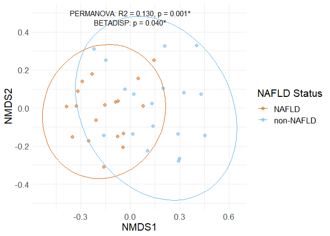<!-- -->

``` r
bray_genus_dists <-
  phy_shotgun_rarefy_8mil %>%
  tax_agg("Genus") %>%
  tax_transform("identity") %>% 
  dist_calc("bray")

bray_genus_perm <- dist_permanova(
  data = bray_genus_dists,
  seed = 1234, # for set.seed to ensure reproducibility of random process
  n_perms = 999, # you should use at least 999!
  n_processes = 1,
  variables = "NAFLD"
)
```

    ## 2022-01-21 11:23:06 - Starting PERMANOVA with 999 perms with 1 processes

    ## 2022-01-21 11:23:06 - Finished PERMANOVA

``` r
perm_get(bray_genus_perm) %>% as.data.frame()
```

    ##          Df  SumOfSqs        R2        F Pr(>F)
    ## NAFLD     1 0.8907814 0.1296556 5.064994  0.001
    ## Residual 34 5.9795861 0.8703444       NA     NA
    ## Total    35 6.8703675 1.0000000       NA     NA

``` r
bray_genus_disp = dist_bdisp(bray_genus_dists, variables = "NAFLD", method = "centroid")

bdisp_get(bray_genus_disp)
```

    ## $NAFLD
    ## $NAFLD$model
    ## 
    ##  Homogeneity of multivariate dispersions
    ## 
    ## Call: vegan::betadisper(d = distMat, group = metadata[[V]], type =
    ## method)
    ## 
    ## No. of Positive Eigenvalues: 24
    ## No. of Negative Eigenvalues: 11
    ## 
    ## Average distance to centroid:
    ##     NAFLD non-NAFLD 
    ##    0.3761    0.4259 
    ## 
    ## Eigenvalues for PCoA axes:
    ## (Showing 8 of 35 eigenvalues)
    ##  PCoA1  PCoA2  PCoA3  PCoA4  PCoA5  PCoA6  PCoA7  PCoA8 
    ## 1.9119 1.0272 0.8966 0.6206 0.6126 0.4675 0.3000 0.2621 
    ## 
    ## $NAFLD$anova
    ## Analysis of Variance Table
    ## 
    ## Response: Distances
    ##           Df   Sum Sq   Mean Sq F value  Pr(>F)  
    ## Groups     1 0.022367 0.0223671  4.5288 0.04066 *
    ## Residuals 34 0.167923 0.0049389                  
    ## ---
    ## Signif. codes:  0 '***' 0.001 '**' 0.01 '*' 0.05 '.' 0.1 ' ' 1
    ## 
    ## $NAFLD$tukeyHSD
    ##   Tukey multiple comparisons of means
    ##     95% family-wise confidence level
    ## 
    ## Fit: aov(formula = distances ~ group, data = df)
    ## 
    ## $group
    ##                       diff         lwr        upr     p adj
    ## non-NAFLD-NAFLD 0.04985214 0.002245203 0.09745907 0.0406606

``` r
#Family
bray_family_supfig1 = phy_shotgun_rarefy_8mil %>%
 tax_transform(rank = "Family", transformation = "identity") %>%
 dist_calc(dist = "bray") %>%
 ord_calc(
  method = "NMDS"
 ) %>% 
 ord_plot(
  axes = c(1, 2),
  colour = "NAFLD",
  shape = "circle", alpha = 0.5,
  size = 2, auto_caption = NA
 ) +
 ggplot2::stat_ellipse(
  ggplot2::aes(colour = NAFLD)
 )
```

    ## Run 0 stress 0.160603 
    ## Run 1 stress 0.160603 
    ## ... Procrustes: rmse 1.787838e-05  max resid 7.447466e-05 
    ## ... Similar to previous best
    ## Run 2 stress 0.1809057 
    ## Run 3 stress 0.1636825 
    ## Run 4 stress 0.2135757 
    ## Run 5 stress 0.1715048 
    ## Run 6 stress 0.1642814 
    ## Run 7 stress 0.1710727 
    ## Run 8 stress 0.160603 
    ## ... Procrustes: rmse 1.39129e-05  max resid 4.77115e-05 
    ## ... Similar to previous best
    ## Run 9 stress 0.1636825 
    ## Run 10 stress 0.160603 
    ## ... Procrustes: rmse 1.747184e-05  max resid 6.994631e-05 
    ## ... Similar to previous best
    ## Run 11 stress 0.1751987 
    ## Run 12 stress 0.1983419 
    ## Run 13 stress 0.1642814 
    ## Run 14 stress 0.1898425 
    ## Run 15 stress 0.160603 
    ## ... New best solution
    ## ... Procrustes: rmse 4.665702e-06  max resid 1.576813e-05 
    ## ... Similar to previous best
    ## Run 16 stress 0.1641309 
    ## Run 17 stress 0.1710727 
    ## Run 18 stress 0.1800556 
    ## Run 19 stress 0.1769432 
    ## Run 20 stress 0.1811929 
    ## *** Solution reached

``` r
bray_family_supfig1 = bray_family_supfig1 + scale_color_manual(values = c("#D55E00", "#56B4E9")) + labs(color = "NAFLD Status") + theme(text = element_text(size = 16)) + annotate("text", x = 0, y = 0.5, label = "PERMANOVA: R2 = 0.155, p = 0.001*", size = 4) + annotate("text", x = 0, y = 0.45, label = "BETADISP: p = 0.138", size = 4)
bray_family_supfig1 
```

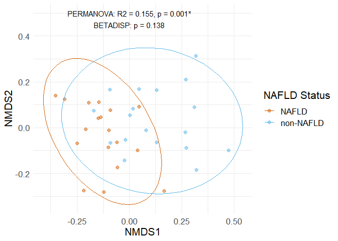<!-- -->

``` r
bray_family_dists <-
  phy_shotgun_rarefy_8mil %>%
  tax_agg("Family") %>%
  tax_transform("identity") %>% 
  dist_calc("bray")

bray_family_perm <- dist_permanova(
  data = bray_family_dists,
  seed = 1234, # for set.seed to ensure reproducibility of random process
  n_perms = 999, # you should use at least 999!
  n_processes = 1,
  variables = "NAFLD"
)
```

    ## 2022-01-21 11:23:07 - Starting PERMANOVA with 999 perms with 1 processes

    ## 2022-01-21 11:23:07 - Finished PERMANOVA

``` r
perm_get(bray_family_perm) %>% as.data.frame()
```

    ##          Df  SumOfSqs        R2        F Pr(>F)
    ## NAFLD     1 0.7421329 0.1550714 6.240087  0.001
    ## Residual 34 4.0436168 0.8449286       NA     NA
    ## Total    35 4.7857497 1.0000000       NA     NA

``` r
bray_family_disp = dist_bdisp(bray_family_dists, variables = "NAFLD", method = "centroid")

bdisp_get(bray_family_disp)
```

    ## $NAFLD
    ## $NAFLD$model
    ## 
    ##  Homogeneity of multivariate dispersions
    ## 
    ## Call: vegan::betadisper(d = distMat, group = metadata[[V]], type =
    ## method)
    ## 
    ## No. of Positive Eigenvalues: 20
    ## No. of Negative Eigenvalues: 15
    ## 
    ## Average distance to centroid:
    ##     NAFLD non-NAFLD 
    ##    0.3028    0.3456 
    ## 
    ## Eigenvalues for PCoA axes:
    ## (Showing 8 of 35 eigenvalues)
    ##  PCoA1  PCoA2  PCoA3  PCoA4  PCoA5  PCoA6  PCoA7  PCoA8 
    ## 1.7186 0.8415 0.6687 0.6153 0.3995 0.2715 0.1484 0.1396 
    ## 
    ## $NAFLD$anova
    ## Analysis of Variance Table
    ## 
    ## Response: Distances
    ##           Df   Sum Sq   Mean Sq F value Pr(>F)
    ## Groups     1 0.016466 0.0164656  2.2979 0.1388
    ## Residuals 34 0.243630 0.0071656               
    ## 
    ## $NAFLD$tukeyHSD
    ##   Tukey multiple comparisons of means
    ##     95% family-wise confidence level
    ## 
    ## Fit: aov(formula = distances ~ group, data = df)
    ## 
    ## $group
    ##                       diff         lwr       upr     p adj
    ## non-NAFLD-NAFLD 0.04277275 -0.01457031 0.1001158 0.1387949

``` r
#Order
bray_order_supfig1 = phy_shotgun_rarefy_8mil %>%
 tax_transform(rank = "Order", transformation = "identity") %>%
 dist_calc(dist = "bray") %>%
 ord_calc(
  method = "NMDS"
 ) %>% 
 ord_plot(
  axes = c(1, 2),
  colour = "NAFLD",
  shape = "circle", alpha = 0.5,
  size = 2, auto_caption = NA
 ) +
 ggplot2::stat_ellipse(
  ggplot2::aes(colour = NAFLD)
 )
```

    ## Run 0 stress 0.07050931 
    ## Run 1 stress 0.078234 
    ## Run 2 stress 0.1214507 
    ## Run 3 stress 0.1345559 
    ## Run 4 stress 0.116741 
    ## Run 5 stress 0.1349759 
    ## Run 6 stress 0.113503 
    ## Run 7 stress 0.07050936 
    ## ... Procrustes: rmse 4.840115e-05  max resid 0.0002571629 
    ## ... Similar to previous best
    ## Run 8 stress 0.07050934 
    ## ... Procrustes: rmse 1.525848e-05  max resid 5.407591e-05 
    ## ... Similar to previous best
    ## Run 9 stress 0.07050932 
    ## ... Procrustes: rmse 6.473273e-05  max resid 0.0003478957 
    ## ... Similar to previous best
    ## Run 10 stress 0.1532123 
    ## Run 11 stress 0.1345558 
    ## Run 12 stress 0.07050932 
    ## ... Procrustes: rmse 6.369559e-05  max resid 0.0003421347 
    ## ... Similar to previous best
    ## Run 13 stress 0.1606443 
    ## Run 14 stress 0.07823404 
    ## Run 15 stress 0.112936 
    ## Run 16 stress 0.07823408 
    ## Run 17 stress 0.1212489 
    ## Run 18 stress 0.1214507 
    ## Run 19 stress 0.1581923 
    ## Run 20 stress 0.1505516 
    ## *** Solution reached

``` r
bray_order_supfig1 = bray_order_supfig1 + scale_color_manual(values = c("#D55E00", "#56B4E9")) + labs(color = "NAFLD Status") + theme(text = element_text(size = 16)) + annotate("text", x = 0, y = 0.5, label = "PERMANOVA: R2 = 0.212, p = 0.001*", size = 4) + annotate("text", x = 0, y = 0.45, label = "BETADISP: p = 0.807", size = 4)
bray_order_supfig1 
```

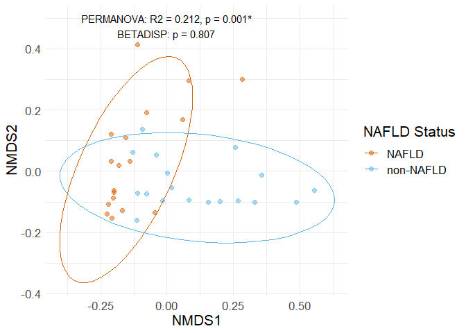<!-- -->

``` r
bray_order_dists <-
  phy_shotgun_rarefy_8mil %>%
  tax_agg("Order") %>%
  tax_transform("identity") %>% 
  dist_calc("bray")

bray_order_perm <- dist_permanova(
  data = bray_order_dists,
  seed = 1234, # for set.seed to ensure reproducibility of random process
  n_perms = 999, # you should use at least 999!
  n_processes = 1,
  variables = "NAFLD"
)
```

    ## 2022-01-21 11:23:08 - Starting PERMANOVA with 999 perms with 1 processes

    ## 2022-01-21 11:23:08 - Finished PERMANOVA

``` r
perm_get(bray_order_perm) %>% as.data.frame()
```

    ##          Df  SumOfSqs        R2        F Pr(>F)
    ## NAFLD     1 0.6331599 0.2118714 9.140165  0.001
    ## Residual 34 2.3552568 0.7881286       NA     NA
    ## Total    35 2.9884167 1.0000000       NA     NA

``` r
bray_order_disp = dist_bdisp(bray_order_dists, variables = "NAFLD", method = "centroid")

bdisp_get(bray_order_disp)
```

    ## $NAFLD
    ## $NAFLD$model
    ## 
    ##  Homogeneity of multivariate dispersions
    ## 
    ## Call: vegan::betadisper(d = distMat, group = metadata[[V]], type =
    ## method)
    ## 
    ## No. of Positive Eigenvalues: 20
    ## No. of Negative Eigenvalues: 15
    ## 
    ## Average distance to centroid:
    ##     NAFLD non-NAFLD 
    ##    0.2289    0.2377 
    ## 
    ## Eigenvalues for PCoA axes:
    ## (Showing 8 of 35 eigenvalues)
    ##   PCoA1   PCoA2   PCoA3   PCoA4   PCoA5   PCoA6   PCoA7   PCoA8 
    ## 1.78374 0.73862 0.17771 0.14839 0.09944 0.08777 0.06357 0.05699 
    ## 
    ## $NAFLD$anova
    ## Analysis of Variance Table
    ## 
    ## Response: Distances
    ##           Df  Sum Sq   Mean Sq F value Pr(>F)
    ## Groups     1 0.00070 0.0007015  0.0603 0.8074
    ## Residuals 34 0.39531 0.0116268               
    ## 
    ## $NAFLD$tukeyHSD
    ##   Tukey multiple comparisons of means
    ##     95% family-wise confidence level
    ## 
    ## Fit: aov(formula = distances ~ group, data = df)
    ## 
    ## $group
    ##                        diff         lwr        upr     p adj
    ## non-NAFLD-NAFLD 0.008828683 -0.06421544 0.08187281 0.8074431

``` r
#Class
bray_class_supfig1 = phy_shotgun_rarefy_8mil %>%
 tax_transform(rank = "Class", transformation = "identity") %>%
 dist_calc(dist = "bray") %>%
 ord_calc(
  method = "NMDS"
 ) %>% 
 ord_plot(
  axes = c(1, 2),
  colour = "NAFLD",
  shape = "circle", alpha = 0.5,
  size = 2, auto_caption = NA
 ) +
 ggplot2::stat_ellipse(
  ggplot2::aes(colour = NAFLD)
 )
```

    ## Run 0 stress 0.07134414 
    ## Run 1 stress 0.1296436 
    ## Run 2 stress 0.07875406 
    ## Run 3 stress 0.07875386 
    ## Run 4 stress 0.07134429 
    ## ... Procrustes: rmse 0.000392444  max resid 0.002024162 
    ## ... Similar to previous best
    ## Run 5 stress 0.1626217 
    ## Run 6 stress 0.07134408 
    ## ... New best solution
    ## ... Procrustes: rmse 3.713239e-05  max resid 0.0001940574 
    ## ... Similar to previous best
    ## Run 7 stress 0.1567851 
    ## Run 8 stress 0.07134421 
    ## ... Procrustes: rmse 0.0003191745  max resid 0.001643147 
    ## ... Similar to previous best
    ## Run 9 stress 0.07134401 
    ## ... New best solution
    ## ... Procrustes: rmse 0.0001544772  max resid 0.0008026143 
    ## ... Similar to previous best
    ## Run 10 stress 0.121121 
    ## Run 11 stress 0.1133188 
    ## Run 12 stress 0.1654608 
    ## Run 13 stress 0.1163201 
    ## Run 14 stress 0.071344 
    ## ... New best solution
    ## ... Procrustes: rmse 5.512924e-05  max resid 0.0002787994 
    ## ... Similar to previous best
    ## Run 15 stress 0.07875388 
    ## Run 16 stress 0.1410038 
    ## Run 17 stress 0.07875402 
    ## Run 18 stress 0.1123818 
    ## Run 19 stress 0.07134419 
    ## ... Procrustes: rmse 0.0002110771  max resid 0.00107563 
    ## ... Similar to previous best
    ## Run 20 stress 0.1214071 
    ## *** Solution reached

``` r
bray_class_supfig1 = bray_class_supfig1 + scale_color_manual(values = c("#D55E00", "#56B4E9")) + labs(color = "NAFLD Status") + theme(text = element_text(size = 16)) + annotate("text", x = 0, y = 0.5, label = "PERMANOVA: R2 = 0.212, p = 0.001*", size = 4) + annotate("text", x = 0, y = 0.45, label = "BETADISP: p = 0.824", size = 4)
bray_class_supfig1 
```

<!-- -->

``` r
bray_class_dists <-
  phy_shotgun_rarefy_8mil %>%
  tax_agg("Class") %>%
  tax_transform("identity") %>% 
  dist_calc("bray")

bray_class_perm <- dist_permanova(
  data = bray_class_dists,
  seed = 1234, # for set.seed to ensure reproducibility of random process
  n_perms = 999, # you should use at least 999!
  n_processes = 1,
  variables = "NAFLD"
)
```

    ## 2022-01-21 11:23:09 - Starting PERMANOVA with 999 perms with 1 processes

    ## 2022-01-21 11:23:09 - Finished PERMANOVA

``` r
perm_get(bray_class_perm) %>% as.data.frame()
```

    ##          Df  SumOfSqs        R2        F Pr(>F)
    ## NAFLD     1 0.6228901 0.2122843 9.162781  0.001
    ## Residual 34 2.3113357 0.7877157       NA     NA
    ## Total    35 2.9342258 1.0000000       NA     NA

``` r
bray_class_disp = dist_bdisp(bray_class_dists, variables = "NAFLD", method = "centroid")

bdisp_get(bray_class_disp)
```

    ## $NAFLD
    ## $NAFLD$model
    ## 
    ##  Homogeneity of multivariate dispersions
    ## 
    ## Call: vegan::betadisper(d = distMat, group = metadata[[V]], type =
    ## method)
    ## 
    ## No. of Positive Eigenvalues: 19
    ## No. of Negative Eigenvalues: 16
    ## 
    ## Average distance to centroid:
    ##     NAFLD non-NAFLD 
    ##    0.2271    0.2351 
    ## 
    ## Eigenvalues for PCoA axes:
    ## (Showing 8 of 35 eigenvalues)
    ##   PCoA1   PCoA2   PCoA3   PCoA4   PCoA5   PCoA6   PCoA7   PCoA8 
    ## 1.77194 0.72520 0.18050 0.14427 0.09565 0.08528 0.06198 0.05232 
    ## 
    ## $NAFLD$anova
    ## Analysis of Variance Table
    ## 
    ## Response: Distances
    ##           Df  Sum Sq   Mean Sq F value Pr(>F)
    ## Groups     1 0.00057 0.0005696  0.0499 0.8246
    ## Residuals 34 0.38843 0.0114244               
    ## 
    ## $NAFLD$tukeyHSD
    ##   Tukey multiple comparisons of means
    ##     95% family-wise confidence level
    ## 
    ## Fit: aov(formula = distances ~ group, data = df)
    ## 
    ## $group
    ##                        diff         lwr        upr     p adj
    ## non-NAFLD-NAFLD 0.007955377 -0.06445006 0.08036081 0.8246474

``` r
#Phylum
bray_phylum_supfig1 = phy_shotgun_rarefy_8mil %>%
 tax_transform(rank = "Phylum", transformation = "identity") %>%
 dist_calc(dist = "bray") %>%
 ord_calc(
  method = "NMDS"
 ) %>% 
 ord_plot(
  axes = c(1, 2),
  colour = "NAFLD",
  shape = "circle", alpha = 0.5,
  size = 2, auto_caption = NA
 ) +
 ggplot2::stat_ellipse(
  ggplot2::aes(colour = NAFLD)
 )
```

    ## Run 0 stress 0.0437223 
    ## Run 1 stress 0.1000442 
    ## Run 2 stress 0.04372225 
    ## ... New best solution
    ## ... Procrustes: rmse 6.112419e-05  max resid 0.0002986846 
    ## ... Similar to previous best
    ## Run 3 stress 0.05699956 
    ## Run 4 stress 0.04372227 
    ## ... Procrustes: rmse 4.08181e-05  max resid 0.0001772821 
    ## ... Similar to previous best
    ## Run 5 stress 0.04372227 
    ## ... Procrustes: rmse 2.734165e-05  max resid 0.0001255783 
    ## ... Similar to previous best
    ## Run 6 stress 0.04372226 
    ## ... Procrustes: rmse 4.667622e-05  max resid 0.0002395831 
    ## ... Similar to previous best
    ## Run 7 stress 0.05699958 
    ## Run 8 stress 0.1096301 
    ## Run 9 stress 0.04372231 
    ## ... Procrustes: rmse 9.03205e-05  max resid 0.0004503993 
    ## ... Similar to previous best
    ## Run 10 stress 0.04372231 
    ## ... Procrustes: rmse 6.284879e-05  max resid 0.0003284215 
    ## ... Similar to previous best
    ## Run 11 stress 0.05699957 
    ## Run 12 stress 0.1038281 
    ## Run 13 stress 0.04372234 
    ## ... Procrustes: rmse 0.0001034668  max resid 0.0005045107 
    ## ... Similar to previous best
    ## Run 14 stress 0.1000443 
    ## Run 15 stress 0.0569951 
    ## Run 16 stress 0.134745 
    ## Run 17 stress 0.04372238 
    ## ... Procrustes: rmse 0.0001233576  max resid 0.0006144922 
    ## ... Similar to previous best
    ## Run 18 stress 0.05737439 
    ## Run 19 stress 0.04372235 
    ## ... Procrustes: rmse 9.044568e-05  max resid 0.0004180186 
    ## ... Similar to previous best
    ## Run 20 stress 0.04372225 
    ## ... Procrustes: rmse 1.184532e-05  max resid 6.41616e-05 
    ## ... Similar to previous best
    ## *** Solution reached

``` r
bray_phylum_supfig1 = bray_phylum_supfig1 + scale_color_manual(values = c("#D55E00", "#56B4E9")) + labs(color = "NAFLD Status") + theme(text = element_text(size = 16)) + annotate("text", x = 0, y = 0.45, label = "PERMANOVA: R2 = 0.266, p = 0.001*", size = 4) + annotate("text", x = 0, y = 0.40, label = "BETADISP: p = 0.136", size = 4) + scale_y_continuous(breaks = c(-0.4, -0.2, 0, 0.2, 0.4))
bray_phylum_supfig1 
```

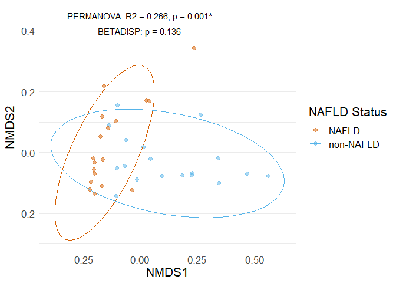<!-- -->

``` r
bray_phylum_dists <-
  phy_shotgun_rarefy_8mil %>%
  tax_agg("Phylum") %>%
  tax_transform("identity") %>% 
  dist_calc("bray")

bray_phylum_perm <- dist_permanova(
  data = bray_phylum_dists,
  seed = 1234, # for set.seed to ensure reproducibility of random process
  n_perms = 999, # you should use at least 999!
  n_processes = 1,
  variables = "NAFLD"
)
```

    ## 2022-01-21 11:23:10 - Starting PERMANOVA with 999 perms with 1 processes

    ## 2022-01-21 11:23:10 - Finished PERMANOVA

``` r
perm_get(bray_phylum_perm) %>% as.data.frame()
```

    ##          Df SumOfSqs        R2        F Pr(>F)
    ## NAFLD     1 0.606567 0.2657223 12.30401  0.001
    ## Residual 34 1.676143 0.7342777       NA     NA
    ## Total    35 2.282710 1.0000000       NA     NA

``` r
bray_phylum_disp = dist_bdisp(bray_phylum_dists, variables = "NAFLD", method = "centroid")

bdisp_get(bray_phylum_disp)
```

    ## $NAFLD
    ## $NAFLD$model
    ## 
    ##  Homogeneity of multivariate dispersions
    ## 
    ## Call: vegan::betadisper(d = distMat, group = metadata[[V]], type =
    ## method)
    ## 
    ## No. of Positive Eigenvalues: 17
    ## No. of Negative Eigenvalues: 18
    ## 
    ## Average distance to centroid:
    ##     NAFLD non-NAFLD 
    ##    0.1619    0.2151 
    ## 
    ## Eigenvalues for PCoA axes:
    ## (Showing 8 of 35 eigenvalues)
    ##   PCoA1   PCoA2   PCoA3   PCoA4   PCoA5   PCoA6   PCoA7   PCoA8 
    ## 1.65235 0.51686 0.10069 0.08937 0.04773 0.03831 0.02312 0.01683 
    ## 
    ## $NAFLD$anova
    ## Analysis of Variance Table
    ## 
    ## Response: Distances
    ##           Df  Sum Sq  Mean Sq F value Pr(>F)
    ## Groups     1 0.02545 0.025452  2.3269 0.1364
    ## Residuals 34 0.37189 0.010938               
    ## 
    ## $NAFLD$tukeyHSD
    ##   Tukey multiple comparisons of means
    ##     95% family-wise confidence level
    ## 
    ## Fit: aov(formula = distances ~ group, data = df)
    ## 
    ## $group
    ##                       diff         lwr       upr     p adj
    ## non-NAFLD-NAFLD 0.05317927 -0.01766828 0.1240268 0.1364002

Supplemental Figure 1 - Patchwork

``` r
Supplemental_Figure_1 = bray_genus_supfig1 + bray_family_supfig1 + bray_order_supfig1 + bray_class_supfig1 + bray_phylum_supfig1
Supplemental_Figure_1 + plot_annotation(tag_levels = "A") + plot_layout(guides = "collect", ncol = 5)
```

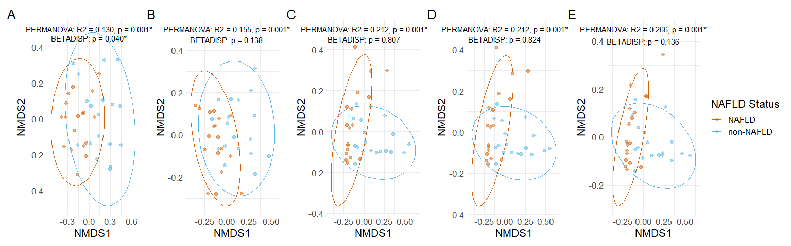<!-- -->

``` r
ggsave("Supplemental_Figure_1.png", width = 18, height = 5)
ggsave("Supplemental_Figure_1.tiff", width = 18, height = 5, compression = "lzw")
```

Supplemental Figure 2 - Barplots with Groups Merged and Taxa Averaged

``` r
barplot_groups_merged_phylum = phy_shotgun %>%
  phyloseq::transform_sample_counts(function(x) (x / sum(x))*10000) %>%
  phyloseq::merge_samples(group = "NAFLD") %>%
  comp_barplot(
    tax_level = "Phylum", n_taxa = 7,
    bar_width = 0.8
  ) +
  coord_flip() + labs(x = NULL, y = NULL)
```

    ## Warning in asMethod(object): NAs introduced by coercion

    ## Warning in asMethod(object): NAs introduced by coercion

    ## Warning in asMethod(object): NAs introduced by coercion

``` r
barplot_groups_merged_phylum
```

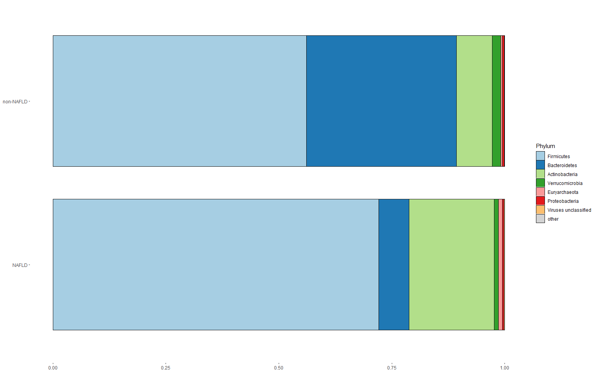<!-- -->

``` r
barplot_groups_merged_phylum$data
```

    ## # A tibble: 16 x 20
    ##    OTU     Sample Abundance Sample_Number NAFLD PNPLA3 Visceral.Subc   sex race2
    ##    <chr>   <chr>      <dbl>         <dbl> <dbl>  <dbl>         <dbl> <dbl> <dbl>
    ##  1 Firmic~ NAFLD  0.721              50.4    NA     NA          1.67  1.39  2.44
    ##  2 Bacter~ NAFLD  0.0667             50.4    NA     NA          1.67  1.39  2.44
    ##  3 Actino~ NAFLD  0.188              50.4    NA     NA          1.67  1.39  2.44
    ##  4 Verruc~ NAFLD  0.00919            50.4    NA     NA          1.67  1.39  2.44
    ##  5 Euryar~ NAFLD  0.00916            50.4    NA     NA          1.67  1.39  2.44
    ##  6 Proteo~ NAFLD  0.00315            50.4    NA     NA          1.67  1.39  2.44
    ##  7 Viruse~ NAFLD  0.00217            50.4    NA     NA          1.67  1.39  2.44
    ##  8 other   NAFLD  0.0000375          50.4    NA     NA          1.67  1.39  2.44
    ##  9 Firmic~ non-N~ 0.561              34.6    NA     NA          1.33  1.56  2.44
    ## 10 Bacter~ non-N~ 0.332              34.6    NA     NA          1.33  1.56  2.44
    ## 11 Actino~ non-N~ 0.0795             34.6    NA     NA          1.33  1.56  2.44
    ## 12 Verruc~ non-N~ 0.0188             34.6    NA     NA          1.33  1.56  2.44
    ## 13 Euryar~ non-N~ 0.00350            34.6    NA     NA          1.33  1.56  2.44
    ## 14 Proteo~ non-N~ 0.00461            34.6    NA     NA          1.33  1.56  2.44
    ## 15 Viruse~ non-N~ 0.000920           34.6    NA     NA          1.33  1.56  2.44
    ## 16 other   non-N~ 0.000119           34.6    NA     NA          1.33  1.56  2.44
    ## # ... with 11 more variables: BMI <dbl>, height <dbl>, weight <dbl>,
    ## #   OverRepresented <dbl>, OverRepresented_Presence <dbl>, SAMPLE <ord>,
    ## #   SuperKingdom <chr>, Phylum <chr>, top <ord>, separate <chr>, unique <ord>

``` r
barplot_groups_merged_species = phy_shotgun %>%
  phyloseq::transform_sample_counts(function(x) (x / sum(x))*10000) %>%
  phyloseq::merge_samples(group = "NAFLD") %>%
  comp_barplot(
    tax_level = "Species", n_taxa = 10,
    bar_width = 0.8
  ) +
  coord_flip() + labs(x = NULL, y = NULL)
```

    ## Warning in asMethod(object): NAs introduced by coercion

    ## Warning in asMethod(object): NAs introduced by coercion

    ## Warning in asMethod(object): NAs introduced by coercion

``` r
barplot_groups_merged_species
```

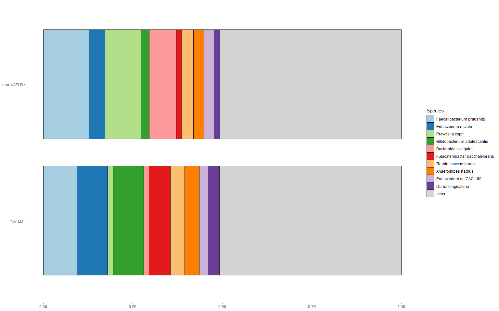<!-- -->

``` r
barplot_groups_merged_species$data
```

    ## # A tibble: 22 x 25
    ##    OTU     Sample Abundance Sample_Number NAFLD PNPLA3 Visceral.Subc   sex race2
    ##    <chr>   <chr>      <dbl>         <dbl> <dbl>  <dbl>         <dbl> <dbl> <dbl>
    ##  1 Faecal~ NAFLD     0.0935          50.4    NA     NA          1.67  1.39  2.44
    ##  2 Eubact~ NAFLD     0.0861          50.4    NA     NA          1.67  1.39  2.44
    ##  3 Prevot~ NAFLD     0.0162          50.4    NA     NA          1.67  1.39  2.44
    ##  4 Bifido~ NAFLD     0.0850          50.4    NA     NA          1.67  1.39  2.44
    ##  5 Bacter~ NAFLD     0.0145          50.4    NA     NA          1.67  1.39  2.44
    ##  6 Fusica~ NAFLD     0.0600          50.4    NA     NA          1.67  1.39  2.44
    ##  7 Rumino~ NAFLD     0.0393          50.4    NA     NA          1.67  1.39  2.44
    ##  8 Anaero~ NAFLD     0.0409          50.4    NA     NA          1.67  1.39  2.44
    ##  9 Eubact~ NAFLD     0.0243          50.4    NA     NA          1.67  1.39  2.44
    ## 10 Dorea ~ NAFLD     0.0321          50.4    NA     NA          1.67  1.39  2.44
    ## # ... with 12 more rows, and 16 more variables: BMI <dbl>, height <dbl>,
    ## #   weight <dbl>, OverRepresented <dbl>, OverRepresented_Presence <dbl>,
    ## #   SAMPLE <ord>, SuperKingdom <chr>, Phylum <chr>, Class <chr>, Order <chr>,
    ## #   Family <chr>, Genus <chr>, Species <chr>, top <ord>, separate <chr>,
    ## #   unique <ord>

Supplemental Figure 2 - Patchwork

``` r
Supplemental_Figure_Mean_Barplot = barplot_groups_merged_phylum + barplot_groups_merged_species
Supplemental_Figure_Mean_Barplot + plot_annotation(tag_levels = "A")
```

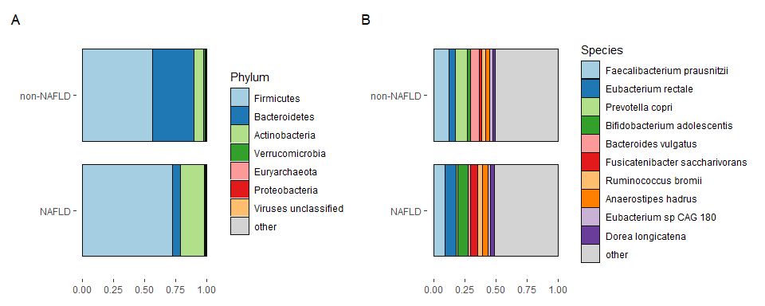<!-- -->

``` r
ggsave("Supplemental_Figure_Mean_Barplot.png", width = 10, height = 3)
ggsave("Supplemental_Figure_Mean_Barplot.tiff", width = 10, height = 3, compression = "lzw")
```

Supplemental Figures 3-8 - Boxplots from ANCOM results as Visualization

``` r
#Species Data
phy_shotgun_species_glom = tax_glom(phy_shotgun, "Species")
phy_shotgun_species_glom = tax_filter(phy_shotgun_species_glom, min_prevalence = 1/4, tax_level = "Genus")
```

    ## Proportional min_prevalence given: 0.25 --> min 9/36 samples.

``` r
phy_normalize_species = transform_sample_counts(phy_shotgun_species_glom, function(x) (x / sum(x)))
melted_phy_species = psmelt(phy_normalize_species)
melted_phy_subset_species = subset(melted_phy_species, Species %in% c("Actinomyces sp ICM47", "Bacteroides thetaiotaomicron", "Fusicatenibacter saccharivorans", "Romboutsia ilealis"))

shotgun_species_comp <- ggplot(melted_phy_subset_species, aes(x=NAFLD, y=Abundance)) + 
  geom_boxplot(outlier.shape = NA) + geom_dotplot(binaxis='y', stackdir='center', dotsize = 0) + theme_bw() + facet_wrap(~Species, scales = "free", nrow = 1) + geom_point(aes(colour = NAFLD)) + scale_color_manual(values = c("#D55E00", "#56B4E9")) + labs(color = "NAFLD Status") + theme(text = element_text(size = 16)) + theme(axis.text.x=element_blank(), axis.title.x = element_blank()) + ylab("Relative Abundance") + scale_y_continuous(labels = comma)
shotgun_species_comp
```

    ## Bin width defaults to 1/30 of the range of the data. Pick better value with `binwidth`.

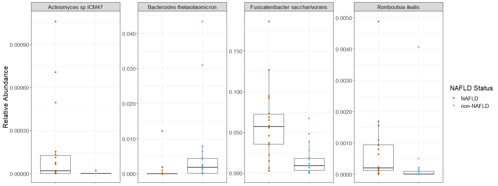<!-- -->

``` r
#Genus Data
phy_shotgun_genus_glom = tax_filter(phy_shotgun, min_prevalence = 1/4, tax_level = "Genus")
```

    ## Proportional min_prevalence given: 0.25 --> min 9/36 samples.

``` r
phy_shotgun_genus_glom = tax_glom(phy_shotgun, "Genus")
phy_normalize_genus = transform_sample_counts(phy_shotgun_genus_glom, function(x) (x / sum(x)))
melted_phy_genus = psmelt(phy_normalize_genus)
melted_phy_subset_genus = subset(melted_phy_genus, Genus %in% c("Bacteroides", "Flavonifractor"))

shotgun_genus_comp <- ggplot(melted_phy_subset_genus, aes(x=NAFLD, y=Abundance)) + 
  geom_boxplot(outlier.shape = NA) + geom_dotplot(binaxis='y', stackdir='center', dotsize = 0) + theme_bw() + facet_wrap(~Genus, scales = "free", nrow = 1) + geom_point(aes(colour = NAFLD)) + scale_color_manual(values = c("#D55E00", "#56B4E9")) + labs(color = "NAFLD Status") + theme(text = element_text(size = 16)) + theme(axis.text.x=element_blank(), axis.title.x = element_blank()) + ylab("Relative Abundance")
shotgun_genus_comp
```

    ## Bin width defaults to 1/30 of the range of the data. Pick better value with `binwidth`.

<!-- -->

``` r
#Family Data
phy_shotgun_family_glom = tax_filter(phy_shotgun, min_prevalence = 1/4, tax_level = "Genus")
```

    ## Proportional min_prevalence given: 0.25 --> min 9/36 samples.

``` r
phy_shotgun_family_glom = tax_glom(phy_shotgun, "Family")
phy_normalize_family = transform_sample_counts(phy_shotgun_family_glom, function(x) (x / sum(x)))
melted_phy_family = psmelt(phy_normalize_family)
melted_phy_subset_family = subset(melted_phy_family, Family %in% c("Bacteroidaceae", "Odoribacteraceae"))

shotgun_family_comp <- ggplot(melted_phy_subset_family, aes(x=NAFLD, y=Abundance)) + 
  geom_boxplot(outlier.shape = NA) + geom_dotplot(binaxis='y', stackdir='center', dotsize = 0) + theme_bw() + facet_wrap(~Family, scales = "free", nrow = 1) + geom_point(aes(colour = NAFLD)) + scale_color_manual(values = c("#D55E00", "#56B4E9")) + labs(color = "NAFLD Status") + theme(text = element_text(size = 16)) + theme(axis.text.x=element_blank(), axis.title.x = element_blank()) + ylab("Relative Abundance")
shotgun_family_comp
```

    ## Bin width defaults to 1/30 of the range of the data. Pick better value with `binwidth`.

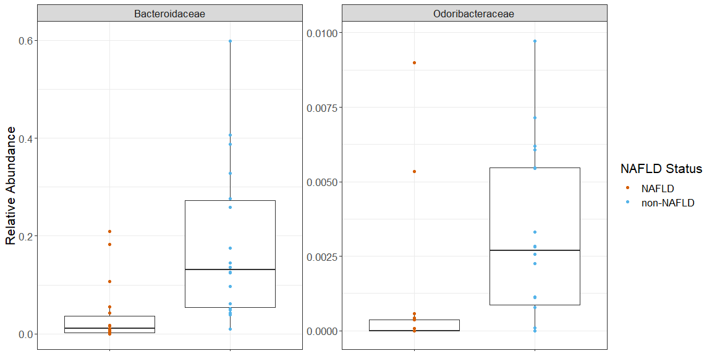<!-- -->

``` r
#Order Data
phy_shotgun_order_glom = tax_filter(phy_shotgun, min_prevalence = 1/4, tax_level = "Genus")
```

    ## Proportional min_prevalence given: 0.25 --> min 9/36 samples.

``` r
phy_shotgun_order_glom = tax_glom(phy_shotgun, "Order")
phy_normalize_order = transform_sample_counts(phy_shotgun_order_glom, function(x) (x / sum(x)))
melted_phy_order = psmelt(phy_normalize_order)
melted_phy_subset_order = subset(melted_phy_order, Order %in% c("Bacteroidales"))

shotgun_order_comp <- ggplot(melted_phy_subset_order, aes(x=NAFLD, y=Abundance)) + 
  geom_boxplot(outlier.shape = NA) + geom_dotplot(binaxis='y', stackdir='center', dotsize = 0) + theme_bw() + facet_wrap(~Order, scales = "free", nrow = 1) + geom_point(aes(colour = NAFLD)) + scale_color_manual(values = c("#D55E00", "#56B4E9")) + labs(color = "NAFLD Status") + theme(text = element_text(size = 16)) + theme(axis.text.x=element_blank(), axis.title.x = element_blank()) + ylab("Relative Abundance")
shotgun_order_comp
```

    ## Bin width defaults to 1/30 of the range of the data. Pick better value with `binwidth`.

<!-- -->

``` r
#Class Data
phy_shotgun_class_glom = tax_filter(phy_shotgun, min_prevalence = 1/4, tax_level = "Genus")
```

    ## Proportional min_prevalence given: 0.25 --> min 9/36 samples.

``` r
phy_shotgun_class_glom = tax_glom(phy_shotgun, "Class")
phy_normalize_class = transform_sample_counts(phy_shotgun_class_glom, function(x) (x / sum(x)))
melted_phy_class = psmelt(phy_normalize_class)
melted_phy_subset_class = subset(melted_phy_class, Class %in% c("Bacteroidia", "Tissierellia"))

shotgun_class_comp <- ggplot(melted_phy_subset_class, aes(x=NAFLD, y=Abundance)) + 
  geom_boxplot(outlier.shape = NA) + geom_dotplot(binaxis='y', stackdir='center', dotsize = 0) + theme_bw() + facet_wrap(~Class, scales = "free", nrow = 1) + geom_point(aes(colour = NAFLD)) + scale_color_manual(values = c("#D55E00", "#56B4E9")) + labs(color = "NAFLD Status") + theme(text = element_text(size = 16)) + theme(axis.text.x=element_blank(), axis.title.x = element_blank()) + ylab("Relative Abundance")
shotgun_class_comp
```

    ## Bin width defaults to 1/30 of the range of the data. Pick better value with `binwidth`.

<!-- -->

``` r
#Phylum Data
phy_shotgun_phylum_glom = tax_filter(phy_shotgun, min_prevalence = 1/4, tax_level = "Genus")
```

    ## Proportional min_prevalence given: 0.25 --> min 9/36 samples.

``` r
phy_shotgun_phylum_glom = tax_glom(phy_shotgun, "Phylum")
phy_normalize_phylum = transform_sample_counts(phy_shotgun_phylum_glom, function(x) (x / sum(x)))
melted_phy_phylum = psmelt(phy_normalize_phylum)
melted_phy_subset_phylum = subset(melted_phy_phylum, Phylum %in% c("Bacteroidetes", "Firmicutes", "Actinobacteria", "Verrucomicrobia"))

shotgun_phylum_comp <- ggplot(melted_phy_subset_phylum, aes(x=NAFLD, y=Abundance)) + 
  geom_boxplot(outlier.shape = NA) + geom_dotplot(binaxis='y', stackdir='center', dotsize = 0) + theme_bw() + facet_wrap(~Phylum, scales = "free", nrow = 1) + geom_point(aes(colour = NAFLD)) + scale_color_manual(values = c("#D55E00", "#56B4E9")) + labs(color = "NAFLD Status") + theme(text = element_text(size = 16)) + theme(axis.text.x=element_blank(), axis.title.x = element_blank()) + ylab("Relative Abundance")
shotgun_phylum_comp
```

    ## Bin width defaults to 1/30 of the range of the data. Pick better value with `binwidth`.

<!-- -->

Export for SupFigures 3-8

``` r
Supplemental_Figure_Species_Barplot = shotgun_species_comp
Supplemental_Figure_Species_Barplot
```

    ## Bin width defaults to 1/30 of the range of the data. Pick better value with `binwidth`.

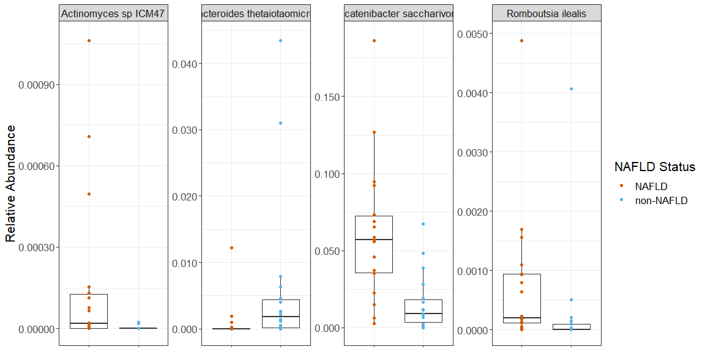<!-- -->

``` r
ggsave("Supplemental_Figure_Species_Barplot.png", width = 16, height = 6)
```

    ## Bin width defaults to 1/30 of the range of the data. Pick better value with `binwidth`.

``` r
ggsave("Supplemental_Figure_Species_Barplot.tiff", width = 16, height = 6, compression = "lzw")
```

    ## Bin width defaults to 1/30 of the range of the data. Pick better value with `binwidth`.

``` r
Supplemental_Figure_Genus_Barplot = shotgun_genus_comp
Supplemental_Figure_Genus_Barplot
```

    ## Bin width defaults to 1/30 of the range of the data. Pick better value with `binwidth`.

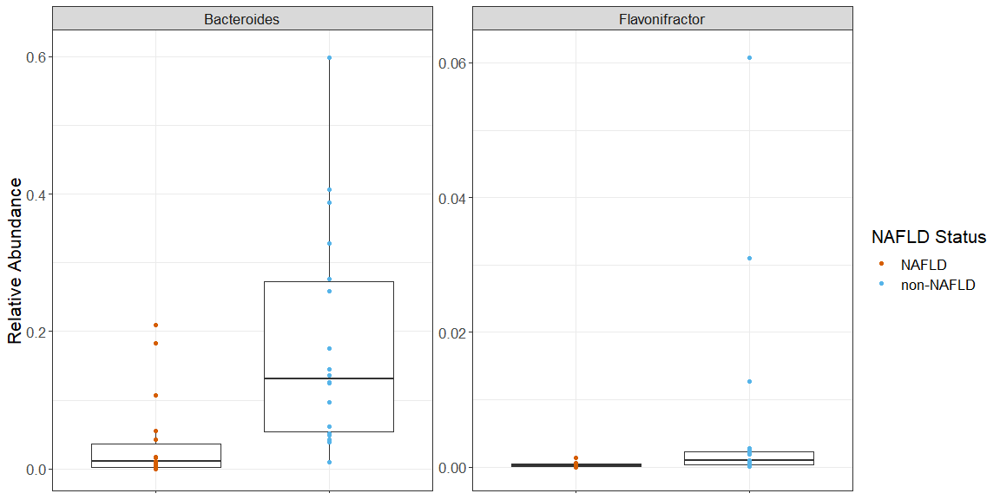<!-- -->

``` r
ggsave("Supplemental_Figure_Genus_Barplot.png", width = 12, height = 6)
```

    ## Bin width defaults to 1/30 of the range of the data. Pick better value with `binwidth`.

``` r
ggsave("Supplemental_Figure_Genus_Barplot.tiff", width = 12, height = 6, compression = "lzw")
```

    ## Bin width defaults to 1/30 of the range of the data. Pick better value with `binwidth`.

``` r
Supplemental_Figure_Family_Barplot = shotgun_family_comp
Supplemental_Figure_Family_Barplot
```

    ## Bin width defaults to 1/30 of the range of the data. Pick better value with `binwidth`.

<!-- -->

``` r
ggsave("Supplemental_Figure_Family_Barplot.png", width = 12, height = 6)
```

    ## Bin width defaults to 1/30 of the range of the data. Pick better value with `binwidth`.

``` r
ggsave("Supplemental_Figure_Family_Barplot.tiff", width = 12, height = 6, compression = "lzw")
```

    ## Bin width defaults to 1/30 of the range of the data. Pick better value with `binwidth`.

``` r
Supplemental_Figure_Order_Barplot = shotgun_order_comp
Supplemental_Figure_Order_Barplot
```

    ## Bin width defaults to 1/30 of the range of the data. Pick better value with `binwidth`.

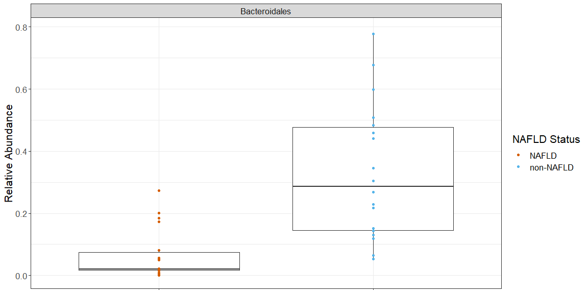<!-- -->

``` r
ggsave("Supplemental_Figure_Order_Barplot.png", width = 12, height = 6)
```

    ## Bin width defaults to 1/30 of the range of the data. Pick better value with `binwidth`.

``` r
ggsave("Supplemental_Figure_Order_Barplot.tiff", width = 12, height = 6, compression = "lzw")
```

    ## Bin width defaults to 1/30 of the range of the data. Pick better value with `binwidth`.

``` r
Supplemental_Figure_Class_Barplot = shotgun_class_comp
Supplemental_Figure_Class_Barplot
```

    ## Bin width defaults to 1/30 of the range of the data. Pick better value with `binwidth`.

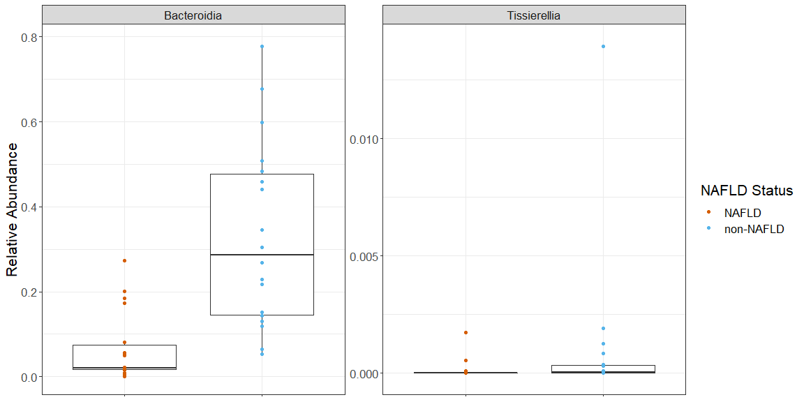<!-- -->

``` r
ggsave("Supplemental_Figure_Class_Barplot.png", width = 12, height = 6)
```

    ## Bin width defaults to 1/30 of the range of the data. Pick better value with `binwidth`.

``` r
ggsave("Supplemental_Figure_Class_Barplot.tiff", width = 12, height = 6, compression = "lzw")
```

    ## Bin width defaults to 1/30 of the range of the data. Pick better value with `binwidth`.

``` r
Supplemental_Figure_Phylum_Barplot = shotgun_phylum_comp
Supplemental_Figure_Phylum_Barplot
```

    ## Bin width defaults to 1/30 of the range of the data. Pick better value with `binwidth`.

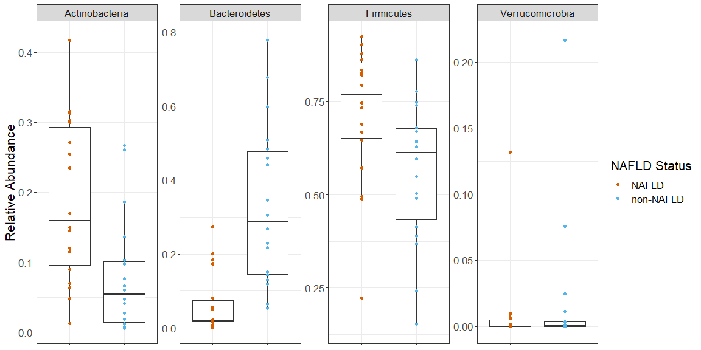<!-- -->

``` r
ggsave("Supplemental_Figure_Phylum_Barplot.png", width = 12, height = 6)
```

    ## Bin width defaults to 1/30 of the range of the data. Pick better value with `binwidth`.

``` r
ggsave("Supplemental_Figure_Phylum_Barplot.tiff", width = 12, height = 6, compression = "lzw")
```

    ## Bin width defaults to 1/30 of the range of the data. Pick better value with `binwidth`.

``` r
session_info()
```

    ## - Session info ---------------------------------------------------------------
    ##  setting  value                       
    ##  version  R version 4.1.0 (2021-05-18)
    ##  os       Windows 10 x64              
    ##  system   x86_64, mingw32             
    ##  ui       RTerm                       
    ##  language (EN)                        
    ##  collate  English_United States.1252  
    ##  ctype    English_United States.1252  
    ##  tz       America/New_York            
    ##  date     2022-01-21                  
    ## 
    ## - Packages -------------------------------------------------------------------
    ##  ! package              * version  date       lib
    ##    abind                  1.4-5    2016-07-21 [1]
    ##    ade4                   1.7-16   2020-10-28 [1]
    ##    ANCOMBC              * 1.2.0    2021-05-19 [1]
    ##    annotate               1.70.0   2021-05-19 [1]
    ##    AnnotationDbi          1.54.0   2021-05-19 [1]
    ##    ape                    5.5      2021-04-25 [1]
    ##    assertthat             0.2.1    2019-03-21 [1]
    ##    backports              1.2.1    2020-12-09 [1]
    ##    base64enc              0.1-3    2015-07-28 [1]
    ##    bayesm                 3.1-4    2019-10-15 [1]
    ##    Biobase              * 2.52.0   2021-05-19 [1]
    ##    BiocGenerics         * 0.38.0   2021-05-19 [1]
    ##    BiocManager          * 1.30.16  2021-06-15 [1]
    ##    BiocParallel           1.26.0   2021-05-19 [1]
    ##    biomformat             1.20.0   2021-05-19 [1]
    ##    Biostrings             2.60.0   2021-05-20 [1]
    ##    bit                    4.0.4    2020-08-04 [1]
    ##    bit64                  4.0.5    2020-08-30 [1]
    ##    bitops                 1.0-7    2021-04-24 [1]
    ##    blob                   1.2.2    2021-07-23 [1]
    ##    broom                  0.7.9    2021-07-27 [1]
    ##    cachem                 1.0.5    2021-05-15 [1]
    ##    callr                  3.7.0    2021-04-20 [1]
    ##    car                    3.0-11   2021-06-27 [1]
    ##    carData                3.0-4    2020-05-22 [1]
    ##    cellranger             1.1.0    2016-07-27 [1]
    ##    checkmate              2.0.0    2020-02-06 [1]
    ##    cli                    3.0.1    2021-07-17 [1]
    ##    cluster                2.1.2    2021-04-17 [2]
    ##    codetools              0.2-18   2020-11-04 [2]
    ##    colorspace             2.0-1    2021-05-04 [1]
    ##    compositions         * 2.0-2    2021-07-14 [1]
    ##    crayon                 1.4.1    2021-02-08 [1]
    ##    curl                   4.3.2    2021-06-23 [1]
    ##    data.table             1.14.0   2021-02-21 [1]
    ##    DBI                    1.1.1    2021-01-15 [1]
    ##    dbplyr                 2.1.1    2021-04-06 [1]
    ##    DelayedArray           0.18.0   2021-05-19 [1]
    ##    DEoptimR               1.0-9    2021-05-24 [1]
    ##    desc                   1.4.0    2021-09-28 [1]
    ##    DESeq2               * 1.32.0   2021-05-19 [1]
    ##    devtools             * 2.4.2    2021-06-07 [1]
    ##    digest                 0.6.28   2021-09-23 [1]
    ##    dplyr                * 1.0.6    2021-05-05 [1]
    ##    DT                     0.19     2021-09-02 [1]
    ##    ellipsis               0.3.2    2021-04-29 [1]
    ##    evaluate               0.14     2019-05-28 [1]
    ##    fansi                  0.5.0    2021-05-25 [1]
    ##    farver                 2.1.0    2021-02-28 [1]
    ##    fastmap                1.1.0    2021-01-25 [1]
    ##    forcats              * 0.5.1    2021-01-27 [1]
    ##    foreach                1.5.1    2020-10-15 [1]
    ##    foreign                0.8-81   2020-12-22 [2]
    ##    Formula                1.2-4    2020-10-16 [1]
    ##    fs                     1.5.0    2020-07-31 [1]
    ##    genefilter             1.74.0   2021-05-19 [1]
    ##    geneplotter            1.70.0   2021-05-19 [1]
    ##    generics               0.1.0    2020-10-31 [1]
    ##    GenomeInfoDb         * 1.28.0   2021-05-19 [1]
    ##    GenomeInfoDbData       1.2.6    2021-06-03 [1]
    ##    GenomicRanges        * 1.44.0   2021-05-19 [1]
    ##    ggplot2              * 3.3.5    2021-06-25 [1]
    ##    ggpubr               * 0.4.0    2020-06-27 [1]
    ##    ggsignif               0.6.3    2021-09-09 [1]
    ##    glue                   1.4.2    2020-08-27 [1]
    ##    gridExtra              2.3      2017-09-09 [1]
    ##    gtable                 0.3.0    2019-03-25 [1]
    ##    GUniFrac             * 1.3      2021-08-18 [1]
    ##    haven                  2.4.3    2021-08-04 [1]
    ##    highr                  0.9      2021-04-16 [1]
    ##    Hmisc                  4.6-0    2021-10-07 [1]
    ##    hms                    1.1.1    2021-09-26 [1]
    ##    htmlTable              2.2.1    2021-05-18 [1]
    ##    htmltools              0.5.2    2021-08-25 [1]
    ##    htmlwidgets            1.5.4    2021-09-08 [1]
    ##    httr                   1.4.2    2020-07-20 [1]
    ##    igraph                 1.2.6    2020-10-06 [1]
    ##    IRanges              * 2.26.0   2021-05-19 [1]
    ##    iterators              1.0.13   2020-10-15 [1]
    ##    jpeg                   0.1-9    2021-07-24 [1]
    ##    jsonlite               1.7.2    2020-12-09 [1]
    ##    KEGGREST               1.32.0   2021-05-19 [1]
    ##    knitr                  1.36     2021-09-29 [1]
    ##    labeling               0.4.2    2020-10-20 [1]
    ##    lattice              * 0.20-44  2021-05-02 [2]
    ##    latticeExtra           0.6-29   2019-12-19 [1]
    ##    lifecycle              1.0.1    2021-09-24 [1]
    ##    locfit                 1.5-9.4  2020-03-25 [1]
    ##    lubridate              1.8.0    2021-10-07 [1]
    ##    magrittr               2.0.1    2020-11-17 [1]
    ##    MASS                   7.3-54   2021-05-03 [2]
    ##    Matrix                 1.3-4    2021-06-01 [2]
    ##    MatrixGenerics       * 1.4.0    2021-05-19 [1]
    ##    matrixStats          * 0.59.0   2021-06-01 [1]
    ##    memoise                2.0.0    2021-01-26 [1]
    ##    mgcv                   1.8-36   2021-06-01 [2]
    ##    microbiome           * 1.14.0   2021-05-19 [1]
    ##    microViz             * 0.7.6    2021-06-04 [1]
    ##    modelr                 0.1.8    2020-05-19 [1]
    ##    multtest               2.48.0   2021-05-19 [1]
    ##    munsell                0.5.0    2018-06-12 [1]
    ##    NADA                   1.6-1.1  2020-03-22 [1]
    ##    nlme                 * 3.1-152  2021-02-04 [2]
    ##    nloptr                 1.2.2.2  2020-07-02 [1]
    ##    nnet                   7.3-16   2021-05-03 [2]
    ##    openxlsx               4.2.4    2021-06-16 [1]
    ##    pacman                 0.5.1    2019-03-11 [1]
    ##    patchwork            * 1.1.1    2020-12-17 [1]
    ##    permute              * 0.9-5    2019-03-12 [1]
    ##    pheatmap             * 1.0.12   2019-01-04 [1]
    ##    phyloseq             * 1.36.0   2021-05-19 [1]
    ##    pillar                 1.6.3    2021-09-26 [1]
    ##    pkgbuild               1.2.0    2020-12-15 [1]
    ##    pkgconfig              2.0.3    2019-09-22 [1]
    ##    pkgload                1.2.2    2021-09-11 [1]
    ##    plyr                   1.8.6    2020-03-03 [1]
    ##    png                    0.1-7    2013-12-03 [1]
    ##    prettyunits            1.1.1    2020-01-24 [1]
    ##    processx               3.5.2    2021-04-30 [1]
    ##    progress               1.2.2    2019-05-16 [1]
    ##    ps                     1.6.0    2021-02-28 [1]
    ##    purrr                * 0.3.4    2020-04-17 [1]
    ##    qiime2R              * 0.99.6   2021-06-04 [1]
    ##    R6                     2.5.1    2021-08-19 [1]
    ##    ranacapa             * 0.1.0    2021-06-04 [1]
    ##    rbibutils              2.2.3    2021-08-09 [1]
    ##    RColorBrewer         * 1.1-2    2014-12-07 [1]
    ##    Rcpp                   1.0.7    2021-07-07 [1]
    ##    RCurl                  1.98-1.3 2021-03-16 [1]
    ##    Rdpack                 2.1.2    2021-06-01 [1]
    ##    readr                * 2.0.2    2021-09-27 [1]
    ##    readxl                 1.3.1    2019-03-13 [1]
    ##    remotes                2.4.1    2021-09-29 [1]
    ##    reprex                 2.0.1    2021-08-05 [1]
    ##    reshape2               1.4.4    2020-04-09 [1]
    ##    rhdf5                  2.36.0   2021-05-19 [1]
    ##  D rhdf5filters           1.4.0    2021-05-19 [1]
    ##    Rhdf5lib               1.14.0   2021-05-19 [1]
    ##    rio                    0.5.27   2021-06-21 [1]
    ##    rlang                  0.4.11   2021-04-30 [1]
    ##    rmarkdown              2.11     2021-09-14 [1]
    ##    rmutil                 1.1.5    2020-06-09 [1]
    ##    robustbase             0.93-9   2021-09-27 [1]
    ##    rpart                  4.1-15   2019-04-12 [2]
    ##    rprojroot              2.0.2    2020-11-15 [1]
    ##    RSQLite                2.2.7    2021-04-22 [1]
    ##    rstatix                0.7.0    2021-02-13 [1]
    ##    rstudioapi             0.13     2020-11-12 [1]
    ##    Rtsne                  0.15     2018-11-10 [1]
    ##    rvest                  1.0.1    2021-07-26 [1]
    ##    S4Vectors            * 0.30.0   2021-05-19 [1]
    ##    scales               * 1.1.1    2020-05-11 [1]
    ##    sessioninfo            1.1.1    2018-11-05 [1]
    ##    statmod                1.4.36   2021-05-10 [1]
    ##    stringi                1.6.2    2021-05-17 [1]
    ##    stringr              * 1.4.0    2019-02-10 [1]
    ##    SummarizedExperiment * 1.22.0   2021-05-19 [1]
    ##    survival               3.2-11   2021-04-26 [1]
    ##    tensorA                0.36.2   2020-11-19 [1]
    ##    testthat               3.1.0    2021-10-04 [1]
    ##    tibble               * 3.1.2    2021-05-16 [1]
    ##    tidyr                * 1.1.4    2021-09-27 [1]
    ##    tidyselect             1.1.1    2021-04-30 [1]
    ##    tidyverse            * 1.3.1    2021-04-15 [1]
    ##    truncnorm              1.0-8    2018-02-27 [1]
    ##    tzdb                   0.1.2    2021-07-20 [1]
    ##    usethis              * 2.0.1    2021-02-10 [1]
    ##    utf8                   1.2.1    2021-03-12 [1]
    ##    vctrs                  0.3.8    2021-04-29 [1]
    ##    vegan                * 2.5-7    2020-11-28 [1]
    ##    viridis              * 0.6.1    2021-05-11 [1]
    ##    viridisLite          * 0.4.0    2021-04-13 [1]
    ##    withr                  2.4.2    2021-04-18 [1]
    ##    xfun                   0.26     2021-09-14 [1]
    ##    XML                    3.99-0.6 2021-03-16 [1]
    ##    xml2                   1.3.2    2020-04-23 [1]
    ##    xtable                 1.8-4    2019-04-21 [1]
    ##    XVector                0.32.0   2021-05-19 [1]
    ##    yaml                   2.2.1    2020-02-01 [1]
    ##    zCompositions          1.3.4    2020-03-04 [1]
    ##    zip                    2.2.0    2021-05-31 [1]
    ##    zlibbioc               1.38.0   2021-05-19 [1]
    ##  source                                 
    ##  CRAN (R 4.1.0)                         
    ##  CRAN (R 4.1.0)                         
    ##  Bioconductor                           
    ##  Bioconductor                           
    ##  Bioconductor                           
    ##  CRAN (R 4.1.0)                         
    ##  CRAN (R 4.1.0)                         
    ##  CRAN (R 4.1.0)                         
    ##  CRAN (R 4.1.0)                         
    ##  CRAN (R 4.1.0)                         
    ##  Bioconductor                           
    ##  Bioconductor                           
    ##  CRAN (R 4.1.1)                         
    ##  Bioconductor                           
    ##  Bioconductor                           
    ##  Bioconductor                           
    ##  CRAN (R 4.1.0)                         
    ##  CRAN (R 4.1.0)                         
    ##  CRAN (R 4.1.0)                         
    ##  CRAN (R 4.1.1)                         
    ##  CRAN (R 4.1.1)                         
    ##  CRAN (R 4.1.0)                         
    ##  CRAN (R 4.1.0)                         
    ##  CRAN (R 4.1.1)                         
    ##  CRAN (R 4.1.0)                         
    ##  CRAN (R 4.1.0)                         
    ##  CRAN (R 4.1.0)                         
    ##  CRAN (R 4.1.1)                         
    ##  CRAN (R 4.1.0)                         
    ##  CRAN (R 4.1.0)                         
    ##  CRAN (R 4.1.0)                         
    ##  CRAN (R 4.1.1)                         
    ##  CRAN (R 4.1.0)                         
    ##  CRAN (R 4.1.1)                         
    ##  CRAN (R 4.1.0)                         
    ##  CRAN (R 4.1.0)                         
    ##  CRAN (R 4.1.0)                         
    ##  Bioconductor                           
    ##  CRAN (R 4.1.0)                         
    ##  CRAN (R 4.1.1)                         
    ##  Bioconductor                           
    ##  CRAN (R 4.1.1)                         
    ##  CRAN (R 4.1.1)                         
    ##  CRAN (R 4.1.0)                         
    ##  CRAN (R 4.1.1)                         
    ##  CRAN (R 4.1.0)                         
    ##  CRAN (R 4.1.0)                         
    ##  CRAN (R 4.1.0)                         
    ##  CRAN (R 4.1.0)                         
    ##  CRAN (R 4.1.0)                         
    ##  CRAN (R 4.1.0)                         
    ##  CRAN (R 4.1.0)                         
    ##  CRAN (R 4.1.0)                         
    ##  CRAN (R 4.1.0)                         
    ##  CRAN (R 4.1.0)                         
    ##  Bioconductor                           
    ##  Bioconductor                           
    ##  CRAN (R 4.1.0)                         
    ##  Bioconductor                           
    ##  Bioconductor                           
    ##  Bioconductor                           
    ##  CRAN (R 4.1.1)                         
    ##  CRAN (R 4.1.0)                         
    ##  CRAN (R 4.1.1)                         
    ##  CRAN (R 4.1.0)                         
    ##  CRAN (R 4.1.0)                         
    ##  CRAN (R 4.1.0)                         
    ##  CRAN (R 4.1.1)                         
    ##  CRAN (R 4.1.1)                         
    ##  CRAN (R 4.1.0)                         
    ##  CRAN (R 4.1.0)                         
    ##  CRAN (R 4.1.1)                         
    ##  CRAN (R 4.1.0)                         
    ##  CRAN (R 4.1.1)                         
    ##  CRAN (R 4.1.1)                         
    ##  CRAN (R 4.1.0)                         
    ##  CRAN (R 4.1.0)                         
    ##  Bioconductor                           
    ##  CRAN (R 4.1.0)                         
    ##  CRAN (R 4.1.1)                         
    ##  CRAN (R 4.1.0)                         
    ##  Bioconductor                           
    ##  CRAN (R 4.1.1)                         
    ##  CRAN (R 4.1.0)                         
    ##  CRAN (R 4.1.0)                         
    ##  CRAN (R 4.1.0)                         
    ##  CRAN (R 4.1.1)                         
    ##  CRAN (R 4.1.0)                         
    ##  CRAN (R 4.1.0)                         
    ##  CRAN (R 4.1.0)                         
    ##  CRAN (R 4.1.0)                         
    ##  CRAN (R 4.1.0)                         
    ##  Bioconductor                           
    ##  CRAN (R 4.1.0)                         
    ##  CRAN (R 4.1.0)                         
    ##  CRAN (R 4.1.0)                         
    ##  Bioconductor                           
    ##  Github (david-barnett/microViz@15fe7a3)
    ##  CRAN (R 4.1.0)                         
    ##  Bioconductor                           
    ##  CRAN (R 4.1.0)                         
    ##  CRAN (R 4.1.0)                         
    ##  CRAN (R 4.1.0)                         
    ##  CRAN (R 4.1.0)                         
    ##  CRAN (R 4.1.0)                         
    ##  CRAN (R 4.1.1)                         
    ##  CRAN (R 4.1.0)                         
    ##  CRAN (R 4.1.0)                         
    ##  CRAN (R 4.1.0)                         
    ##  CRAN (R 4.1.0)                         
    ##  Bioconductor                           
    ##  CRAN (R 4.1.1)                         
    ##  CRAN (R 4.1.0)                         
    ##  CRAN (R 4.1.0)                         
    ##  CRAN (R 4.1.1)                         
    ##  CRAN (R 4.1.0)                         
    ##  CRAN (R 4.1.0)                         
    ##  CRAN (R 4.1.0)                         
    ##  CRAN (R 4.1.0)                         
    ##  CRAN (R 4.1.0)                         
    ##  CRAN (R 4.1.0)                         
    ##  CRAN (R 4.1.0)                         
    ##  Github (jbisanz/qiime2R@d1ad966)       
    ##  CRAN (R 4.1.1)                         
    ##  Github (gauravsk/ranacapa@58c0cab)     
    ##  CRAN (R 4.1.1)                         
    ##  CRAN (R 4.1.0)                         
    ##  CRAN (R 4.1.2)                         
    ##  CRAN (R 4.1.0)                         
    ##  CRAN (R 4.1.0)                         
    ##  CRAN (R 4.1.1)                         
    ##  CRAN (R 4.1.0)                         
    ##  CRAN (R 4.1.1)                         
    ##  CRAN (R 4.1.1)                         
    ##  CRAN (R 4.1.0)                         
    ##  Bioconductor                           
    ##  Bioconductor                           
    ##  Bioconductor                           
    ##  CRAN (R 4.1.1)                         
    ##  CRAN (R 4.1.0)                         
    ##  CRAN (R 4.1.1)                         
    ##  CRAN (R 4.1.1)                         
    ##  CRAN (R 4.1.1)                         
    ##  CRAN (R 4.1.0)                         
    ##  CRAN (R 4.1.0)                         
    ##  CRAN (R 4.1.0)                         
    ##  CRAN (R 4.1.0)                         
    ##  CRAN (R 4.1.0)                         
    ##  CRAN (R 4.1.0)                         
    ##  CRAN (R 4.1.1)                         
    ##  Bioconductor                           
    ##  CRAN (R 4.1.0)                         
    ##  CRAN (R 4.1.0)                         
    ##  CRAN (R 4.1.1)                         
    ##  CRAN (R 4.1.0)                         
    ##  CRAN (R 4.1.0)                         
    ##  Bioconductor                           
    ##  CRAN (R 4.1.0)                         
    ##  CRAN (R 4.1.0)                         
    ##  CRAN (R 4.1.1)                         
    ##  CRAN (R 4.1.0)                         
    ##  CRAN (R 4.1.1)                         
    ##  CRAN (R 4.1.0)                         
    ##  CRAN (R 4.1.0)                         
    ##  CRAN (R 4.1.0)                         
    ##  CRAN (R 4.1.1)                         
    ##  CRAN (R 4.1.0)                         
    ##  CRAN (R 4.1.0)                         
    ##  CRAN (R 4.1.0)                         
    ##  CRAN (R 4.1.0)                         
    ##  CRAN (R 4.1.0)                         
    ##  CRAN (R 4.1.0)                         
    ##  CRAN (R 4.1.0)                         
    ##  CRAN (R 4.1.1)                         
    ##  CRAN (R 4.1.0)                         
    ##  CRAN (R 4.1.0)                         
    ##  CRAN (R 4.1.0)                         
    ##  Bioconductor                           
    ##  CRAN (R 4.1.0)                         
    ##  CRAN (R 4.1.0)                         
    ##  CRAN (R 4.1.0)                         
    ##  Bioconductor                           
    ## 
    ## [1] C:/Users/Todd/Rpackages
    ## [2] C:/Program Files/R/R-4.1.0/library
    ## 
    ##  D -- DLL MD5 mismatch, broken installation.
